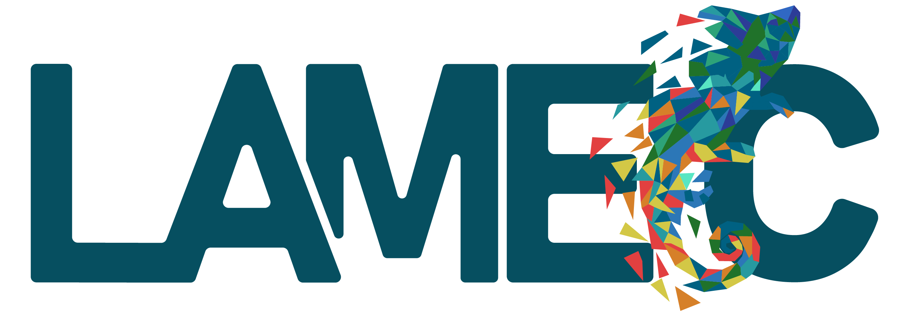

### Arquivo: .\pages\extension\bull_racing.html
`$Lang
<!DOCTYPE html>
<html lang="pt-BR">
<head>
    <meta charset="UTF-8">
    <meta name="viewport" content="width=device-width, initial-scale=1.0">
    <title>LAMEC - SIMCOMPI</title>
    <link rel="stylesheet" href="https://cdnjs.cloudflare.com/ajax/libs/font-awesome/6.5.1/css/all.min.css">
    <link rel="stylesheet" href="../../style.css">
    
</head>
<body>

    <!-- Navegação (Com Dropdowns implementados na resposta anterior) -->
    <nav class="navbar" id="navbar">
        

            

            <ul class="nav-links">
                <li><a href="../../index.html">HOME</a></li>
                <li><a href="../publications.html">PUBLICATIONS</a></li>
                <li class="dropdown"><a href="../research_team.html">PEOPLE <i class="fa-solid fa-chevron-down"></i></a><ul class="dropdown-menu"><li><a href="../research_team.html">RESEARCH TEAM</a></li><li><a href="../alumni.html">ALUMNI</a></li></ul></li>
                <li><a href="../simcompi/simcompi.html">SIMCOMPI</a></li>
                <li class="dropdown"><a href="faisca.html">EXTENSION <i class="fa-solid fa-chevron-down"></i></a><ul class="dropdown-menu"><li><a href="bull_racing.html">BULL RACING</a></li><li><a href="faisca.html">FAÍSCA</a></li></ul></li>
                <li><a href="../about.html">ABOUT</a></li>
            </ul>
        

    </nav>

    <!-- Hero & Countdown -->
    <header class="simcompi-hero">
        
                Bull Racing is the first Formula SAE
    </header>

    <!-- Intro Text -->
    <section class="simcompi-intro">
        
Bull Racing is the first Formula SAE team in Piauí, formed by students from the Universidade Federal do Piauí (UFPI). The project brings together students from Mechanical Engineering, Electrical Engineering, Materials Engineering, Production Engineering and even Journalism, who work together to develop a high-performance racing car.

         
        
  The team participates annually in the Formula SAE Brazil competition, where they seek to improve their knowledge in automotive engineering, project management and technological innovation. In addition to technical development, the project encourages teamwork, creativity and problem-solving, preparing its members for challenges in the automotive sector and industry in general. With dedication and a spirit of collaboration, Bull Racing represents Piauí on the national stage, proving that talent and perseverance can take innovation even further.

        
        

            <a href="../simcompi/submissions.html" class="btn btn-green">SUBSCRIBE NOW</a>
        

    </section>

    <!-- Instagram Section -->
    <section class="instagram-section">
        <h2 class="instagram-title">Follow on Instagram @simcompi</h2>
        <!-- Para usar o widget real, cole aqui o 
</body>
</html>
``n

### Arquivo: .\pages\extension\faisca.html
`$Lang
<!DOCTYPE html>
<html lang="pt-BR">
<head>
    <meta charset="UTF-8">
    <meta name="viewport" content="width=device-width, initial-scale=1.0">
    <title>LAMEC - SIMCOMPI</title>
    <link rel="stylesheet" href="https://cdnjs.cloudflare.com/ajax/libs/font-awesome/6.5.1/css/all.min.css">
    <link rel="stylesheet" href="../../style.css">
    
</head>
<body>

    <!-- Navegação (Com Dropdowns implementados na resposta anterior) -->
    <nav class="navbar" id="navbar">
        

            

            <ul class="nav-links">
                <li><a href="../../index.html">HOME</a></li>
                <li><a href="../publications.html">PUBLICATIONS</a></li>
                <li class="dropdown"><a href="../research_team.html">PEOPLE <i class="fa-solid fa-chevron-down"></i></a><ul class="dropdown-menu"><li><a href="../research_team.html">RESEARCH TEAM</a></li><li><a href="../alumni.html">ALUMNI</a></li></ul></li>
                <li><a href="../simcompi/simcompi.html">SIMCOMPI</a></li>
                <li class="dropdown"><a href="faisca.html">EXTENSION <i class="fa-solid fa-chevron-down"></i></a><ul class="dropdown-menu"><li><a href="bull_racing.html">BULL RACING</a></li><li><a href="faisca.html">FAÍSCA</a></li></ul></li>
                <li><a href="../about.html">ABOUT</a></li>
            </ul>
        

    </nav>

    <!-- Hero & Countdown -->
    <header class="simcompi-hero">
        
                Proejto Faísca
    </header>

    <!-- Intro Text -->
    <section class="simcompi-intro">
        
Faísca is a project that aims to strengthen the Female Presence in Mechanical Engineering, promoting a more inclusive, welcoming and motivating environment. The initiative seeks to encourage female students to participate, offering support, inspiration, and representation to overcome challenges and drive change in the field.

        
        

            <a href="../simcompi/submissions.html" class="btn btn-green">SUBSCRIBE NOW</a>
        

    </section>

    <!-- Instagram Section -->
    <section class="instagram-section">
        <h2 class="instagram-title">Follow on Instagram @simcompi</h2>
        <!-- Para usar o widget real, cole aqui o 
</body>
</html>
``n

### Arquivo: .\pages\simcompi\prev_edition\ii_simcompi.html
`$Lang

<!DOCTYPE html>
<html lang="pt-BR">
<head>
    <meta charset="UTF-8">
    <meta name="viewport" content="width=device-width, initial-scale=1.0">
    <title>LAMEC - I SIMCOMP (2019)</title>
    <link rel="stylesheet" href="https://cdnjs.cloudflare.com/ajax/libs/font-awesome/6.5.1/css/all.min.css">
    <link rel="stylesheet" href="../../../style.css">
    
</head>
<body>

    <!-- Navegação Principal -->
            <nav class="navbar" id="navbar">
      

        

        <ul class="nav-links">
          <li><a href="../simcompi.html">SIMCOMPI</a></li>
          <li><a href="../submissions.html">SUBMISSÕES</a></li>
          <li><a href="../proceedings/proceedings.html">ANAIS DO EVENTO</a></li>
          <li class="dropdown"><a href="i_simcompi.html">EDIÇÕES ANTERIORES <i class="fa-solid fa-chevron-down"></i></a><ul class="dropdown-menu"><li><a href="i_simcompi.html">I SIMCOMPI</a></li><li><a href="ii_simcompi.html">II SIMCOMPI</a></li></ul></li>
          <li><a href="../committees.html">COMISSÕES</a></li>
          <li><a href="../contact-us.html">CONTATO</a></li>
          <li><a href="../../../index.html" class="back-btn"><i class="fa-solid fa-house"></i> LAMEC</a></li>
        </ul>
      

    </nav>

    <!-- Hero Section (II SIMCOMP) -->
    <header class="past-edition-hero past-edition-banner" style="background-image: url('../../../images/simcompi/simcompi%202/ii-simcompi-horizontal-logo.png');">
    </header>

    
A segunda edição do SIMCOMPI ocorreu de 14 a 17 de abril de 2025, no Auditório do Centro de Tecnologia da Universidade Federal do Piauí. O evento reúne especialistas para discutir avanços e desafios relacionados à aplicação de modelos computacionais. Nosso objetivo é criar um ambiente favorável à troca de conhecimentos e experiências entre os participantes. Obrigado pela participação!

    <!-- Event Sub-Navbar -->
    <a href="../simcompi.html" class="btn-outline" style="display: inline-block; margin: 20px 0;"><i class="fa-solid fa-arrow-left"></i> Voltar para o SIMCOMPI</a>
    <!-- Layout Dividido (Pôsteres e Palestrantes) -->
    <section class="schedule-section">
        
        <!-- Coluna Esquerda: Pôsteres -->
        

            
            
        

        <!-- Coluna Direita: Cronograma em Texto -->
        

            <h2 class="highlight-heading">Palestrantes</h2>
            
            <ul class="speaker-list">
                <li>
                    <strong>Formação do conhecimento e impactos na carreira</strong>
                    Dr. Marco Adolph (TROX - USA)
                </li>
                <li>
                    <strong>Análise multiescalar pelo método dos elementos de contorno</strong>
                    Prof. Dr Paulo Sollero (UNICAMP)
                </li>
                <li>
                    <strong>Otimização topológica de estruturas submersas</strong>
                    Prof. Dr. Renato Picelli (USP)
                </li>
                <li>
                    <strong>O programa espacial no Brasil e no mundo e possibilidades de carreira não acadêmica para graduandos, mestres e doutores em institutos de pesquisa</strong>
                    Prof. Dr. Carlos D'Andrade Souto (IAE/ITA)
                </li>
                <li>
                    <strong>Simulação numérica de mecanismos dinâmicos</strong>
                    Prof. Dr. Paulo Roberto Gardel Kurka
                </li>
                <li>
                    <strong>Importância e aplicações do MEF na indústria</strong>
                    Dr. Cornélis Joannes Van Der Poel Filho (General Motors)
                </li>
                <li>
                    <strong>Otimização topológica multifísica e multiescalar: aplicações e desafios</strong>
                    Prof. Dr. Renato Pavanello
                </li>
                <li>
                    <strong>Projeto de sistemas de climatização e eficiência energética</strong>
                    Dr. Marco Adolph
                </li>
                <li>
                    <strong>Criação de animações para destacar resultados de engenharia</strong>
                    Prof. Dr. Josué Labaki
                </li>
                <li>
                    <strong>Acústica e vibroacústica no setor espacial</strong>
                    Prof. Dr. Carlos D'Andrade Souto
                </li>
                <li>
                    <strong>Mentoria rápida: elementos essenciais para direcionar sua carreira</strong>
                    Dr. Cornélis Joannes Van Der Poel
                </li>
            </ul>

            <h2 class="highlight-heading">Mesa-redonda</h2>
            <ul class="speaker-list">
                <li>
                    Mediador: Prof. Dr. Eduardo Costa Girão
                </li>
            </ul>
        

    </section>

    
<a href="https://drive.google.com/drive/folders/1ldzZ7aEng5TXYjYCLAa523nnYtX0icgE" class="btn-outline" target="_blank" rel="noopener"><i class="fa-solid fa-images"></i> Fotos do II SIMCOMPI</a>

    <!-- Footer -->
    <footer>
        
© Laboratório de Métodos de Modelagem Computacional - LAMEC, 2026.

    </footer>

    
</body>
</html>

``n

### Arquivo: .\pages\simcompi\prev_edition\i_simcompi.html
`$Lang

<!DOCTYPE html>
<html lang="pt-BR">
<head>
    <meta charset="UTF-8">
    <meta name="viewport" content="width=device-width, initial-scale=1.0">
    <title>LAMEC - I SIMCOMP (2019)</title>
    <link rel="stylesheet" href="https://cdnjs.cloudflare.com/ajax/libs/font-awesome/6.5.1/css/all.min.css">
    <link rel="stylesheet" href="../../../style.css">
    
</head>
<body>

    <!-- Navegação Principal -->
            <nav class="navbar" id="navbar">
      

        

        <ul class="nav-links">
          <li><a href="../simcompi.html">SIMCOMPI</a></li>
          <li><a href="../submissions.html">SUBMISSÕES</a></li>
          <li><a href="../proceedings/proceedings.html">ANAIS DO EVENTO</a></li>
          <li class="dropdown"><a href="i_simcompi.html">EDIÇÕES ANTERIORES <i class="fa-solid fa-chevron-down"></i></a><ul class="dropdown-menu"><li><a href="i_simcompi.html">I SIMCOMPI</a></li><li><a href="ii_simcompi.html">II SIMCOMPI</a></li></ul></li>
          <li><a href="../committees.html">COMISSÕES</a></li>
          <li><a href="../contact-us.html">CONTATO</a></li>
          <li><a href="../../../index.html" class="back-btn"><i class="fa-solid fa-house"></i> LAMEC</a></li>
        </ul>
      

    </nav>

    <!-- Hero Section (I SIMCOMP) -->
    <header class="past-edition-hero past-edition-banner" style="background-image: url('../../../images/simcompi/simcompi%201/i-simcompi-horizontal-banner.jpg');">
    </header>
    
    
O <strong>I Simpósio Internacional de Modelagem Computacional em Ciência e Tecnologia (SIMCOMP)</strong> foi realizado na cidade de <strong>Teresina, Piauí</strong>, de <strong>15 a 18 de abril de 2019</strong>. Organizado pelo LAMEC, o evento promoveu o encontro entre pesquisadores, engenheiros, profissionais e estudantes interessados no avanço científico e tecnológico. A programação incluiu palestras, minicursos e uma mesa-redonda. As áreas de interesse estão relacionadas à modelagem computacional e à interação entre engenharia, computação, matemática e física.

    <!-- Event Sub-Navbar -->
    <a href="../simcompi.html" class="btn-outline" style="display: inline-block; margin: 20px 0;"><i class="fa-solid fa-arrow-left"></i> Voltar para o SIMCOMPI</a>
    <!-- Layout Dividido (Pôsteres e Palestrantes) -->
    <section class="schedule-section">
        
        <!-- Coluna Esquerda: Pôsteres -->
        
 
            
            

        

        <!-- Coluna Direita: Cronograma em Texto -->
        

            <h2 class="highlight-heading">Palestrantes</h2>
            
            <ul class="speaker-list">
                <li>
                    <strong>Formação do conhecimento e impactos na carreira</strong>
                    Dr. Marco Adolph (TROX - USA)
                </li>
                <li>
                    <strong>Análise multiescalar pelo método dos elementos de contorno</strong>
                    Prof. Dr Paulo Sollero (UNICAMP)
                </li>
                <li>
                    <strong>Otimização topológica de estruturas submersas</strong>
                    Prof. Dr. Renato Picelli (USP)
                </li>
                <li>
                    <strong>O programa espacial no Brasil e no mundo e possibilidades de carreira não acadêmica para graduandos, mestres e doutores em institutos de pesquisa</strong>
                    Prof. Dr. Carlos D'Andrade Souto (IAE/ITA)
                </li>
                <li>
                    <strong>Simulação numérica de mecanismos dinâmicos</strong>
                    Prof. Dr. Paulo Roberto Gardel Kurka
                </li>
                <li>
                    <strong>Importância e aplicações do MEF na indústria</strong>
                    Dr. Cornélis Joannes Van Der Poel Filho (General Motors)
                </li>
                <li>
                    <strong>Otimização topológica multifísica e multiescalar: aplicações e desafios</strong>
                    Prof. Dr. Renato Pavanello
                </li>
                <li>
                    <strong>Projeto de sistemas de climatização e eficiência energética</strong>
                    Dr. Marco Adolph
                </li>
                <li>
                    <strong>Criação de animações para destacar resultados de engenharia</strong>
                    Prof. Dr. Josué Labaki
                </li>
                <li>
                    <strong>Acústica e vibroacústica no setor espacial</strong>
                    Prof. Dr. Carlos D'Andrade Souto
                </li>
                <li>
                    <strong>Mentoria rápida: elementos essenciais para direcionar sua carreira</strong>
                    Dr. Cornélis Joannes Van Der Poel
                </li>
            </ul>

            <h2 class="highlight-heading">Mesa-redonda</h2>
            <ul class="speaker-list">
                <li>
                    Mediador: Prof. Dr. Eduardo Costa Girão
                </li>
            </ul>
        

    </section>

    <!-- Full Width Image Section -->
    

        <!-- aqui deve ser um slider com todas as fotos do i simcompi nas pastas locais -->
        <!-- Placeholder para a foto da sessão de pôsteres (visão superior) -->
        
    

    <!-- Award Section -->
    <section class="award-section">
        <h2 class="highlight-heading">Prêmio do simpósio de 2019</h2>
        
        

            Na primeira edição do evento, o estudante <strong>Juan Gabriel Queiroz Blanche</strong> recebeu o prêmio de <strong>melhor pesquisa</strong> com o pôster "<em>Análise de vibração livre de uma viga cônica rotativa</em>".
        

        

            <!-- Placeholder para a foto da premiação -->
            
        

    </section>

    <!-- Footer -->
    <footer>
        
© Laboratório de Métodos de Modelagem Computacional - LAMEC, 2026.

    </footer>

    
</body>
</html>

``n

### Arquivo: .\pages\simcompi\proceedings\volumes\vol_1.html
`$Lang
<!DOCTYPE html>
<html lang="pt-BR">
<head>
    <meta charset="UTF-8">
    <meta name="viewport" content="width=device-width, initial-scale=1.0">
    <title>LAMEC - SIMCOMPI Vol. 1 (2019)</title>
    <link rel="stylesheet" href="https://cdnjs.cloudflare.com/ajax/libs/font-awesome/6.5.1/css/all.min.css">
    <link rel="stylesheet" href="../../../../style.css">
    
</head>
<body>

    <!-- Navegação Principal -->
            <nav class="navbar" id="navbar">
      

        

        <ul class="nav-links">
          <li><a href="../../simcompi.html">SIMCOMPI</a></li>
          <li><a href="../../submissions.html">SUBMISSÕES</a></li>
          <li><a href="../proceedings.html">ANAIS DO EVENTO</a></li>
          <li class="dropdown"><a href="../../prev_edition/i_simcompi.html">EDIÇÕES ANTERIORES <i class="fa-solid fa-chevron-down"></i></a><ul class="dropdown-menu"><li><a href="../../prev_edition/i_simcompi.html">I SIMCOMPI</a></li><li><a href="../../prev_edition/ii_simcompi.html">II SIMCOMPI</a></li></ul></li>
          <li><a href="../../committees.html">COMISSÕES</a></li>
          <li><a href="../../contact-us.html">CONTATO</a></li>
          <li><a href="../../../../index.html" class="back-btn"><i class="fa-solid fa-house"></i> LAMEC</a></li>
        </ul>
      

    </nav>

    <!-- Header do Evento -->
    <header class="page-header">
        <h1>Anais do evento</h1>
    </header>

    <!-- Sub-Navbar do Evento -->
<!-- Estrutura Principal: Sidebar + Artigos -->
    <main class="container proceedings-layout">
        
        <!-- SIDEBAR -->
        <aside class="sidebar">
            

                
Buscar

                

                    <form action="#" method="GET" id="searchForm">
                        <input type="text" class="search-input" placeholder="Buscar artigos, autores..." required>
                        <button type="submit" class="search-btn">Buscar</button>
                    </form>
                

            

            

                
Navegação

                

                    <ul class="sidebar-menu">
                        <li><a href="../apresentacao.html">Apresentação</a></li>
                        <li><a href="../expediente.html">Expediente</a></li>
                        <li><a href="vol_3.html">Edição Atual</a></li>
                        <li><a href="vol_1.html" class="active">Edições Anteriores</a></li>
                        <li><a href="../arquivo.html">Arquivo</a></li>
                    </ul>
                

            

            
            

                
Explorar

                

                    <ul class="sidebar-menu">
                        <li><a href="#edition">Por Edição</a></li>
                        <li><a href="#author">Por Autor</a></li>
                        <li><a href="#title">Por Título</a></li>
                        <li><a href="#category">Por Categoria</a></li>
                    </ul>
                

            

        </aside>

        <!-- MAIN CONTENT (Articles List) -->
        <section class="main-content">
            
            

                <h1>SIMCOMPI - Vol. 1 (2019)</h1>
                <i class="fa-solid fa-file-pdf"></i> Download Complete Volume
            

            <!-- Categoria 1 -->
            <h2 class="category-title">Desenvolvimento de ferramentas computacionais</h2>

            

                <h3 class="article-title">Android Aplicativo para verificação de Steel Elements under Axial Force</h3>
                
Rodrigo Diniz Filgueiras, Prof. Dr. Eduardo Martins Fontes do Rêgo

                
<strong>DOI:</strong> <a href="https://doi.org/10.xxxx/simcompi.2019.001">10.xxxx/simcompi.2019.001</a>

                

                    <button class="btn-action btn-pdf"><i class="fa-solid fa-file-pdf"></i> PDF</button>
                    <button class="btn-action btn-outline">Resumo</button>
                    <button class="btn-action btn-outline">Palavras-chave</button>
                

            

            

                <h3 class="article-title">Dimensionamento de redes de distribuição de água com AutoCAD e EPANET</h3>
                
José Paulo da Silveira Neto, Alessandro de Araújo Bezerra, Renata Shirley de Andrade Araújo, Jordana Madeira Alaggio Ribeiro

                
<strong>DOI:</strong> <a href="https://doi.org/10.xxxx/simcompi.2019.002">10.xxxx/simcompi.2019.002</a>

                

                    <button class="btn-action btn-pdf"><i class="fa-solid fa-file-pdf"></i> PDF</button>
                    <button class="btn-action btn-outline">Resumo</button>
                    <button class="btn-action btn-outline">Palavras-chave</button>
                

            

            

                <h3 class="article-title">Ferramenta computacional para dimensionamento de Wooden Roofs</h3>
                
João Pedro Silva Soares, Prof. Dr. Eduardo Martins Fontes do Rêgo

                
<strong>DOI:</strong> <a href="https://doi.org/10.xxxx/simcompi.2019.003">10.xxxx/simcompi.2019.003</a>

                

                    <button class="btn-action btn-pdf"><i class="fa-solid fa-file-pdf"></i> PDF</button>
                    <button class="btn-action btn-outline">Resumo</button>
                    <button class="btn-action btn-outline">Palavras-chave</button>
                

            

            

                <h3 class="article-title">Modelagem computacional de Pumping Systems</h3>
                
Natanael Basilio Pires, Profª. Dra. Renata Shirley de Andrade Araújo, Prof. Dr. Alessandro de Araújo Bezerra

                
<strong>DOI:</strong> <a href="https://doi.org/10.xxxx/simcompi.2019.004">10.xxxx/simcompi.2019.004</a>

                

                    <button class="btn-action btn-pdf"><i class="fa-solid fa-file-pdf"></i> PDF</button>
                    <button class="btn-action btn-outline">Resumo</button>
                    <button class="btn-action btn-outline">Palavras-chave</button>
                

            

            

                <h3 class="article-title">Programação aplicada à inserção de elementos gráficos no AutoCAD Environment</h3>
                
Paulo Roberto Queiroz de Almeida, Profª. Drª. Renata Shirley de Andrade Araújo, Prof. Dr. Alessandro De Araújo Bezerra

                
<strong>DOI:</strong> <a href="https://doi.org/10.xxxx/simcompi.2019.005">10.xxxx/simcompi.2019.005</a>

                

                    <button class="btn-action btn-pdf"><i class="fa-solid fa-file-pdf"></i> PDF</button>
                    <button class="btn-action btn-outline">Resumo</button>
                    <button class="btn-action btn-outline">Palavras-chave</button>
                

            

            <!-- Categoria 2 -->
            <h2 class="category-title">Aeronautical Engineering</h2>

            

                <h3 class="article-title">CFD Análise de a Nozzle Throat Geometry</h3>
                
Kassio Felipe da Costa Serra, João Manoel Torres Lobato

                
<strong>DOI:</strong> <a href="https://doi.org/10.xxxx/simcompi.2019.006">10.xxxx/simcompi.2019.006</a>

                

                    <button class="btn-action btn-pdf"><i class="fa-solid fa-file-pdf"></i> PDF</button>
                    <button class="btn-action btn-outline">Resumo</button>
                    <button class="btn-action btn-outline">Palavras-chave</button>
                

            

            

                <h3 class="article-title">Estudo prospectivo sobre o uso de materiais poliméricos na engenharia aeroespacial</h3>
                
Millena de Cassia Sousa e Silva, Yvo Borges da Silva, Valdivânia Albuquerque do Nascimento

                
<strong>DOI:</strong> <a href="https://doi.org/10.xxxx/simcompi.2019.007">10.xxxx/simcompi.2019.007</a>

                

                    <button class="btn-action btn-pdf"><i class="fa-solid fa-file-pdf"></i> PDF</button>
                    <button class="btn-action btn-outline">Resumo</button>
                    <button class="btn-action btn-outline">Palavras-chave</button>
                

            

            

                <h3 class="article-title">Nitretação por plasma em gaiola catódica do aço AISI 444: investigação e análise dos parâmetros de tratamento</h3>
                
Renan Matos Monção, Bruno Barbosa de Aquino, Prof. Dr. Rômulo Ribeiro Magalhães

                
<strong>DOI:</strong> <a href="https://doi.org/10.xxxx/simcompi.2019.008">10.xxxx/simcompi.2019.008</a>

                

                    <button class="btn-action btn-pdf"><i class="fa-solid fa-file-pdf"></i> PDF</button>
                    <button class="btn-action btn-outline">Resumo</button>
                    <button class="btn-action btn-outline">Palavras-chave</button>
                

            

            <!-- Categoria 3 -->
            <h2 class="category-title">Energy Efficiency</h2>

            

                <h3 class="article-title">Análise de eficiência energética em uma rede de distribuição de ar comprimido para uma fábrica de bicicletas</h3>
                
Luiz Henrique Portela de Abreu, Renan Matos Monção, Wênio Fhará Alencar Borges

                
<strong>DOI:</strong> <a href="https://doi.org/10.xxxx/simcompi.2019.009">10.xxxx/simcompi.2019.009</a>

                

                    <button class="btn-action btn-pdf"><i class="fa-solid fa-file-pdf"></i> PDF</button>
                    <button class="btn-action btn-outline">Resumo</button>
                    <button class="btn-action btn-outline">Palavras-chave</button>
                

            

            

                <h3 class="article-title">Avaliação de monitoramento de sistema fotovoltaico conectado à rede e seus impactos na qualidade da energia na UFPI</h3>
                
Tatyane Mityko Dias Fussuma, Prof. Dr. Fábio Rocha Barbosa

                
<strong>DOI:</strong> <a href="https://doi.org/10.xxxx/simcompi.2019.010">10.xxxx/simcompi.2019.010</a>

                

                    <button class="btn-action btn-pdf"><i class="fa-solid fa-file-pdf"></i> PDF</button>
                    <button class="btn-action btn-outline">Resumo</button>
                    <button class="btn-action btn-outline">Palavras-chave</button>
                

            

            

                <h3 class="article-title">Uso de materiais supercondutores de alta temperatura em sistemas de energia: uma prospecção tecnológica</h3>
                
Laura Almeida Pereira dos Santos, Valdivânia Albuquerque do Nascimento, Felipe Pereira Siqueira e Silva

                
<strong>DOI:</strong> <a href="https://doi.org/10.xxxx/simcompi.2019.011">10.xxxx/simcompi.2019.011</a>

                

                    <button class="btn-action btn-pdf"><i class="fa-solid fa-file-pdf"></i> PDF</button>
                    <button class="btn-action btn-outline">Resumo</button>
                    <button class="btn-action btn-outline">Palavras-chave</button>
                

            

            

                <h3 class="article-title">Uso de nanocompósitos metálicos para eficiência energética na produção industrial: uma prospecção tecnológica</h3>
                
Yvo Borges da Silva, Millena de Cássia Sousa e Silva, Valdivânia Albuquerque do Nascimento

                
<strong>DOI:</strong> <a href="https://doi.org/10.xxxx/simcompi.2019.012">10.xxxx/simcompi.2019.012</a>

                

                    <button class="btn-action btn-pdf"><i class="fa-solid fa-file-pdf"></i> PDF</button>
                    <button class="btn-action btn-outline">Resumo</button>
                    <button class="btn-action btn-outline">Palavras-chave</button>
                

            

            <!-- Categoria 4 -->
            <h2 class="category-title">Boundary Element Method</h2>

            

                <h3 class="article-title">Formulação pelo método dos elementos de contorno para modelagem do fenômeno de cone de gás em poços de petróleo</h3>
                
Pedro Lucas Sanches Fonseca Silva, Jennifer Slayder Santos Sousa, Prof. Dr. Luís Jorge Mesquita de Jesus

                
<strong>DOI:</strong> <a href="https://doi.org/10.xxxx/simcompi.2019.013">10.xxxx/simcompi.2019.013</a>

                

                    <button class="btn-action btn-pdf"><i class="fa-solid fa-file-pdf"></i> PDF</button>
                    <button class="btn-action btn-outline">Resumo</button>
                    <button class="btn-action btn-outline">Palavras-chave</button>
                

            

            <!-- Categoria 5 -->
            <h2 class="category-title">Finite Element Method</h2>

            

                <h3 class="article-title">Análise de vibração livre de uma viga cônica rotativa</h3>
                
Juan Gabriel Queiroz Blanche, Simone dos Santos Hoefel

                
<strong>DOI:</strong> <a href="https://doi.org/10.xxxx/simcompi.2019.014">10.xxxx/simcompi.2019.014</a>

                

                    <button class="btn-action btn-pdf"><i class="fa-solid fa-file-pdf"></i> PDF</button>
                    <button class="btn-action btn-outline">Resumo</button>
                    <button class="btn-action btn-outline">Palavras-chave</button>
                

            

            

                <h3 class="article-title">Vibração livre de uma viga-coluna sobre fundação elástica de dois parâmetros</h3>
                
Lucas Oliveira Siqueira, Rômulo Luz Cortez, Profa. Dra. Simone dos Santos Hoefel

                
<strong>DOI:</strong> <a href="https://doi.org/10.xxxx/simcompi.2019.015">10.xxxx/simcompi.2019.015</a>

                

                    <button class="btn-action btn-pdf"><i class="fa-solid fa-file-pdf"></i> PDF</button>
                    <button class="btn-action btn-outline">Resumo</button>
                    <button class="btn-action btn-outline">Palavras-chave</button>
                

            

            

                <h3 class="article-title">Modelagem numérica de Contact Problem</h3>
                
Vinicius da Silva Costa, Prof. Dr. Eduardo Martins Fontes do Rêgo

                
<strong>DOI:</strong> <a href="https://doi.org/10.xxxx/simcompi.2019.016">10.xxxx/simcompi.2019.016</a>

                

                    <button class="btn-action btn-pdf"><i class="fa-solid fa-file-pdf"></i> PDF</button>
                    <button class="btn-action btn-outline">Resumo</button>
                    <button class="btn-action btn-outline">Palavras-chave</button>
                

            

            

                <h3 class="article-title">Nonlocal Finite Element Análise de Euler-Bernoulli Nanobeams</h3>
                
Aldemar Pontes de Siqueira Neto, Simone dos Santos Hoefel

                
<strong>DOI:</strong> <a href="https://doi.org/10.xxxx/simcompi.2019.017">10.xxxx/simcompi.2019.017</a>

                

                    <button class="btn-action btn-pdf"><i class="fa-solid fa-file-pdf"></i> PDF</button>
                    <button class="btn-action btn-outline">Resumo</button>
                    <button class="btn-action btn-outline">Palavras-chave</button>
                

            

            

                <h3 class="article-title">Simulação numérica para análise estrutural de estruturas de suporte de basculador ferroviário pelo método dos elementos finitos</h3>
                
Rodrigo da Silva Melo, Leonardo Vinícius Lisboa da Cruz, Anaximandro Souza

                
<strong>DOI:</strong> <a href="https://doi.org/10.xxxx/simcompi.2019.018">10.xxxx/simcompi.2019.018</a>

                

                    <button class="btn-action btn-pdf"><i class="fa-solid fa-file-pdf"></i> PDF</button>
                    <button class="btn-action btn-outline">Resumo</button>
                    <button class="btn-action btn-outline">Palavras-chave</button>
                

            

            

                <h3 class="article-title">Resposta vibratória de a Beam-Column on Pasternack Foundation</h3>
                
Rômulo Luz Cortez, Lucas Oliveira Siqueira, Prof. Dra. Simone dos Santos Hoefel

                
<strong>DOI:</strong> <a href="https://doi.org/10.xxxx/simcompi.2019.019">10.xxxx/simcompi.2019.019</a>

                

                    <button class="btn-action btn-pdf"><i class="fa-solid fa-file-pdf"></i> PDF</button>
                    <button class="btn-action btn-outline">Resumo</button>
                    <button class="btn-action btn-outline">Palavras-chave</button>
                

            

            <!-- Categoria 6 -->
            <h2 class="category-title">Modelagem e identificação de sistemas</h2>

            

                <h3 class="article-title">Estudo e aplicação de sensor LIDAR em carros autônomos</h3>
                
Darieldon de Brito Medeiros, Denilson Alves de Sousa, José Maria Pires de Menezes Júnior

                
<strong>DOI:</strong> <a href="https://doi.org/10.xxxx/simcompi.2019.020">10.xxxx/simcompi.2019.020</a>

                

                    <button class="btn-action btn-pdf"><i class="fa-solid fa-file-pdf"></i> PDF</button>
                    <button class="btn-action btn-outline">Resumo</button>
                    <button class="btn-action btn-outline">Palavras-chave</button>
                

            

            

                <h3 class="article-title">Modelagem baseada em agentes para Oil Spills on the Maranhão Coast</h3>
                
Pedro Lucas Sanches Fonseca Silva, Jennifer Slayder Santos Sousa, Prof. Dr. Luís Jorge Mesquita de Jesus

                
<strong>DOI:</strong> <a href="https://doi.org/10.xxxx/simcompi.2019.021">10.xxxx/simcompi.2019.021</a>

                

                    <button class="btn-action btn-pdf"><i class="fa-solid fa-file-pdf"></i> PDF</button>
                    <button class="btn-action btn-outline">Resumo</button>
                    <button class="btn-action btn-outline">Palavras-chave</button>
                

            

            

                <h3 class="article-title">Modelagem de um modelo didático para a Servomotor</h3>
                
Luan da Silva Bezerra, Prof. Dr. José Medeiros de Araújo Júnior

                
<strong>DOI:</strong> <a href="https://doi.org/10.xxxx/simcompi.2019.022">10.xxxx/simcompi.2019.022</a>

                

                    <button class="btn-action btn-pdf"><i class="fa-solid fa-file-pdf"></i> PDF</button>
                    <button class="btn-action btn-outline">Resumo</button>
                    <button class="btn-action btn-outline">Palavras-chave</button>
                

            

            

                <h3 class="article-title">Modelagem da atitude de a Quadrotor Drone</h3>
                
Pedro Iago Carvalho Martins, Prof. Dr. Otacílio da Mota Almeida

                
<strong>DOI:</strong> <a href="https://doi.org/10.xxxx/simcompi.2019.023">10.xxxx/simcompi.2019.023</a>

                

                    <button class="btn-action btn-pdf"><i class="fa-solid fa-file-pdf"></i> PDF</button>
                    <button class="btn-action btn-outline">Resumo</button>
                    <button class="btn-action btn-outline">Palavras-chave</button>
                

            

            <!-- Categoria 7 -->
            <h2 class="category-title">Nanotechnology</h2>

            

                <h3 class="article-title">Avanços em Pharmaceutical Nanotechnology aplicado ao the Desenvolvimento de Controlled-Release Drugs: A Technological Foresight</h3>
                
Nayara de Oliveira Sobrinho, Moisés das Virgens Santana, Hitalo de Jesus Bezerra da Silva

                
<strong>DOI:</strong> <a href="https://doi.org/10.xxxx/simcompi.2019.024">10.xxxx/simcompi.2019.024</a>

                

                    <button class="btn-action btn-pdf"><i class="fa-solid fa-file-pdf"></i> PDF</button>
                    <button class="btn-action btn-outline">Resumo</button>
                    <button class="btn-action btn-outline">Palavras-chave</button>
                

            

            

                <h3 class="article-title">Propriedades eletrônicas de Nitrogen Doped Graphene Nanowiggles</h3>
                
Anderson Soares da Costa Azevêdo, Eduardo Costa Girão

                
<strong>DOI:</strong> <a href="https://doi.org/10.xxxx/simcompi.2019.025">10.xxxx/simcompi.2019.025</a>

                

                    <button class="btn-action btn-pdf"><i class="fa-solid fa-file-pdf"></i> PDF</button>
                    <button class="btn-action btn-outline">Resumo</button>
                    <button class="btn-action btn-outline">Palavras-chave</button>
                

            

            

                <h3 class="article-title">Estrutura eletrônica de Carbon Nanocage with Bipartite Structure: A DFT study</h3>
                
Fábio Nascimento de Sousa, Eduardo Costa Girão

                
<strong>DOI:</strong> <a href="https://doi.org/10.xxxx/simcompi.2019.026">10.xxxx/simcompi.2019.026</a>

                

                    <button class="btn-action btn-pdf"><i class="fa-solid fa-file-pdf"></i> PDF</button>
                    <button class="btn-action btn-outline">Resumo</button>
                    <button class="btn-action btn-outline">Palavras-chave</button>
                

            

            

                <h3 class="article-title">Estados magnéticos em Graphene Nanoflakes</h3>
                
Caio Vitor Teixeira Costa, Eduardo Costa Girão

                
<strong>DOI:</strong> <a href="https://doi.org/10.xxxx/simcompi.2019.027">10.xxxx/simcompi.2019.027</a>

                

                    <button class="btn-action btn-pdf"><i class="fa-solid fa-file-pdf"></i> PDF</button>
                    <button class="btn-action btn-outline">Resumo</button>
                    <button class="btn-action btn-outline">Palavras-chave</button>
                

            

            

                <h3 class="article-title">Estados magnéticos em Graphene Nanoflakes Containing Anti-dots</h3>
                
Herus Teixeira Lopes, Prof. Dr. Eduardo Girão Costa

                
<strong>DOI:</strong> <a href="https://doi.org/10.xxxx/simcompi.2019.028">10.xxxx/simcompi.2019.028</a>

                

                    <button class="btn-action btn-pdf"><i class="fa-solid fa-file-pdf"></i> PDF</button>
                    <button class="btn-action btn-outline">Resumo</button>
                    <button class="btn-action btn-outline">Palavras-chave</button>
                

            

            <!-- Categoria 8 -->
            <h2 class="category-title">Intelligent Systems</h2>

            

                <h3 class="article-title">Classificação de High-Speed Steel Metallographic Samples Using Machine Learning Models</h3>
                
Marcus Patrick Acioli da Silva, Dr. José Maria Pires de Menezes Júnior, Dr. Francisco Riccelly Pereira Feitosa

                
<strong>DOI:</strong> <a href="https://doi.org/10.xxxx/simcompi.2019.029">10.xxxx/simcompi.2019.029</a>

                

                    <button class="btn-action btn-pdf"><i class="fa-solid fa-file-pdf"></i> PDF</button>
                    <button class="btn-action btn-outline">Resumo</button>
                    <button class="btn-action btn-outline">Palavras-chave</button>
                

            

            

                <h3 class="article-title">Identificação do fenômeno de transferência grafêmica-fônica-fonológica BP-EFL usando redes neurais artificiais</h3>
                
Atos Apollo Silva Borges, Prof. Dra. Aratuza Rodrigues Silva Rocha, Prof. Dr. Fábio Rocha Barbosa

                
<strong>DOI:</strong> <a href="https://doi.org/10.xxxx/simcompi.2019.030">10.xxxx/simcompi.2019.030</a>

                

                    <button class="btn-action btn-pdf"><i class="fa-solid fa-file-pdf"></i> PDF</button>
                    <button class="btn-action btn-outline">Resumo</button>
                    <button class="btn-action btn-outline">Palavras-chave</button>
                

            

            

                <h3 class="article-title">Identificação e classificação do fenômeno de transferência de apagamento (HD) BP-EFL usando redes neurais artificiais MLP</h3>
                
Washington Luís Pinho Rodrigues Filho, Prof. Dra. Aratuza Rodrigues Silva Rocha, Prof. Dr. Fábio Rocha Barbosa

                
<strong>DOI:</strong> <a href="https://doi.org/10.xxxx/simcompi.2019.031">10.xxxx/simcompi.2019.031</a>

                

                    <button class="btn-action btn-pdf"><i class="fa-solid fa-file-pdf"></i> PDF</button>
                    <button class="btn-action btn-outline">Resumo</button>
                    <button class="btn-action btn-outline">Palavras-chave</button>
                

            

            <!-- Categoria 9 -->
            <h2 class="category-title">Teoria de controle e aplicações</h2>

            

                <h3 class="article-title">Controladores com estrutura PID fuzzy aplicada à malha de temperatura de uma incubadora neonatal</h3>
                
José Borges do Carmo Neto, Luno Gomes de Oliveira, Gabryel Figueiredo Soares, Prof. Dr. Otacílio da Mota Almeida

                
<strong>DOI:</strong> <a href="https://doi.org/10.xxxx/simcompi.2019.032">10.xxxx/simcompi.2019.032</a>

                

                    <button class="btn-action btn-pdf"><i class="fa-solid fa-file-pdf"></i> PDF</button>
                    <button class="btn-action btn-outline">Resumo</button>
                    <button class="btn-action btn-outline">Palavras-chave</button>
                

            

            

                <h3 class="article-title">Fuzzy Control aplicado ao a Didactic Level Tank</h3>
                
Francisco Leão de Oliveira, Prof. Dr. José Medeiros de Araújo Júnior

                
<strong>DOI:</strong> <a href="https://doi.org/10.xxxx/simcompi.2019.033">10.xxxx/simcompi.2019.033</a>

                

                    <button class="btn-action btn-pdf"><i class="fa-solid fa-file-pdf"></i> PDF</button>
                    <button class="btn-action btn-outline">Resumo</button>
                    <button class="btn-action btn-outline">Palavras-chave</button>
                

            

            

                <h3 class="article-title">Desenvolvimento de hardware didático para ensino de controle digital</h3>
                
Gabryel Figueiredo Soares, José B. do Carmo Neto, Luno Gomes de Oliveira, Prof. Dr. Otacílio da Mota Almeida

                
<strong>DOI:</strong> <a href="https://doi.org/10.xxxx/simcompi.2019.034">10.xxxx/simcompi.2019.034</a>

                

                    <button class="btn-action btn-pdf"><i class="fa-solid fa-file-pdf"></i> PDF</button>
                    <button class="btn-action btn-outline">Resumo</button>
                    <button class="btn-action btn-outline">Palavras-chave</button>
                

            

            

                <h3 class="article-title">Desenvolvimento de a SCARA-Type Manipulator Robot</h3>
                
Victor Eduardo Alves da Silva Carvalho, Nádia Raquel Matos Oliveira, José Maria Pires Menezes Junior

                
<strong>DOI:</strong> <a href="https://doi.org/10.xxxx/simcompi.2019.035">10.xxxx/simcompi.2019.035</a>

                

                    <button class="btn-action btn-pdf"><i class="fa-solid fa-file-pdf"></i> PDF</button>
                    <button class="btn-action btn-outline">Resumo</button>
                    <button class="btn-action btn-outline">Palavras-chave</button>
                

            

            

                <h3 class="article-title">Projeto de um controlador PID aplicado a um tanque didático de nível</h3>
                
Vanessa dos Santos Conceição, Prof. Dr. José Medeiros de Araújo Júnior

                
<strong>DOI:</strong> <a href="https://doi.org/10.xxxx/simcompi.2019.036">10.xxxx/simcompi.2019.036</a>

                

                    <button class="btn-action btn-pdf"><i class="fa-solid fa-file-pdf"></i> PDF</button>
                    <button class="btn-action btn-outline">Resumo</button>
                    <button class="btn-action btn-outline">Palavras-chave</button>
                

            

            

                <h3 class="article-title">Sistema de acionamento para incubadora neonatal</h3>
                
Raimundo da Silva Nunes Neto, Gabryel Figueiredo Soares, Prof. Dr. Otacílio da Mota Almeida

                
<strong>DOI:</strong> <a href="https://doi.org/10.xxxx/simcompi.2019.037">10.xxxx/simcompi.2019.037</a>

                

                    <button class="btn-action btn-pdf"><i class="fa-solid fa-file-pdf"></i> PDF</button>
                    <button class="btn-action btn-outline">Resumo</button>
                    <button class="btn-action btn-outline">Palavras-chave</button>
                

            

        </section>

    </main>

    <!-- Footer -->
    <footer>
        
© Laboratório de Métodos de Modelagem Computacional - LAMEC, 2026.

    </footer>

    
    
</body>
</html>

``n

### Arquivo: .\pages\simcompi\proceedings\volumes\vol_2.html
`$Lang
<!DOCTYPE html>
<html lang="pt-BR">
<head>
    <meta charset="UTF-8">
    <meta name="viewport" content="width=device-width, initial-scale=1.0">
    <title>LAMEC - SIMCOMPI Vol. 2 (2025)</title>
    <link rel="stylesheet" href="https://cdnjs.cloudflare.com/ajax/libs/font-awesome/6.5.1/css/all.min.css">
    <link rel="stylesheet" href="../../../../style.css">
    
</head>
<body>

    <!-- Navegação Principal -->
            <nav class="navbar" id="navbar">
      

        

        <ul class="nav-links">
          <li><a href="../../simcompi.html">SIMCOMPI</a></li>
          <li><a href="../../submissions.html">SUBMISSÕES</a></li>
          <li><a href="../proceedings.html">ANAIS DO EVENTO</a></li>
          <li class="dropdown"><a href="../../prev_edition/i_simcompi.html">EDIÇÕES ANTERIORES <i class="fa-solid fa-chevron-down"></i></a><ul class="dropdown-menu"><li><a href="../../prev_edition/i_simcompi.html">I SIMCOMPI</a></li><li><a href="../../prev_edition/ii_simcompi.html">II SIMCOMPI</a></li></ul></li>
          <li><a href="../../committees.html">COMISSÕES</a></li>
          <li><a href="../../contact-us.html">CONTATO</a></li>
          <li><a href="../../../../index.html" class="back-btn"><i class="fa-solid fa-house"></i> LAMEC</a></li>
        </ul>
      

    </nav>

    <!-- Header do Evento -->
    <header class="page-header">
        <h1>Anais do evento</h1>
    </header>

    <!-- Sub-Navbar do Evento -->
<!-- Estrutura Principal: Sidebar + Artigos -->
    <main class="container proceedings-layout">
        
        <!-- SIDEBAR -->
        <aside class="sidebar">
            

                
Buscar

                

                    <form action="#" method="GET" id="searchForm">
                        <input type="text" class="search-input" placeholder="Buscar artigos, autores..." required>
                        <button type="submit" class="search-btn">Buscar</button>
                    </form>
                

            

            

                
Navegação

                

                    <ul class="sidebar-menu">
                        <li><a href="../apresentacao.html">Apresentação</a></li>
                        <li><a href="../expediente.html">Expediente</a></li>
                        <li><a href="vol_3.html">Edição Atual</a></li>
                        <li><a href="vol_2.html" class="active">Edições Anteriores</a></li>
                        <li><a href="../arquivo.html">Arquivo</a></li>
                    </ul>
                

            

            
            

                
Explorar

                

                    <ul class="sidebar-menu">
                        <li><a href="#edition">Por Edição</a></li>
                        <li><a href="#author">Por Autor</a></li>
                        <li><a href="#title">Por Título</a></li>
                        <li><a href="#category">Por Categoria</a></li>
                    </ul>
                

            

        </aside>

        <!-- MAIN CONTENT -->
        <section class="main-content">
            
            

                <h1>II SIMCOMPI - Vol. 2 (2025)</h1>
                <i class="fa-solid fa-file-pdf"></i> Download Complete Volume
            

            <h2 class="category-title">Technical Papers</h2>

            

                <h3 class="article-title">Desenvolvimento de do sistema de monitoramento de grandezas elétricas em máquinas eletromecânicas</h3>
                
João Ferreira Borges Filho, Otacílio da Mota Almeida, Raphael Lima de Paiva

                
<strong>DOI:</strong> <a href="https://doi.org/10.xxxx/simcompi.2025.001">10.xxxx/simcompi.2025.001</a>

                

                    <button class="btn-action btn-pdf"><i class="fa-solid fa-file-pdf"></i> PDF</button>
                    <button class="btn-action btn-outline">Resumo</button>
                    <button class="btn-action btn-outline">Palavras-chave</button>
                

            

            

                <h3 class="article-title">Identificação e controle dos dos motores de um robô micromouse diferencial</h3>
                
Händel Mateus Carvalho Sarmento, Otacilio da Mota Almeida

                
<strong>DOI:</strong> <a href="https://doi.org/10.xxxx/simcompi.2025.002">10.xxxx/simcompi.2025.002</a>

                

                    <button class="btn-action btn-pdf"><i class="fa-solid fa-file-pdf"></i> PDF</button>
                    <button class="btn-action btn-outline">Resumo</button>
                    <button class="btn-action btn-outline">Palavras-chave</button>
                

            

            

                <h3 class="article-title">Modelagem computacional de um sistema de minigeração agrivoltaica em uma granja no estado do Piauí</h3>
                
Atos A. S. Borges, Juan de A. Gonçalves, Thiago M. S. Rocha, Ítalo F. e Silva

                
<strong>DOI:</strong> <a href="https://doi.org/10.xxxx/simcompi.2025.003">10.xxxx/simcompi.2025.003</a>

                

                    <button class="btn-action btn-pdf"><i class="fa-solid fa-file-pdf"></i> PDF</button>
                    <button class="btn-action btn-outline">Resumo</button>
                    <button class="btn-action btn-outline">Palavras-chave</button>
                

            

            

                <h3 class="article-title">Modelagem numérica de Partially Submerged Beam-column</h3>
                
Davi Kauê de Sousa Gomes, Simone dos Santos Hoefel

                
<strong>DOI:</strong> <a href="https://doi.org/10.xxxx/simcompi.2025.004">10.xxxx/simcompi.2025.004</a>

                

                    <button class="btn-action btn-pdf"><i class="fa-solid fa-file-pdf"></i> PDF</button>
                    <button class="btn-action btn-outline">Resumo</button>
                    <button class="btn-action btn-outline">Palavras-chave</button>
                

            

            

                <h3 class="article-title">Mitigação passiva de frequências de vibração em estruturas offshore</h3>
                
Thierry Miqueias Melo Madeira, Dário Carvalho Viveiros, Simone dos Santos Hoefel

                
<strong>DOI:</strong> <a href="https://doi.org/10.xxxx/simcompi.2025.005">10.xxxx/simcompi.2025.005</a>

                

                    <button class="btn-action btn-pdf"><i class="fa-solid fa-file-pdf"></i> PDF</button>
                    <button class="btn-action btn-outline">Resumo</button>
                    <button class="btn-action btn-outline">Palavras-chave</button>
                

            

            

                <h3 class="article-title">Estruturas periódicas para atenuação de vibrações em trilhos</h3>
                
Iasmin Brandão Leal, Jenário Souza dos Reis Júnior, Profa. Dra. Simone dos Santos Hoefel

                
<strong>DOI:</strong> <a href="https://doi.org/10.xxxx/simcompi.2025.006">10.xxxx/simcompi.2025.006</a>

                

                    <button class="btn-action btn-pdf"><i class="fa-solid fa-file-pdf"></i> PDF</button>
                    <button class="btn-action btn-outline">Resumo</button>
                    <button class="btn-action btn-outline">Palavras-chave</button>
                

            

            

                <h3 class="article-title">Paredes superficiais periódicas para atenuação de vibrações no solo</h3>
                
Jenario Souza dos Reis Júnior, Profa. Dra. Simone dos Santos Hoefel, Prof. Dr. Josué Labaki

                
<strong>DOI:</strong> <a href="https://doi.org/10.xxxx/simcompi.2025.007">10.xxxx/simcompi.2025.007</a>

                

                    <button class="btn-action btn-pdf"><i class="fa-solid fa-file-pdf"></i> PDF</button>
                    <button class="btn-action btn-outline">Resumo</button>
                    <button class="btn-action btn-outline">Palavras-chave</button>
                

            

            

                <h3 class="article-title">Propriedades eletrônicas de Nitrogen-Doped Rectangular Tripentaphenes</h3>
                
Lourdes Maria de Oliveira Santos, Eduardo Costa Girão

                
<strong>DOI:</strong> <a href="https://doi.org/10.xxxx/simcompi.2025.008">10.xxxx/simcompi.2025.008</a>

                

                    <button class="btn-action btn-pdf"><i class="fa-solid fa-file-pdf"></i> PDF</button>
                    <button class="btn-action btn-outline">Resumo</button>
                    <button class="btn-action btn-outline">Palavras-chave</button>
                

            

            

                <h3 class="article-title">Iris-Diaphragm Flow Regulator para aplicação em uma planta didática de levitação pneumática</h3>
                
João Marcos V. A. M. Silva, Douglas de Araújo França, Otacílio da Mota Almeida

                
<strong>DOI:</strong> <a href="https://doi.org/10.xxxx/simcompi.2025.009">10.xxxx/simcompi.2025.009</a>

                

                    <button class="btn-action btn-pdf"><i class="fa-solid fa-file-pdf"></i> PDF</button>
                    <button class="btn-action btn-outline">Resumo</button>
                    <button class="btn-action btn-outline">Palavras-chave</button>
                

            

            

                <h3 class="article-title">Simulação MATLAB de controle psicrométrico aplicado a sistemas de refrigeração</h3>
                
Álvaro Barreto da Silva, Lucas Rodrigues Soares da Silva

                
<strong>DOI:</strong> <a href="https://doi.org/10.xxxx/simcompi.2025.010">10.xxxx/simcompi.2025.010</a>

                

                    <button class="btn-action btn-pdf"><i class="fa-solid fa-file-pdf"></i> PDF</button>
                    <button class="btn-action btn-outline">Resumo</button>
                    <button class="btn-action btn-outline">Palavras-chave</button>
                

            

            

                <h3 class="article-title">Propagação de ondas em trilhos ferroviários periódicos: análise de flexão lateral e vertical</h3>
                
Isadora Rodrigues de Souza, Simone dos Santos Hoefel

                
<strong>DOI:</strong> <a href="https://doi.org/10.xxxx/simcompi.2025.011">10.xxxx/simcompi.2025.011</a>

                

                    <button class="btn-action btn-pdf"><i class="fa-solid fa-file-pdf"></i> PDF</button>
                    <button class="btn-action btn-outline">Resumo</button>
                    <button class="btn-action btn-outline">Palavras-chave</button>
                

            

        </section>

    </main>

    <!-- Footer -->
    <footer>
        
© Laboratório de Métodos de Modelagem Computacional - LAMEC, 2026.

    </footer>

    
</body>
</html>

``n

### Arquivo: .\pages\simcompi\proceedings\volumes\vol_3.html
`$Lang
<!DOCTYPE html>
<html lang="pt-BR">
<head>
    <meta charset="UTF-8">
    <meta name="viewport" content="width=device-width, initial-scale=1.0">
    <title>LAMEC - SIMCOMPI Vol. 3 (2027)</title>
    <link rel="stylesheet" href="https://cdnjs.cloudflare.com/ajax/libs/font-awesome/6.5.1/css/all.min.css">
    <link rel="stylesheet" href="../../../../style.css">
</head>
<body>

    <!-- Navegação Principal -->
    <nav class="navbar" id="navbar">
        

            

            <ul class="nav-links">
                <li><a href="../../simcompi.html">SIMCOMPI</a></li>
                <li><a href="../../submissions.html">SUBMISSÕES</a></li>
                <li><a href="../proceedings.html">ANAIS DO EVENTO</a></li>
                <li class="dropdown"><a href="../../prev_edition/i_simcompi.html">EDIÇÕES ANTERIORES <i class="fa-solid fa-chevron-down"></i></a><ul class="dropdown-menu"><li><a href="../../prev_edition/i_simcompi.html">I SIMCOMPI</a></li><li><a href="../../prev_edition/ii_simcompi.html">II SIMCOMPI</a></li></ul></li>
                <li><a href="../../committees.html">COMISSÕES</a></li>
                <li><a href="../../contact-us.html">CONTATO</a></li>
                <li><a href="../../../../index.html" class="back-btn"><i class="fa-solid fa-house"></i> LAMEC</a></li>
            </ul>
        

    </nav>

    <!-- Header do Evento -->
    <header class="page-header current-event-page-header">
        <h1>Anais do evento</h1>
    </header>

    <!-- Estrutura Principal: Sidebar + Conteúdo -->
    <main class="container proceedings-layout">
        <aside class="sidebar">
            

                
Buscar

                

                    <form action="#" method="GET" id="searchForm">
                        <input type="text" class="search-input" placeholder="Buscar artigos, autores..." required>
                        <button type="submit" class="search-btn">Buscar</button>
                    </form>
                

            

            

                
Navegação

                

                    <ul class="sidebar-menu">
                        <li><a href="../apresentacao.html">Apresentação</a></li>
                        <li><a href="../expediente.html">Expediente</a></li>
                        <li><a href="vol_3.html">Edição Atual</a></li>
                        <li><a href="vol_1.html">Edições Anteriores</a></li>
                        <li><a href="../arquivo.html">Arquivo</a></li>
                    </ul>
                

            

            

                
Explorar

                

                    <ul class="sidebar-menu">
                        <li><a href="#edition">Por Edição</a></li>
                        <li><a href="#author">Por Autor</a></li>
                        <li><a href="#title">Por Título</a></li>
                        <li><a href="#category">Por Categoria</a></li>
                    </ul>
                

            

            

                
Edição Atual

                

                    
Vol. 3 (2027)

                

            

        </aside>

        <section class="main-content" style="display: flex; align-items: center; justify-content: center; min-height: 360px; text-align: center;">
            
Os anais desta edição serão publicados e disponibilizados ao final do evento.

        </section>
    </main>

    <footer>
        
© Laboratório de Métodos de Modelagem Computacional - LAMEC, 2026.

    </footer>

    
</body>
</html>

``n

### Arquivo: .\pages\simcompi\proceedings\apresentacao.html
`$Lang
<!DOCTYPE html>
<html lang="pt-BR">
<head>
    <meta charset="UTF-8">
    <meta name="viewport" content="width=device-width, initial-scale=1.0">
    <title>LAMEC - Apresentação (Anais)</title>
    <link rel="stylesheet" href="https://cdnjs.cloudflare.com/ajax/libs/font-awesome/6.5.1/css/all.min.css">
    <link rel="stylesheet" href="../../../style.css">
    
</head>
<body>

    <!-- Navegação Principal -->
            <nav class="navbar" id="navbar">
      

        

        <ul class="nav-links">
          <li><a href="../simcompi.html">SIMCOMPI</a></li>
          <li><a href="../submissions.html">SUBMISSÕES</a></li>
          <li><a href="proceedings.html">ANAIS DO EVENTO</a></li>
          <li class="dropdown"><a href="../prev_edition/i_simcompi.html">EDIÇÕES ANTERIORES <i class="fa-solid fa-chevron-down"></i></a><ul class="dropdown-menu"><li><a href="../prev_edition/i_simcompi.html">I SIMCOMPI</a></li><li><a href="../prev_edition/ii_simcompi.html">II SIMCOMPI</a></li></ul></li>
          <li><a href="../committees.html">COMISSÕES</a></li>
          <li><a href="../contact-us.html">CONTATO</a></li>
          <li><a href="../../../index.html" class="back-btn"><i class="fa-solid fa-house"></i> LAMEC</a></li>
        </ul>
      

    </nav>

    <!-- Header do Evento -->
    <header class="page-header">
        <h1>Anais do evento</h1>
    </header>

    <!-- Sub-Navbar do Evento -->
<!-- Estrutura Principal: Sidebar + Conteúdo em Texto -->
    <main class="container proceedings-layout">
        
        <!-- SIDEBAR -->
        <aside class="sidebar">
            
            

                
Buscar

                

                    <form action="#" method="GET" id="searchForm">
                        <input type="text" class="search-input" placeholder="Buscar artigos, autores, palavras-c..." required>
                        <button type="submit" class="search-btn">Buscar</button>
                    </form>
                

            

            

                
Navegação

                

                    <ul class="sidebar-menu">
                        <!-- Removidos: Normas e Contato. "Apresentação" marcado como ativo. -->
                        <li><a href="apresentacao.html" class="active">Apresentação</a></li>
                        <li><a href="expediente.html">Expediente</a></li>
                        <li><a href="volumes/vol_3.html">Edição Atual</a></li>
                        <li><a href="volumes/vol_1.html">Edições Anteriores</a></li>
                        <li><a href="arquivo.html">Arquivo</a></li>
                    </ul>
                

            

            

                
Explorar

                

                    <ul class="sidebar-menu">
                        <li><a href="#edition">Por Edição</a></li>
                        <li><a href="#author">Por Autor</a></li>
                        <li><a href="#title">Por Título</a></li>
                        <li><a href="#category">Por Categoria</a></li>
                    </ul>
                

            

            

                
Edição Atual

                

                    
Vol. 1 No. 1 (2027)

                

            

        </aside>

        <!-- MAIN CONTENT (Texto da Apresentação) -->
        <section class="main-content text-content">
            <a href="proceedings.html" class="btn btn-secondary">Voltar aos anais do evento</a>
            <h1>Apresentação</h1>
            
            <h2>Sobre a Revista Brasileira de Incêndios</h2>
            
A Revista Brasileira de Incêndios é uma publicação científica Semestral, dedicada à divulgação de pesquisas acadêmicas de alta qualidade nas diversas áreas do conhecimento.

            <h2>Missão</h2>
            
Nossa missão é promover o avanço do conhecimento científico através da publicação de artigos originais, revisões bibliográficas e estudos de caso que contribuam para o desenvolvimento acadêmico e profissional de pesquisadores, docentes e estudantes.

            <h2>Visão</h2>
            
Ser reconhecida como uma das principais revistas científicas de incêndio do país, mantendo os mais altos padrões de qualidade editorial e contribuindo significativamente para o progresso da ciência e da educação superior.

            <h2>Valores</h2>
            <ul>
                <li><strong>Excelência Acadêmica:</strong> Compromisso com a qualidade e rigor científico</li>
                <li><strong>Integridade:</strong> Ética e transparência em todos os processos editoriais</li>
                <li><strong>Inovação:</strong> Abertura a novas ideias e metodologias de pesquisa</li>
                <li><strong>Inclusão:</strong> Diversidade de perspectivas e democratização do conhecimento</li>
                <li><strong>Responsabilidade Social:</strong> Contribuição para o desenvolvimento da sociedade</li>
            </ul>

            <h2>Escopo e Áreas de Interesse</h2>
            
A revista aceita submissões nas seguintes áreas temáticas:

            <ul>
                <li>Incêndios, estruturais, florestais, químicos, prevenção e estudos técnicos de explosões da matéria.</li>
            </ul>

            <h2>Público-Alvo</h2>
            
Nossa publicação destina-se a:

            <ul>
                <li>Pesquisadores e docentes universitários</li>
                <li>Estudantes de graduação e pós-graduação</li>
                <li>Profissionais das diversas áreas do conhecimento</li>
                <li>Instituições de ensino e pesquisa</li>
                <li>Sociedade acadêmica em geral</li>
            </ul>

            <h2>Compromisso com a Qualidade</h2>
            
Todos os artigos submetidos passam por rigoroso processo de avaliação por pares (peer review), garantindo a qualidade e relevância científica das publicações. Nosso corpo editorial é composto por pesquisadores renomados e especialistas em suas respectivas áreas.

            <h2>Acesso Aberto</h2>
            
A Revista Brasileira de Incêndios adota a política de acesso aberto, disponibilizando gratuitamente todo o conteúdo publicado, contribuindo para a democratização do conhecimento científico e o aumento do impacto das pesquisas divulgadas.

            <!-- Links para Normas e Contato (Substituindo itens do menu lateral) -->
            <h2>Normas e Contato</h2>
            
Para submeter seu artigo ou falar com a organização do evento, acesse as páginas oficiais do SIMCOMPI:

            

                <a href="../submissions.html" class="btn-outline"><i class="fa-solid fa-file-arrow-up"></i> Diretrizes para Submissão</a>
                <a href="../contact-us.html" class="btn-outline"><i class="fa-solid fa-envelope"></i> Entre em Contato</a>
            

            <!-- Caixa de Destaque -->
            

                <h3><i class="fa-solid fa-circle-info"></i> Informações Importantes</h3>
                <ul>
                    <li><strong>Periodicidade:</strong> Semestral</li>
                    <li><strong>Idiomas aceitos:</strong> Português</li>
                    <li><strong>ISSN:</strong> 3086-0539</li>
                    <li><strong>Instituição Responsável:</strong> Revista Brasileira de Incêndios</li>
                </ul>
            

        </section>

    </main>

    <!-- Footer -->
    <footer>
        
© Laboratório de Métodos de Modelagem Computacional - LAMEC, 2026.

    </footer>

    <!-- Script de Placeholder para o Formulário de Busca -->
    
    
</body>
</html>

``n

### Arquivo: .\pages\simcompi\proceedings\arquivo.html
`$Lang
<!DOCTYPE html>
<html lang="pt-BR">
<head>
    <meta charset="UTF-8">
    <meta name="viewport" content="width=device-width, initial-scale=1.0">
    <title>LAMEC - SIMCOMPI Arquivo</title>
    <link rel="stylesheet" href="https://cdnjs.cloudflare.com/ajax/libs/font-awesome/6.5.1/css/all.min.css">
    <link rel="stylesheet" href="../../../style.css">
    
</head>
<body>

    <!-- Navegação Principal -->
            <nav class="navbar" id="navbar">
      

        

        <ul class="nav-links">
          <li><a href="../simcompi.html">SIMCOMPI</a></li>
          <li><a href="../submissions.html">SUBMISSÕES</a></li>
          <li><a href="proceedings.html">ANAIS DO EVENTO</a></li>
          <li class="dropdown"><a href="../prev_edition/i_simcompi.html">EDIÇÕES ANTERIORES <i class="fa-solid fa-chevron-down"></i></a><ul class="dropdown-menu"><li><a href="../prev_edition/i_simcompi.html">I SIMCOMPI</a></li><li><a href="../prev_edition/ii_simcompi.html">II SIMCOMPI</a></li></ul></li>
          <li><a href="../committees.html">COMISSÕES</a></li>
          <li><a href="../contact-us.html">CONTATO</a></li>
          <li><a href="../../../index.html" class="back-btn"><i class="fa-solid fa-house"></i> LAMEC</a></li>
        </ul>
      

    </nav>

    <!-- Header -->
    <header class="page-header">
        <h1>Arquivo de Anais</h1>
    </header>

    <!-- Sub-Navbar -->
    <!-- Layout Principal -->
    <main class="container proceedings-layout">
        
        <!-- SIDEBAR -->
        <aside class="sidebar">
            

                
Buscar

                

                    <form id="searchForm">
                        <input type="text" id="searchInput" class="search-input" placeholder="Buscar artigos, autores..." required>
                        <button type="submit" class="search-btn">Buscar</button>
                    </form>
                

            

            

                
Navegação

                

                    <ul class="sidebar-menu">
                        <li><a href="apresentacao.html">Apresentação</a></li>
                        <li><a href="expediente.html">Expediente</a></li>
                        <li><a href="../submissions.html#author-guidelines">Normas para Publicação</a></li>
                        <li><a href="../contact-us.html">Contato</a></li>
                        <li><a href="volumes/vol_3.html" data-action="current">Edição Atual</a></li>
                        <li><a href="volumes/vol_1.html">Edições Anteriores</a></li>
                        <li><a href="arquivo.html" class="active" data-action="archive">Arquivo (Todos os Volumes)</a></li>
                    </ul>
                

            

            

                
Explorar

                

                    <ul class="sidebar-menu">
                        <li><a href="arquivo.html" data-action="author">Por Autor</a></li>
                        <li><a href="arquivo.html" data-action="title">Por Título</a></li>
                        <li><a href="arquivo.html" data-action="category">Por Categoria</a></li>
                        <li><a href="arquivo.html" data-action="archive">Por Edição</a></li>
                    </ul>
                

            

        </aside>

        <!-- MAIN CONTENT -->
        <a href="proceedings.html" class="btn btn-secondary">Voltar aos anais do evento</a>
        <section class="main-content" id="data-container">
            

                <i class="fa-solid fa-circle-notch fa-spin"></i> Carregando artigos...
            

        </section>

    </main>

    <footer>
        
© Laboratório de Métodos de Modelagem Computacional - LAMEC, 2026.

    </footer>

    <!-- SCRIPT MÁGICO: LÊ O JSON E GERA O HTML AUTOMATICAMENTE -->
    
    
</body>
</html>

``n

### Arquivo: .\pages\simcompi\proceedings\expediente.html
`$Lang
<!DOCTYPE html>
<html lang="pt-BR">
<head>
    <meta charset="UTF-8">
    <meta name="viewport" content="width=device-width, initial-scale=1.0">
    <title>LAMEC - Comissões</title>
    <link rel="stylesheet" href="https://cdnjs.cloudflare.com/ajax/libs/font-awesome/6.5.1/css/all.min.css">
    <link rel="stylesheet" href="../../../style.css">
    
</head>
<body>

    <!-- Navegação Principal -->
            <nav class="navbar" id="navbar">
      

        

        <ul class="nav-links">
          <li><a href="../simcompi.html">SIMCOMPI</a></li>
          <li><a href="../submissions.html">SUBMISSÕES</a></li>
          <li><a href="proceedings.html">ANAIS DO EVENTO</a></li>
          <li class="dropdown"><a href="../prev_edition/i_simcompi.html">EDIÇÕES ANTERIORES <i class="fa-solid fa-chevron-down"></i></a><ul class="dropdown-menu"><li><a href="../prev_edition/i_simcompi.html">I SIMCOMPI</a></li><li><a href="../prev_edition/ii_simcompi.html">II SIMCOMPI</a></li></ul></li>
          <li><a href="../committees.html">COMISSÕES</a></li>
          <li><a href="../contact-us.html">CONTATO</a></li>
          <li><a href="../../../index.html" class="back-btn"><i class="fa-solid fa-house"></i> LAMEC</a></li>
        </ul>
      

    </nav>

    <header class="page-header">
        <h1>Comissões</h1>
    </header>

    <!-- Event Sub-Navbar -->
<!-- Comissões Content -->
    <main class="container committees-section">

        <!-- BOTAO DE VOLTAR ### deixa ele maiorzim ou mais visivel-->
        <a href="proceedings.html" class="btn btn-secondary">← Voltar aos anais do evento</a>

                

            

                <i class="fa-solid fa-circle-info"></i> COORDENAÇÃO
            

            

                <ul class="info-list">
                    <li><strong>Título:</strong>Anais do Simpósio de Modelagem Computacional em Ciência e Tecnologia do Piauí </li>
                    <li><strong>Periodicidade:</strong> Bienal</li>
                    <li><strong>Idiomas aceitos:</strong> Português, Inglês</li>
                </ul>
                <ul class="info-list">
                    <li><strong>Responsável:</strong>Simone dos Santos Hoefel</li>
                    <li><strong>Endereço:</strong> <ul>
                        <li>Laboratório de Métodos de Modelagem Computacional</li>
                        <li>Universidade Federal do Piauí (UFPI)</li>
                        <li>Campus Universitário Ministro Petrônio Portella</li>
                        <li>Ininga, Teresina - PI,  64049-550. Brazil.</li>
                    </ul></li>
                    <li><strong><i class="fa-solid fa-envelope"></i> E-mail:</strong> simone.santos@ufpi.edu.br</li>
                </ul>
            

        

        <!-- Comissão organizadora -->
        <h2 class="section-title">Comissão organizadora</h2>
        

            <table class="styled-table">
                <thead>
                    <tr>
                        <th>Nome</th>
                        <th>Instituição</th>
                    </tr>
                </thead>
                <tbody>
                    <tr>
                        <td><strong>Simone dos Santos Hoefel</strong></td>
                        <td>UFPI</td>
                    </tr>
                    <tr>
                        <td><strong>Bruna Silveira Lira</strong></td>
                        <td>UFPI</td>
                    </tr>
                    <tr>
                        <td><strong>Wallison Angelim Medeiros</strong></td>
                        <td>UFPI</td>
                    </tr>
                </tbody>
            </table>
        

        <!-- Comissão científica -->
        <h2 class="section-title">Comissão científica</h2>
        

            <table class="styled-table">
                <thead>
                    <tr>
                        <th>Nome</th>
                        <th>Instituição</th>
                    </tr>
                </thead>
                <tbody>
                    <tr><td><strong>Adriano Todorovic Fabro</strong></td><td>UNB</td></tr>
                    <tr><td><strong>Anderson Soares da Costa Azevêdo</strong></td><td>USP</td></tr>
                    <tr><td><strong>Daniel Candeloro Cunha</strong></td><td>UNICAMP</td></tr>
                    <tr><td><strong>Ediman Dias Novo</strong></td><td>UFPI</td></tr>
                    <tr><td><strong>Eduardo Martins Fontes Do Rêgo</strong></td><td>UFPI</td></tr>
                    <tr><td><strong>Francisco Wellington Dourado Rebelo</strong></td><td>UFPI</td></tr>
                    <tr><td><strong>Hélio De Paula Barbosa</strong></td><td>UFPI</td></tr>
                    <tr><td><strong>Laís Bittencourt Visnadi</strong></td><td>UNB</td></tr>
                    <tr><td><strong>Márcio Davi Tenório Correia Alves</strong></td><td>UFPI</td></tr>
                    <tr><td><strong>Waydson Martins Ferreira</strong></td><td>UFPI</td></tr>
                </tbody>
            </table>
        

    </main>

    <footer>
        
© Laboratório de Métodos de Modelagem Computacional - LAMEC, 2026.

    </footer>

    
</body>
</html>

``n

### Arquivo: .\pages\simcompi\proceedings\proceedings.html
`$Lang
<!DOCTYPE html>
<html lang="pt-BR">
<head>
    <meta charset="UTF-8">
    <meta name="viewport" content="width=device-width, initial-scale=1.0">
    <title>LAMEC - SIMCOMPI Anais do evento</title>
    <link rel="stylesheet" href="https://cdnjs.cloudflare.com/ajax/libs/font-awesome/6.5.1/css/all.min.css">
    <link rel="stylesheet" href="../../../style.css">
    
</head>
<body>

    <!-- Navegação Principal -->
            <nav class="navbar" id="navbar">
      

        

        <ul class="nav-links">
          <li><a href="../simcompi.html">SIMCOMPI</a></li>
          <li><a href="../submissions.html">SUBMISSÕES</a></li>
          <li><a href="proceedings.html">ANAIS DO EVENTO</a></li>
          <li class="dropdown"><a href="../prev_edition/i_simcompi.html">EDIÇÕES ANTERIORES <i class="fa-solid fa-chevron-down"></i></a><ul class="dropdown-menu"><li><a href="../prev_edition/i_simcompi.html">I SIMCOMPI</a></li><li><a href="../prev_edition/ii_simcompi.html">II SIMCOMPI</a></li></ul></li>
          <li><a href="../committees.html">COMISSÕES</a></li>
          <li><a href="../contact-us.html">CONTATO</a></li>
          <li><a href="../../../index.html" class="back-btn"><i class="fa-solid fa-house"></i> LAMEC</a></li>
        </ul>
      

    </nav>

    <!-- Header do Evento -->
    <header class="page-header current-event-page-header">
        <h1>Anais do evento</h1>
    </header>

    <!-- Sub-Navbar do Evento -->
    <!-- Estrutura Principal: Sidebar + Grade de Cards -->
    <main class="container proceedings-layout">
        
        <!-- SIDEBAR -->
        <aside class="sidebar">
            
            <!-- Widget 1: Buscar -->
            

                
Buscar

                

                    <form action="#" method="GET" id="searchForm">
                        <input type="text" class="search-input" placeholder="Buscar artigos, autores, palavras-c..." required>
                        <button type="submit" class="search-btn">Buscar</button>
                    </form>
                

            

            <!-- Widget 2: Navegação -->
            

                
Navegação

                

                    <ul class="sidebar-menu">
                        <li><a href="apresentacao.html">Apresentação</a></li>
                        <li><a href="expediente.html">Expediente</a></li>
                        <li><a href="../submissions.html#guidelines">Normas para Publicação</a></li> <!--  ### ancora pra section <h2 class="section-title">Diretrizes para autores</h2> -->
                        <li><a href="../contact-us.html#contact">Contato</a></li>
                        <li><a href="volumes/vol_3.html">Edição Atual</a></li>
                        <li><a href="volumes/vol_1.html">Edições Anteriores</a></li>
                        <li><a href="arquivo.html">Arquivo</a></li>
                    </ul>
                

            

            <!-- Widget 3: Explorar -->
            

                
Explorar

                

                    <ul class="sidebar-menu">
                        <li><a href="#edition">Por Edição</a></li>
                        <li><a href="#author">Por Autor</a></li>
                        <li><a href="#title">Por Título</a></li>
                        <li><a href="#category">Por Categoria</a></li>
                    </ul>
                

            

            <!-- Widget 4: Edição Atual -->
            

                
Edição Atual

                

                    
Vol. 3 (2027)

                

            

        </aside>

        <!-- MAIN CONTENT (Grade de Cartões) -->
        <section class="main-content">
            

                
                

                    <h3>Apresentação</h3>
                    
Conheça nossa revista e nossos objetivos

                    <!-- Os links abaixo já apontam para a estrutura de pastas que você mencionou -->
                    <a href="apresentacao.html" class="btn-acessar">Acessar</a>
                

                

                    <h3>Corpo Editorial</h3>
                    
Conheça nossa equipe editorial

                    <a href="expediente.html" class="btn-acessar">Acessar</a>
                

 

            

            <h2 class="section-title">Diretrizes para autores</h2>

            
Os autores devem seguir rigorosamente as diretrizes de formatação dos modelos oficiais. Para instruções detalhadas sobre a preparação dos manuscritos e para baixar os modelos da edição atual, acesse a página de submissões.

            <a href="../submissions.html#guidelines" class="btn btn-solid">Diretrizes para submissão</a>
            <h2 class="section-title">Contato</h2>

            
Estamos à disposição para ajudar com dúvidas ou informações. Entre em contato pelo e-mail simcompiaui@gmail.com.

            <a href="../contact-us.html#contact" class="btn btn-solid">Entre em contato</a>
        </section>

        

    </main>

    <!-- Footer -->
    <footer>
        
© Laboratório de Métodos de Modelagem Computacional - LAMEC, 2026.

    </footer>

    <!-- Script de Placeholder para o Formulário de Busca -->
    
    
</body>
</html>

``n

### Arquivo: .\pages\simcompi\committees.html
`$Lang
<!DOCTYPE html>
<html lang="pt-BR">
<head>
    <meta charset="UTF-8">
    <meta name="viewport" content="width=device-width, initial-scale=1.0">
    <title>LAMEC - Comissões</title>
    <link rel="stylesheet" href="https://cdnjs.cloudflare.com/ajax/libs/font-awesome/6.5.1/css/all.min.css">
    <link rel="stylesheet" href="../../style.css">
    
</head>
<body>

    <!-- Navegação Principal -->
    <nav class="navbar" id="navbar">
      

        

        <ul class="nav-links">
          <li><a href="simcompi.html">SIMCOMPI</a></li>
          <li><a href="submissions.html">SUBMISSÕES</a></li>
          <li><a href="proceedings/proceedings.html">ANAIS DO EVENTO</a></li>
          <li class="dropdown"><a href="prev_edition/i_simcompi.html">EDIÇÕES ANTERIORES <i class="fa-solid fa-chevron-down"></i></a><ul class="dropdown-menu"><li><a href="prev_edition/i_simcompi.html">I SIMCOMPI</a></li><li><a href="prev_edition/ii_simcompi.html">II SIMCOMPI</a></li></ul></li>
          <li><a href="committees.html">COMISSÕES</a></li>
          <li><a href="contact-us.html">CONTATO</a></li>
          <li><a href="../../index.html" class="back-btn"><i class="fa-solid fa-house"></i> LAMEC</a></li>
        </ul>
      

    </nav>

    <header class="page-header">
        <h1>Comissões</h1>
        <!-- n era pa existir uma section h1 e h2 do msm estilo, ou é td h2, ou td h1 (eu prefiro td h1) -->
    </header>

    <!-- Event Sub-Navbar -->
    <!-- Comissões Content -->
    <main class="container proceedings-layout">
        <aside class="sidebar">
            

                
Buscar

                

                    <form id="searchForm">
                        <input type="text" id="searchInput" class="search-input" placeholder="Buscar artigos, autores..." required>
                        <button type="submit" class="search-btn">Buscar</button>
                    </form>
                

            

            

                
Navegação

                

                    <ul class="sidebar-menu">
                        <li><a href="proceedings/apresentacao.html">Apresentação</a></li>
                        <li><a href="proceedings/expediente.html">Expediente</a></li>
                        <li><a href="submissions.html#author-guidelines">Normas para Publicação</a></li>
                        <li><a href="contact-us.html#contact">Contato</a></li>
                        <li><a href="proceedings/volumes/vol_3.html">Edição Atual</a></li>
                        <li><a href="proceedings/volumes/vol_1.html">Edições Anteriores</a></li>
                        <li><a href="proceedings/arquivo.html">Arquivo (Todos os Volumes)</a></li>
                    </ul>
                

            

            

                
Explorar

                

                    <ul class="sidebar-menu">
                        <li><a href="proceedings/arquivo.html#author">Por Autor</a></li>
                        <li><a href="proceedings/arquivo.html#title">Por Título</a></li>
                        <li><a href="proceedings/arquivo.html#category">Por Categoria</a></li>
                        <li><a href="proceedings/arquivo.html#edition">Por Edição</a></li>
                    </ul>
                

            

        </aside>

        <section class="main-content committees-section">

                <!-- Informações da Publicação -->
        

            

                <i class="fa-solid fa-circle-info"></i> COORDENAÇÃO
            

            

                <ul class="info-list">
                    <li><strong>Responsável:</strong>Simone dos Santos Hoefel</li>
                    <li><strong>Endereço:</strong> <ul>
                        <li>Laboratório de Métodos de Modelagem Computacional</li>
                        <li>Universidade Federal do Piauí (UFPI)</li>
                        <li>Campus Universitário Ministro Petrônio Portella</li>
                        <li>Ininga, Teresina - PI,  64049-550. Brazil.</li>
                    </ul></li>
                    <li><strong><i class="fa-solid fa-envelope"></i> E-mail:</strong> simone.santos@ufpi.edu.br</li>
                </ul>
            

        

        <!-- Comissão organizadora -->
        <h2 class="section-title">Comissão organizadora</h2>
        

            <table class="styled-table">
                <thead>
                    <tr>
                        <th>Nome</th>
                        <th>Instituição</th>
                    </tr>
                </thead>
                <tbody>
                    <tr>
                        <td><strong>Simone dos Santos Hoefel</strong></td>
                        <td>UFPI</td>
                    </tr>
                    <tr>
                        <td><strong>Bruna Silveira Lira</strong></td>
                        <td>UFPI</td>

                    </tr>
                    <tr>
                        <td><strong>Wallison Angelim Medeiros</strong></td>
                        <td>UFPI</td>

                    </tr>
                </tbody>
            </table>
        

        <!-- Comissão científica -->
        <h2 class="section-title">Comissão científica</h2>
        

            <table class="styled-table">
                <thead>
                    <tr>
                        <th>Nome</th>
                        <th>Instituição</th>
                    </tr>
                </thead>
                <tbody>
                    <tr><td><strong>Adriano Todorovic Fabro</strong></td><td>UNB</td></tr>
                    <tr><td><strong>Anderson Soares da Costa Azevêdo</strong></td><td>USP</td></tr>
                    <tr><td><strong>Daniel Candeloro Cunha</strong></td><td>UNICAMP</td></tr>
                    <tr><td><strong>Ediman Dias Novo</strong></td><td>UFPI</td></tr>
                    <tr><td><strong>Eduardo Martins Fontes Do Rêgo</strong></td><td>UFPI</td></tr>
                    <tr><td><strong>Francisco Wellington Dourado Rebelo</strong></td><td>UFPI</td></tr>
                    <tr><td><strong>Hélio De Paula Barbosa</strong></td><td>UFPI</td></tr>
                    <tr><td><strong>Laís Bittencourt Visnadi</strong></td><td>UNB</td></tr>
                    <tr><td><strong>Márcio Davi Tenório Correia Alves</strong></td><td>UFPI</td></tr>
                    <tr><td><strong>Waydson Martins Ferreira</strong></td><td>UFPI</td></tr>
                </tbody>
            </table>
        

    

        </section>
    </main>

    <footer>
        
© Laboratório de Métodos de Modelagem Computacional - LAMEC, 2026.

    </footer>

    
</body>
</html>

``n

### Arquivo: .\pages\simcompi\contact-us.html
`$Lang
<!DOCTYPE html>
<html lang="pt-BR">
<head>
    <meta charset="UTF-8">
    <meta name="viewport" content="width=device-width, initial-scale=1.0">
    <title>LAMEC - Laboratório de Métodos de Modelagem Computacional</title>
    <link rel="stylesheet" href="https://cdnjs.cloudflare.com/ajax/libs/font-awesome/6.5.1/css/all.min.css">
        
    <!-- Font Awesome para os ícones -->
    <link rel="stylesheet" href="../../style.css">
</head>
<body>

<!-- Navegação -->
            <nav class="navbar" id="navbar">
      

        

        <ul class="nav-links">
          <li><a href="simcompi.html">SIMCOMPI</a></li>
          <li><a href="submissions.html">SUBMISSÕES</a></li>
          <li><a href="proceedings/proceedings.html">ANAIS DO EVENTO</a></li>
          <li class="dropdown"><a href="prev_edition/i_simcompi.html">EDIÇÕES ANTERIORES <i class="fa-solid fa-chevron-down"></i></a><ul class="dropdown-menu"><li><a href="prev_edition/i_simcompi.html">I SIMCOMPI</a></li><li><a href="prev_edition/ii_simcompi.html">II SIMCOMPI</a></li></ul></li>
          <li><a href="committees.html">COMISSÕES</a></li>
          <li><a href="contact-us.html">CONTATO</a></li>
          <li><a href="../../index.html" class="back-btn"><i class="fa-solid fa-house"></i> LAMEC</a></li>
        </ul>
      

    </nav>
<!-- Contato -->
    <main class="contact-section container" id="contact">
        

            <!-- Info -->
            

                
Estamos à disposição para ajudar com dúvidas ou informações. Entre em contato conosco por qualquer um dos canais abaixo.

                
Fale conosco pelo e-mail: lamec@ufpi.edu.br

                
                <h4>Endereço</h4>
                
Laboratório de Métodos de Modelagem Computacional Universidade Federal do Piauí (UFPI) Campus Universitário Ministro Petrônio Portella Ininga, Teresina - PI, 64049-550 Brasil

                
                <h4>Horário de atendimento</h4>
                
Segunda a sexta: 9h às 17h Sábado e domingo: fechado

                <h4>Contato da coordenação</h4>
                
simone.santos@ufpi.edu.br

                

                    <a href="https://www.instagram.com/" target="_blank" rel="noopener" aria-label="Instagram"><i class="fa-brands fa-instagram"></i></a>
                    <a href="https://www.linkedin.com/" target="_blank" rel="noopener" aria-label="LinkedIn"><i class="fa-brands fa-linkedin"></i></a>
                    <a href="https://www.ufpi.br/" target="_blank" rel="noopener" aria-label="UFPI website"><i class="fa-solid fa-globe"></i></a>
                

            

        

    </main>

    <!-- Footer -->
    <footer>
        

            
© Laboratório de Métodos de Modelagem Computacional - LAMEC, 2026.

            <a href="#top" class="back-to-top" aria-label="Back to top"><i class="fa-solid fa-arrow-up"></i></a>
        

    </footer>

    
</body>
</html>

``n

### Arquivo: .\pages\simcompi\proceedings.html
`$Lang
<!DOCTYPE html>
<html lang="pt-BR">
<head>
    <meta charset="UTF-8">
    <meta name="viewport" content="width=device-width, initial-scale=1.0">
    <title>LAMEC - SIMCOMPI Anais do evento</title>
    <link rel="stylesheet" href="https://cdnjs.cloudflare.com/ajax/libs/font-awesome/6.5.1/css/all.min.css">
    <link rel="stylesheet" href="../../style.css">
    
</head>
<body>

    <!-- Navegação Principal -->
            <nav class="navbar" id="navbar">
      

        

        <ul class="nav-links">
          <li><a href="simcompi.html">SIMCOMPI</a></li>
          <li><a href="submissions.html">SUBMISSÕES</a></li>
          <li><a href="proceedings/proceedings.html">ANAIS DO EVENTO</a></li>
          <li class="dropdown"><a href="prev_edition/i_simcompi.html">EDIÇÕES ANTERIORES <i class="fa-solid fa-chevron-down"></i></a><ul class="dropdown-menu"><li><a href="prev_edition/i_simcompi.html">I SIMCOMPI</a></li><li><a href="prev_edition/ii_simcompi.html">II SIMCOMPI</a></li></ul></li>
          <li><a href="committees.html">COMISSÕES</a></li>
          <li><a href="contact-us.html">CONTATO</a></li>
          <li><a href="../../index.html" class="back-btn"><i class="fa-solid fa-house"></i> LAMEC</a></li>
        </ul>
      

    </nav>

    <!-- Header do Evento -->
    <header class="page-header">
        <h1>Anais do evento</h1>
    </header>

    <!-- Sub-Navbar do Evento -->
    <!-- Estrutura Principal: Sidebar + Grade de Cards -->
    <main class="container proceedings-layout">
        
        <!-- SIDEBAR -->
        <aside class="sidebar">
            
            <!-- Widget 1: Buscar -->
            

                
Buscar

                

                    <form action="#" method="GET" id="searchForm">
                        <input type="text" class="search-input" placeholder="Buscar artigos, autores, palavras-c..." required>
                        <button type="submit" class="search-btn">Buscar</button>
                    </form>
                

            

            <!-- Widget 2: Navegação -->
            

                
Navegação

                

                    <ul class="sidebar-menu">
                        <li><a href="proceedings/apresentacao.html">Apresentação</a></li>
                        <li><a href="proceedings/expediente.html">Expediente</a></li>
                        <li><a href="submissions.html#guidelines">Normas para Publicação</a></li> <!--  ### ancora pra section <h2 class="section-title">Diretrizes para autores</h2> -->
                        <li><a href="contact-us.html#contact">Contato</a></li>
                        <li><a href="proceedings/volumes/vol_3.html">Edição Atual</a></li>
                        <li><a href="proceedings/volumes/vol_1.html">Edições Anteriores</a></li>
                        <li><a href="proceedings/arquivo.html">Arquivo</a></li>
                    </ul>
                

            

            <!-- Widget 3: Explorar -->
            

                
Explorar

                

                    <ul class="sidebar-menu">
                        <li><a href="#edition">Por Edição</a></li>
                        <li><a href="#author">Por Autor</a></li>
                        <li><a href="#title">Por Título</a></li>
                        <li><a href="#category">Por Categoria</a></li>
                    </ul>
                

            

            <!-- Widget 4: Edição Atual -->
            

                
Edição Atual

                

                    
Vol. 3 (2027)

                

            

        </aside>

        <!-- MAIN CONTENT (Grade de Cartões) -->
        <section class="main-content">
            

                
                

                    <h3>Apresentação</h3>
                    
Conheça nossa revista e nossos objetivos

                    <!-- Os links abaixo já apontam para a estrutura de pastas que você mencionou -->
                    <a href="proceedings/apresentacao.html" class="btn-acessar">Acessar</a>
                

                

                    <h3>Corpo Editorial</h3>
                    
Conheça nossa equipe editorial

                    <a href="proceedings/expediente.html" class="btn-acessar">Acessar</a>
                

 

            

            <h2 class="section-title">Diretrizes para autores</h2>

            
Os autores devem seguir rigorosamente as diretrizes de formatação dos modelos oficiais. Para instruções detalhadas sobre a preparação dos manuscritos e para baixar os modelos da edição atual, acesse a página de submissões.

            <a href="submissions.html#guidelines" class="btn btn-solid">Diretrizes para submissão</a>
            <h2 class="section-title">Contato</h2>

            
Estamos à disposição para ajudar com dúvidas ou informações. Entre em contato pelo e-mail simcompiaui@gmail.com.

            <a href="contact-us.html#contact" class="btn btn-solid">Entre em contato</a>
        </section>

        

    </main>

    <!-- Footer -->
    <footer>
        
© Laboratório de Métodos de Modelagem Computacional - LAMEC, 2026.

    </footer>

    <!-- Script de Placeholder para o Formulário de Busca -->
    
    
</body>
</html>

``n

### Arquivo: .\pages\simcompi\simcompi.html
`$Lang
<!DOCTYPE html>
<html lang="pt-BR">
<head>
    <meta charset="UTF-8">
    <meta name="viewport" content="width=device-width, initial-scale=1.0">
    <title>LAMEC - SIMCOMPI</title>
    <link rel="stylesheet" href="https://cdnjs.cloudflare.com/ajax/libs/font-awesome/6.5.1/css/all.min.css">
    <link rel="stylesheet" href="../../style.css">
    
</head>
<body>

    <!-- Navegação (Com Dropdowns implementados na resposta anterior) -->
    <nav class="navbar" id="navbar">
      

        

        <ul class="nav-links">
          <li><a href="simcompi.html">SIMCOMPI</a></li>
          <li><a href="submissions.html">SUBMISSÕES</a></li>
          <li><a href="proceedings/proceedings.html">ANAIS DO EVENTO</a></li>
          <li class="dropdown"><a href="prev_edition/i_simcompi.html">EDIÇÕES ANTERIORES <i class="fa-solid fa-chevron-down"></i></a><ul class="dropdown-menu"><li><a href="prev_edition/i_simcompi.html">I SIMCOMPI</a></li><li><a href="prev_edition/ii_simcompi.html">II SIMCOMPI</a></li></ul></li>
          <li><a href="committees.html">COMISSÕES</a></li>
          <li><a href="contact-us.html">CONTATO</a></li>
          <li><a href="../../index.html" class="back-btn"><i class="fa-solid fa-house"></i> LAMEC</a></li>
        </ul>
      

    </nav>

    <!-- Hero & Countdown -->
    <header class="simcompi-hero current-event-hero">
        
        
        

            
00<small>Dias</small>

            
00<small>Horas</small>

            
00<small>Minutos</small>

            
00<small>Segundos</small>

            
            

                22 a 24 de março de 2027 
                Auditório do Centro de Tecnologia, UFPI
            

        

    </header>

    <!-- Event Sub-Navbar -->
    <!-- Intro Text -->
    <section class="simcompi-intro">
        
A terceira edição do <strong>SIMCOMPI</strong> será realizada de <strong>22 a 24 de março de 2027</strong>, no <strong>Auditório do Centro de Tecnologia da Universidade Federal do Piauí</strong>. O SIMCOMPI é um evento nacional organizado pelo LAMEC que reúne especialistas para discutir avanços e desafios relacionados à aplicação de modelos computacionais. Nosso principal objetivo é promover a troca de conhecimentos e fortalecer a colaboração entre pesquisadores, profissionais e estudantes das áreas de engenharia, computação, matemática e física.

         
        
Em sua terceira edição, o simpósio destaca a integração entre universidade e indústria, oferecendo um espaço dedicado a aproximar a pesquisa científica dos desafios reais do setor industrial. Esperamos por você!

        
        

            <a href="submissions.html" class="btn btn-green">INSCREVA-SE AGORA</a>
        

        </section>

    

    <!-- Instagram Section -->
    <iframe 
    src="https://instagram.com/simcompi/embed" 
    width="100%" 
    height="700px" 
    style="border: none;" 
    title="Convidados do Evento">
    </iframe>

        <!-- Logos Flexbox Automático -->
    <section class="logos-wrapper">
        
        <h3>Organizadores</h3>
        

            <!-- Jogue as imagens aqui e elas se alinham sozinhas -->
            
            
        

        <h3>Parceiros institucionais</h3>
        

            
            
        

        <h3>Patrocinadores</h3>
        

            
            
        

    </section>

    <footer>
        
© Laboratório de Métodos de Modelagem Computacional - LAMEC, 2026.

    </footer>

    
</body>
</html>

``n

### Arquivo: .\pages\simcompi\submissions.html
`$Lang
<!DOCTYPE html>
<html lang="pt-BR">
<head>
    <meta charset="UTF-8">
    <meta name="viewport" content="width=device-width, initial-scale=1.0">
    <title>LAMEC - SIMCOMPI Submissions</title>
    <link rel="stylesheet" href="https://cdnjs.cloudflare.com/ajax/libs/font-awesome/6.5.1/css/all.min.css">
    <link rel="stylesheet" href="../../style.css">
    
</head>
<body>

    <!-- Navegação Principal -->
            <nav class="navbar" id="navbar">
      

        

        <ul class="nav-links">
          <li><a href="simcompi.html">SIMCOMPI</a></li>
          <li><a href="submissions.html">SUBMISSÕES</a></li>
          <li><a href="proceedings/proceedings.html">ANAIS DO EVENTO</a></li>
          <li class="dropdown"><a href="prev_edition/i_simcompi.html">EDIÇÕES ANTERIORES <i class="fa-solid fa-chevron-down"></i></a><ul class="dropdown-menu"><li><a href="prev_edition/i_simcompi.html">I SIMCOMPI</a></li><li><a href="prev_edition/ii_simcompi.html">II SIMCOMPI</a></li></ul></li>
          <li><a href="committees.html">COMISSÕES</a></li>
          <li><a href="contact-us.html">CONTATO</a></li>
          <li><a href="../../index.html" class="back-btn"><i class="fa-solid fa-house"></i> LAMEC</a></li>
        </ul>
      

    </nav>

    <!-- Hero & Countdown -->
    <header class="simcompi-hero">
        
        
        

            
00<small>Dias</small>

            
00<small>Horas</small>

            
00<small>Minutos</small>

            
00<small>Segundos</small>

            
            

                22 a 24 de março de 2027 
                Auditório do Centro de Tecnologia, UFPI
            

        

    </header>

    <!-- Event Sub-Navbar -->
    <!-- Important Dates -->
    <section class="important-dates container">
        <h2 class="section-title-plain">Datas importantes</h2>
        <ul class="dates-list">
            <li>Prazo para submissão de resumo: <strong>15/06/2026</strong></li>
            <li>Aceite dos resumos: <strong>20/07/2026</strong></li>
            <li>Abertura da submissão de artigo completo: <strong>21/07/2026</strong></li>
            <li>Prazo para submissão de artigo completo: <strong>10/10/2026</strong></li>
            <li>Aceite dos artigos completos: <strong>01/12/2026</strong></li>
            <li>Prazo para submissão da versão revisada: <strong>15/12/2026</strong></li>
            <li>Simpósio: <strong>22 a 24 de março de 2027</strong></li>
        </ul>
    </section>

    <!-- Submission (Fundo Azul + Even3 Embed) -->
    <section class="bg-light-blue submission-section" id="guidelines">
        

    </section>

    <!-- Resources (Downloads) -->
    <section class="resources-section">
        

            

                <h3>Recursos para submissão de artigo completo em LaTeX</h3>
                Clique aqui para baixar o modelo de artigo completo em LaTeX.
            

            
            

                <h3>Recursos para submissão de artigo completo em MS Word</h3>
                Clique aqui para baixar o modelo de artigo completo em MS Word.
            

            
            

                <h3>Recursos para apresentação de pôsteres</h3>
                O modelo para apresentação de pôsteres ainda não está disponível.
            

        

    </section>

    <!-- Event Anais -->
    <section class="bg-light-blue proceedings-section">
        

            <h2 class="section-title-highlight">Anais do evento</h2>
            

                Todos os artigos completos apresentados no SIMCOMPI serão reunidos em um único documento e disponibilizados publicamente na seção de <strong>anais</strong>.
            

            <a href="proceedings/proceedings.html" class="btn btn-green">Ver anais do evento</a>
        

    </section>

    <footer>
        
© Laboratório de Métodos de Modelagem Computacional - LAMEC, 2026.

    </footer>

    <!-- Script do Cronômetro -->
    
    
</body>
</html>

``n

### Arquivo: .\pages\about.html
`$Lang
<!DOCTYPE html>
<html lang="pt-BR">
<head>
    <meta charset="UTF-8">
    <meta name="viewport" content="width=device-width, initial-scale=1.0">
    <title>LAMEC - About</title>
    <link rel="stylesheet" href="https://cdnjs.cloudflare.com/ajax/libs/font-awesome/6.5.1/css/all.min.css">
    <link rel="stylesheet" href="../style.css">
    
</head>
<body>

    <!-- Navegação Principal -->
    <nav class="navbar" id="navbar">
        

            

            <ul class="nav-links">
                <li><a href="../index.html">HOME</a></li>
                <li><a href="publications.html">PUBLICATIONS</a></li>
                <li class="dropdown"><a href="research_team.html">PEOPLE <i class="fa-solid fa-chevron-down"></i></a><ul class="dropdown-menu"><li><a href="research_team.html">RESEARCH TEAM</a></li><li><a href="alumni.html">ALUMNI</a></li></ul></li>
                <li><a href="simcompi/simcompi.html">SIMCOMPI</a></li>
                <li class="dropdown"><a href="extension/faisca.html">EXTENSION <i class="fa-solid fa-chevron-down"></i></a><ul class="dropdown-menu"><li><a href="extension/bull_racing.html">BULL RACING</a></li><li><a href="extension/faisca.html">FAÍSCA</a></li></ul></li>
                <li><a href="about.html">ABOUT</a></li>
            </ul>
        

    </nav>

    <!-- Hero Section com Slider -->
    <header class="about-hero" id="hero-slider">
        <button class="slider-btn slider-prev" data-slide="prev" aria-label="Previous slide"><i class="fa-solid fa-angle-left"></i></button>
        <button class="slider-btn slider-next" data-slide="next" aria-label="Next slide"><i class="fa-solid fa-angle-right"></i></button>

        

            <h1>About LAMEC</h1>
            
Computer Modeling Methods Laboratory (LAMEC) is a research laboratory at UFPI.

            
The team develops projects and activities on real engineering problems using tools such as computational modeling, structural analysis, numerical simulations, and the development of innovative solutions. The laboratory acts as a bridge between theory and practice, fostering autonomy, discipline, critical thinking, and the ability to work collaboratively.

            
LAMEC's mission goes far beyond technical training. The lab is also a space for personal growth, autonomy building, and the development of a scientific and critical mindset, where students are constantly encouraged to pursue excellence, overcome challenges, and build a solid academic and professional path — capable of opening opportunities both inside and outside the university.

        

    </header>

    <!-- Conteúdo Principal -->
    <main class="container about-content">

        <!-- KNOWLEDGE BUILDING -->
        
KNOWLEDGE BUILDING

        
        
<em>LAMEC</em> is dedicated to the construction and dissemination of knowledge through applied research. The laboratory promotes an environment of continuous learning, encouraging the exchange of ideas between students and researchers, participation in scientific conferences and the publication of scientific articles. In addition, <em>LAMEC</em> values interdisciplinary collaboration, connecting computational modeling to various areas of engineering and applied sciences. The development of academic and industrial projects reinforces the laboratory's commitment to innovation and technological advancement, preparing members for complex challenges in research and the job market.

        <!-- RESEARCH TOPICS (Implícito no texto da imagem) -->
        
RESEARCH TOPICS

        <ul class="about-list">
            <li><strong>Multiphysics modeling</strong> – Analysis involving fluid and structural behavior simultaneously.</li>
            <li><strong>Computational optimization</strong> – Development of algorithms to optimize material geometries and properties.</li>
        </ul>

        
<em>LAMEC</em> stands out for its use of cutting-edge computational methods to solve challenging engineering problems, contributing to the advancement of knowledge and the development of new technologies.

        <!-- ADMISSION -->
        
ADMISSION

        
        
At <em>LAMEC</em>, we believe that passion and perseverance are the key factors for success in research. Unlike traditional selection processes, we do not consider academic performance indexes (IRA) or grades as admission criteria. Instead, we look for students who are truly motivated, curious, and willing to dedicate themselves to the challenges of computational modeling. We value individuals who are eager to learn, experiment, and push the boundaries of knowledge. Research requires resilience, critical thinking, and the ability to persist through complex problems. If you are driven by the desire to explore new ideas, solve intricate numerical challenges, and contribute to cutting-edge engineering advancements, LAMEC is the right place for you.

        <!-- COLLABORATION -->
        
COLLABORATION

        
<em>LAMEC</em> maintains a network of strategic collaborations with leading researchers and laboratories, strengthening its presence in the academic and industrial scenarios. The laboratory has partnerships with professors and research leaders from <em>USP, UNICAMP, UnB, and UFSM, among others</em>, who frequently accept (or event ask for) <em>LAMEC</em> students to continue their academic careers. In addition, <em>LAMEC</em> cultivates friendly relations with professors from several universities, expanding opportunities for scientific exchange. Former students of the laboratory currently hold positions in foreign universities and large companies, facilitating cooperation in research and innovation projects and contributing to the expansion of LAMEC's impact in science.

        
<em>LAMEC</em> is open to collaborations with professors, researchers, companies, and sponsors interested in advancing computational modeling in engineering. We believe that strong partnerships drive innovation, and we welcome opportunities for joint research projects, knowledge exchange, and industry applications. Companies looking for cutting-edge numerical simulations, optimization strategies, or custom computational solutions will find in LAMEC a dedicated and skilled team ready to tackle complex engineering challenges. Whether through academic cooperation, technology transfer, or sponsorship of research initiatives and events, we are eager to build meaningful connections that foster scientific and technological progress.

        <!-- Call to Action -->
        

            <a href="simcompi/contact-us.html" class="btn-solid">CONTACT</a>
        

    </main>

    <!-- Footer -->
    <footer>
        
© Laboratório de Métodos de Modelagem Computacional - LAMEC, 2026.

    </footer>

    <!-- Script simples para o Slider de Fundo -->
    
    
</body>
</html>
``n

### Arquivo: .\pages\alumni.html
`$Lang
<!DOCTYPE html>
<html lang="pt-BR">
<head>
    <meta charset="UTF-8">
    <meta name="viewport" content="width=device-width, initial-scale=1.0">
    <title>LAMEC - Alumini</title>
    <link rel="stylesheet" href="https://cdnjs.cloudflare.com/ajax/libs/font-awesome/6.5.1/css/all.min.css">
    <link rel="stylesheet" href="../style.css">
    
</head>
<body>

    <!-- Navegação -->
    <nav class="navbar" id="navbar">
        

            

            <ul class="nav-links">
                <li><a href="../index.html">HOME</a></li>
                <li><a href="publications.html">PUBLICATIONS</a></li>
                <li class="dropdown"><a href="research_team.html">PEOPLE <i class="fa-solid fa-chevron-down"></i></a><ul class="dropdown-menu"><li><a href="research_team.html">RESEARCH TEAM</a></li><li><a href="alumni.html">ALUMNI</a></li></ul></li>
                <li><a href="simcompi/simcompi.html">SIMCOMPI</a></li>
                <li class="dropdown"><a href="extension/faisca.html">EXTENSION <i class="fa-solid fa-chevron-down"></i></a><ul class="dropdown-menu"><li><a href="extension/bull_racing.html">BULL RACING</a></li><li><a href="extension/faisca.html">FAÍSCA</a></li></ul></li>
                <li><a href="about.html">ABOUT</a></li>
            </ul>
        

    </nav>

    <header class="page-header">
        <h1>Alumini & Career</h1>
    </header>

    <main class="container">
        
        <!-- ==========================================
             SEÇÃO: ALUMINI
             ========================================== -->
        <h2 class="section-title">ALUMINI</h2>
        
        <section class="team-grid">
            
            
Current Position:</b> Ph.D. at Department of Maritime and Transport Technology (MTT), Faculty of Mechanical, Maritime and Materials Engineering (3mE), Delft University of Technology, Netherlands  <b>Current Research Topic:</b> Design of a large-scale acoustic/elastic metamaterial for structural vibration control.">
                

                
ANA CAROLINA A. VASCONCELOS

            

            
Current Position:</b> Ph.D. student in Mechanical Engineering at the School of Mechanical Engineering of the University of Campinas.  <b>Current Research Topic:</b> Topology optimization of buried structures">
                

                
ALDEMAR P. DE SIQUEIRA NETO

            

            
Current Position:</b> Postdoctoral researcher at the Polytechnic School of the University of São Paulo (POLI-USP)  <b>Current Research Topic:</b> Topology optimization in fluid flow and fluid-structure interaction problems.">
                

                
ANDERSON S. DA COSTA AZEVÊDO

            

            
Current Position:</b> Postdoctoral researcher at the Department of Mechanics, Mathematics, and Management (DMMM), Politecnico di Bari, Italy.  <b>Current Research Topic:</b> Postdoctoral researcher at the Department of Mechanics, Mathematics, and Management (DMMM), Politecnico di Bari, Italy.">
                

                
BRUNO R. DE MELO CAVALCANTE

            

            
Current Position:</b> Ph.D. student at KU Leuven (Belgium), MSc from UNICAMP.  <b>Current Research Topic:</b> Ground vibration attenuation by heavy surface structures.">
                

                
DAVID ANDRADE S. CARNEIRO

            

            
Current Position:</b> Ph.D. student in Mechanical Engineering at the School of Mechanical Engineering of the Universit of Campinas.  <b>Current Research Topic:</b> Currently working on 3D topology optimization in soil-structure interaction problems, under static and time-harmonic excitation, as well as ground vibration.">
                

                
IAGO CAVALCANTE GERALDO

            

            
Current Position:</b> MSc in Mining and Petroleum Engineering at the Polytechnic School of the University of São Paulo (POLI-USP).  <b>Current Research Topic:</b> Oil well/fluid interaction from the hydraulic fracturing technique.">
                

                
KEALANÃ MOURA DE ARAÚJO

            

            
Current Position:</b> Ph.D student in Mechanical Engineering at the Polytechnic School of the University of São Paulo - POLI USP. MSc in Aerospace Engineering by UFPE.  <b>Current Research Topic:</b> Brazing of austenitic stainless steels using silver-based filler metals.">
                

                
LUCAS OLIVEIRA SIQUEIRA

            

            
Current Position:</b> Ph.D in Mechanical Engineering at the Polytechnic School of the University of São Paulo - POLI USP.  <b>Current Research Topic:</b> Topology optimization applied to multiphysics problems.">
                

                
RÔMULO LUZ CORTEZ

            

            
Current Position:</b> PhD. Student in the Department of Naval Architecture and Ocean Engineering (PNV) at the Polytechnic School of the University of São Paulo (POLI-USP).  <b>Current Research Topic:</b> Topology optimization in fluid flow and structural problems.">
                

                
JOSÉ PEREIRA RAMOS JUNIOR

            

            
Current Position:</b> MSc. student in Mechanical Engineering at the School of Mechanical Engineering of the University of Campinas.  <b>Current Research Topic:</b> Topology optimization in problems including interface and contact objective functions.">
                

                
JENARIO SOUZA DOS REIS JR

            

            
Current Position:</b> MSc. student in Mechanical Engineering at the School of Mechanical Engineering of the University of Campinas.  <b>Current Research Topic:</b> Seismic metamaterials for ground vibration attenuation.">
                

                
ISADORA RODRIGUES DE SOUZA

            

            
Current Position:</b> MSc. student in Mechanical Engineering at the School of Mechanical Engineering of the University of Campinas.  <b>Current Research Topic:</b> Dynamics of railway vehicles and railway components.">
                

                
DÁRIO CARVALHO VIVEIROS

            

            
Current Position:</b> MSc. student in Mechanical Engineering at the School of Mechanical Engineering of the University of Campinas.  <b>Current Research Topic:</b> Dynamics of railway vehicles and railway components.">
                

                
DAVI KAUÊ DE SOUSA GOMES

            

        </section>

        <!-- ==========================================
             SEÇÃO: PROFESSIONAL CAREER
             ========================================== -->
        <h2 class="section-title">PROFESSIONAL CAREER</h2>
        
        <section class="team-grid">
            
            
Current Position:</b> Maintenance Engineer  <b>Working Area:</b> Development and analysis of Projects such as 3D Printer, Automation and Instrumentation, and Control and Quality of Beer Production.">
                

                
BRENDON MENEZES DE ABREU

            

            
Current Position:</b> Regional Development Analyst at Codevasf.  MSc. in Mechanical Engineering (Topological optimization in dynamic soil-structure interaction problems) by UNICAMP, and graduated in Mechanical Engineering by UFPI.">
                

                
L'HAUÃ BARBOSA P. DE MIRANDA

            

        </section>

        <!-- ==========================================
             SEÇÃO: IN MEMORIAM
             ========================================== -->
        <h2 class="section-title">IN MEMORIAM</h2>
        
        <section class="team-grid">
            
            
<b>There is no departure for those who are eternal. ♥</b></i>">
                

                
JUAN GABRIEL Q. BLANCHE

            

        </section>

    </main>

    <!-- Estrutura do Modal (Preenchido via JavaScript) -->
    

        

            <button class="close-btn" id="closeModal">&times;</button>
            

                

                

                    <h3 id="modalName">Nome</h3>
                    
Função

                    
Resumo

                    <a target="_blank" class="lattes-btn" id="modalLattes">
                        <i class="fa-solid fa-link"></i> Acessar Perfil / Lattes
                    </a>
                

            

        

    

    <!-- Script para o Modal -->
    
    
</body>
</html>
``n

### Arquivo: .\pages\publications.html
`$Lang
<!DOCTYPE html>
<html lang="pt-BR">
<head>
    <meta charset="UTF-8">
    <meta name="viewport" content="width=device-width, initial-scale=1.0">
    <title>LAMEC - Publications</title>
    <link rel="stylesheet" href="https://cdnjs.cloudflare.com/ajax/libs/font-awesome/6.5.1/css/all.min.css">
    <link rel="stylesheet" href="../style.css">
    
</head>
<body>
    <nav class="navbar" id="navbar">
        

            

            <ul class="nav-links">
                <li><a href="../index.html">HOME</a></li>
                <li><a href="publications.html">PUBLICATIONS</a></li>
                <li class="dropdown"><a href="research_team.html">PEOPLE <i class="fa-solid fa-chevron-down"></i></a><ul class="dropdown-menu"><li><a href="research_team.html">RESEARCH TEAM</a></li><li><a href="alumni.html">ALUMNI</a></li></ul></li>
                <li><a href="simcompi/simcompi.html">SIMCOMPI</a></li>
                <li class="dropdown"><a href="extension/faisca.html">EXTENSION <i class="fa-solid fa-chevron-down"></i></a><ul class="dropdown-menu"><li><a href="extension/bull_racing.html">BULL RACING</a></li><li><a href="extension/faisca.html">FAÍSCA</a></li></ul></li>
                <li><a href="about.html">ABOUT</a></li>
            </ul>
        

    </nav>

    <main class="container">
        <h1 class="page-title">Publications</h1>
        
Academic and scientific production of the laboratory

        
        <h2 class="section-title">Journal Papers</h2>
        

            

                <i class="fa-solid fa-circle-notch fa-spin"></i> Carregando Journal Papers...
            

        

        <h2 class="section-title">Conference Papers</h2>
        

            

                <i class="fa-solid fa-circle-notch fa-spin"></i> Carregando Conference Papers...
            

        

    </main>

    <!-- Script para carregar o JSON e gerar a lista -->
    
    
</body>
</html>
``n

### Arquivo: .\pages\research_team.html
`$Lang

<!DOCTYPE html>
<html lang="pt-BR">
<head>
    <meta charset="UTF-8">
    <meta name="viewport" content="width=device-width, initial-scale=1.0">
    <title>LAMEC - Research Team</title>
    <link rel="stylesheet" href="https://cdnjs.cloudflare.com/ajax/libs/font-awesome/6.5.1/css/all.min.css">
    <link rel="stylesheet" href="../style.css">
    
</head>
<body>

    <nav class="navbar" id="navbar">
        

            

            <ul class="nav-links">
                <li><a href="../index.html">HOME</a></li>
                <li><a href="publications.html">PUBLICATIONS</a></li>
                <li class="dropdown"><a href="research_team.html">PEOPLE <i class="fa-solid fa-chevron-down"></i></a><ul class="dropdown-menu"><li><a href="research_team.html">RESEARCH TEAM</a></li><li><a href="alumni.html">ALUMNI</a></li></ul></li>
                <li><a href="simcompi/simcompi.html">SIMCOMPI</a></li>
                <li class="dropdown"><a href="extension/faisca.html">EXTENSION <i class="fa-solid fa-chevron-down"></i></a><ul class="dropdown-menu"><li><a href="extension/bull_racing.html">BULL RACING</a></li><li><a href="extension/faisca.html">FAÍSCA</a></li></ul></li>
                <li><a href="about.html">ABOUT</a></li>
            </ul>
        

    </nav>

    <header class="page-header">
        <h1>Research Team</h1>
    </header>

    <main class="container">
        
        <!-- LABORATORY HEAD -->
        <!-- O atributo 'data-modal-target' define que este card abre o modal -->
        <!-- Os atributos 'data-*' guardam as informacoes que vao pro modal -->
        <section class="head-section modal-trigger" 
                 data-name="Simone dos Santos Hoefel, PhD." 
                 data-role="Laboratory Head"
                 data-img="../images/team/simone_dona.JPG"
                 data-lattes="http://lattes.cnpq.br/seu-link-aqui"
                 data-bio="Professora Titular na Universidade Federal do Piauí e fundadora do Laboratório de Métodos de Modelagem Computacional (LAMEC). Desenvolve projetos e atividades relacionadas ao uso de métodos numéricos, em particular na mecânica dos sólidos e fluidos, estruturas, solos e interação fluido-estrutura.">
            
            

            

                
Laboratory Head

                <h2>Simone dos Santos Hoefel, PhD.</h2>
                
Graduada em Engenharia Civil, Mestre em Métodos Numéricos em Engenharia e Doutora em Engenharia Mecânica. Atualmente é professora na Universidade Federal do Piauí e fundadora do LAMEC...

                

                    Google Scholar Citations: 104
                    H-index: 7
                

            

        </section>

        <!-- TEAM GRID -->
        <section class="team-grid">
            
            <!-- MEMBRO 1 -->
            

                

                
Henrique Ezequiel

            

            <!-- MEMBRO 2 -->
            

                

                
Thierry Miqueias

            

            <!-- MEMBRO 3 -->
            

                

                
José Fernando

            

            <!-- MEMBRO 4 -->
            

                

                
Gabriel Garrett

            

            <!-- MEMBRO 5 -->
            

                

                
Sabrina Sousa

            

            <!-- MEMBRO 6 -->
            

                

                
Camile Ximenes

            

        </section>
    </main>

    <!-- Estrutura Única do Modal (Oculta por padrão) -->
    

        

            <button class="close-btn" id="closeModal">&times;</button>
            

                

                

                    <h3 id="modalName">Nome do Pesquisador</h3>
                    
Função

                    
Resumo do currículo...

                    <a target="_blank" class="lattes-btn" id="modalLattes">
                        <i class="fa-solid fa-link"></i> Currículo Lattes
                    </a>
                

            

        

    

    <!-- Script para gerenciar a injeção de dados no Modal -->
    
    
</body>
</html>
``n

### Arquivo: .\proceedings\proceedings.js
`$Lang
let eventData = null;
let allArticles = [];

document.addEventListener('DOMContentLoaded', initializeProceedings);

async function initializeProceedings() {
    const container = document.getElementById('data-container');
    if (!container) return;

    try {
        const response = await fetch('proceedings_data.json');
        if (!response.ok) throw new Error('Falha ao carregar proceedings_data.json.');

        eventData = await response.json();
        allArticles = flattenArticles(eventData);
        window.eventData = eventData;
        window.allArticles = allArticles;
        bindProceedingsControls();
        renderArchive();
    } catch (error) {
        console.error(error);
        container.innerHTML = `
            

                Erro ao carregar os anais. Certifique-se de que o arquivo proceedings_data.json está disponível.
            
`;
    }
}

function flattenArticles(data) {
    return data.volumes.flatMap((volume) => volume.categories.flatMap((category) => (
        category.articles.map((article) => ({
            ...article,
            volumeId: volume.id,
            volumeTitle: volume.title,
            volumeYear: volume.year,
            categoryName: category.name
        }))
    )));
}

function normalize(value) {
    return String(value || '')
        .normalize('NFD')
        .replace(/[\u0300-\u036f]/g, '')
        .toLowerCase();
}

function escapeHtml(value) {
    return String(value ?? '')
        .replace(/&/g, '&amp;')
        .replace(/</g, '&lt;')
        .replace(/>/g, '&gt;')
        .replace(/"/g, '&quot;')
        .replace(/'/g, '&#039;');
}

function safeLink(value) {
    const link = String(value || '#');
    return /^(https?:|mailto:|tel:|#|\/)/i.test(link) ? link : '#';
}

function getContainer() {
    return document.getElementById('data-container');
}

function renderArchive() {
    const container = getContainer();
    if (!container || !eventData) return;

    container.innerHTML = eventData.volumes.map((volume) => `
        <article class="volume-section" id="${escapeHtml(volume.id)}">
            

                
                

                    <h2>${escapeHtml(volume.title)}</h2>
                    
Ano: ${escapeHtml(volume.year)}

                    <a href="${escapeHtml(safeLink(volume.full_pdf_link))}" class="btn-download-full" target="_blank" rel="noopener">
                        <i class="fa-solid fa-file-pdf"></i> Baixar Volume Completo (PDF)
                    </a>
                    <button type="button" class="btn-action btn-outline volume-articles-btn" data-volume-id="${escapeHtml(volume.id)}">
                        Ver Artigos desta Edição
                    </button>
                

            

        </article>`).join('');

    container.querySelectorAll('.volume-articles-btn').forEach((button) => {
        button.addEventListener('click', () => {
            const articles = allArticles.filter((article) => article.volumeId === button.dataset.volumeId);
            renderArticlesList(articles);
        });
    });
}

function renderCurrentEdition() {
    const container = getContainer();
    if (!container) return;
    container.innerHTML = `
        

            <i class="fa-solid fa-hourglass-half"></i>
            
Os anais desta edição serão publicados e disponibilizados ao final do evento.

        
`;
}

function renderArticlesList(articles, grouped = false) {
    const container = getContainer();
    if (!container) return;

    if (!articles.length) {
        container.innerHTML = '
Nenhum artigo encontrado.
';
        return;
    }

    const groups = grouped
        ? articles.reduce((result, article) => {
            (result[article.categoryName] ||= []).push(article);
            return result;
        }, {})
        : { '': articles };

    container.innerHTML = Object.entries(groups).map(([category, categoryArticles]) => `
        <section class="article-results-group">
            ${category ? `<h2 class="category-title">${escapeHtml(category)}</h2>` : ''}
            ${categoryArticles.map(renderArticleCard).join('')}
        </section>`).join('');
}

function renderArticleCard(article) {
    return `
        <article class="article-card">
            
${escapeHtml(article.volumeTitle)} (${escapeHtml(article.volumeYear)})

            <h3 class="article-title">${escapeHtml(article.title)}</h3>
            
${escapeHtml(article.authors)}

            
<strong>DOI:</strong> ${escapeHtml(article.doi)}

            

                <a href="${escapeHtml(safeLink(article.pdf_link))}" class="btn-action btn-pdf" target="_blank" rel="noopener">
                    <i class="fa-solid fa-file-pdf"></i> PDF
                </a>
            

            ${renderArticleDetails(article)}
        </article>`;
}

function renderArticleDetails(article) {
    const abstract = article.abstract || 'Abstract não informado.';
    const keywords = article.keywords || 'Palavras-chave não informadas.';
    return `
        

            

                <strong>Abstract:</strong> ${escapeHtml(abstract)}  
                <strong>Keywords:</strong> ${escapeHtml(keywords)}
            

            <button type="button" class="btn-read-more">Read More <i class="fa-solid fa-chevron-down"></i></button>
        
`;
}

function searchArticles(term) {
    const query = normalize(term).trim();
    const filtered = allArticles.filter((article) => (
        normalize(`${article.title} ${article.authors} ${article.doi}`).includes(query)
    ));
    renderArticlesList(filtered);
}

function bindProceedingsControls() {
    const form = document.getElementById('searchForm');
    const input = document.getElementById('searchInput');
    form?.addEventListener('submit', (event) => {
        event.preventDefault();
        searchArticles(input?.value || '');
    });

    document.querySelectorAll('[data-action]').forEach((control) => {
        control.addEventListener('click', (event) => {
            event.preventDefault();
            const actions = {
                archive: renderArchive,
                current: renderCurrentEdition,
                author: () => renderArticlesList([...allArticles].sort((a, b) => normalize(a.authors).localeCompare(normalize(b.authors)))),
                title: () => renderArticlesList([...allArticles].sort((a, b) => normalize(a.title).localeCompare(normalize(b.title)))),
                category: () => renderArticlesList([...allArticles].sort((a, b) => normalize(a.categoryName).localeCompare(normalize(b.categoryName))), true)
            };
            actions[control.dataset.action]?.();
        });
    });
}

window.renderArchive = renderArchive;
window.renderCurrentEdition = renderCurrentEdition;
window.renderArticlesList = renderArticlesList;

``n

### Arquivo: .\index.html
`$Lang
<!DOCTYPE html>
<html lang="pt-BR">
<head>
    <meta charset="UTF-8">
    <meta name="viewport" content="width=device-width, initial-scale=1.0">
    <title>LAMEC - Laboratório de Métodos de Modelagem Computacional</title>
    <link rel="stylesheet" href="style.css">
    <!-- Font Awesome para os ícones -->
    <link rel="stylesheet" href="https://cdnjs.cloudflare.com/ajax/libs/font-awesome/6.5.1/css/all.min.css">
</head>
<body>

<!-- Navegação -->
    <nav class="navbar" id="navbar">
        

            

            <ul class="nav-links">
                <li><a href="index.html">HOME</a></li>
                <li><a href="pages/publications.html">PUBLICATIONS</a></li>
                <li class="dropdown"><a href="pages/research_team.html">PEOPLE <i class="fa-solid fa-chevron-down"></i></a><ul class="dropdown-menu"><li><a href="pages/research_team.html">RESEARCH TEAM</a></li><li><a href="pages/alumni.html">ALUMNI</a></li></ul></li>
                <li><a href="pages/simcompi/simcompi.html">SIMCOMPI</a></li>
                <li class="dropdown"><a href="pages/extension/faisca.html">EXTENSION <i class="fa-solid fa-chevron-down"></i></a><ul class="dropdown-menu"><li><a href="pages/extension/bull_racing.html">BULL RACING</a></li><li><a href="pages/extension/faisca.html">FAÍSCA</a></li></ul></li>
                <li><a href="pages/about.html">ABOUT</a></li>
            </ul>
        

    </nav>

    <!-- Hero Section -->
    <header class="hero" id="home">
        

            <h1>LAMEC</h1>
            
LABORATÓRIO DE MÉTODOS DE MODELAGEM COMPUTACIONAL

        

    </header>

    <!-- Intro Text Box -->
    <section class="intro-section container">
        

            
The Laboratory of Computational Modeling Methods (LAMEC), affiliated with the Technology Center (CT) at the Federal University of Piauí (UFPI), is an institutional space dedicated to teaching, research, and academic development. It focuses on advanced studies and the qualification of students through scientific initiation programs. The laboratory specializes in analyzing and solving complex engineering problems, with an emphasis on computational modeling and simulation applied to the railway and offshore industries, contributing to scientific knowledge and technological advancement in these fields.

             
            
Our mission is to foster the development of undergraduate students by providing a solid scientific and technical foundation, stimulating critical thinking, intellectual autonomy, and engagement with high-level research.

        

    </section>

    <!-- Funcionalidades / Zigue-Zague -->
    <section class="features-section container" id="about">
        
        <!-- Bloco 1 -->
        

            

                <h2>LAMEC</h2>
            

            

                <h3>About LAMEC</h3>
                
The LAMEC - Laboratory of Computational Modeling Methods is a space dedicated to the academic and scientific training of undergraduate students, linked to the Technology Center at the Federal University of Piauí (UFPI). Its main objective is to provide students with a differentiated research experience...

                <a href="pages/about.html" class="btn btn-outline">Read More ></a>
            

        

        <!-- Bloco 2 -->
        

            

            

                <h3>Research Topics</h3>
                
LAMEC develops projects in areas such as dynamic analysis of offshore structures, soil-structure interaction, and fluid-structure interaction. Furthermore, the lab strongly encourages scientific production...

                <a href="pages/research_team.html" class="btn btn-outline">Read More ></a>
            

        

        <!-- Bloco 3 -->
        

            

            

                <h3>Knowledge Building</h3>
                
At LAMEC, students are challenged to solve real engineering problems using tools such as computational modeling, structural analysis, numerical simulations, and the development of innovative solutions...

            

        

        
        <!-- Bloco 4 -->
        

            

            

                <h3>External Relation and Collab</h3>
                
One of LAMEC's great differentials is the direct collaboration with professors and researchers from top-tier universities in Brazil and abroad, such as USP, UNICAMP, UnB, and UFSM, among others...

            

        

    </section>

    <!-- Citação e Admissão -->
    <section class="quote-section container text-center">
        
"LAMEC's mission goes far beyond technical training. The lab is also a space for personal growth, autonomy building, and the development of a scientific and critical mindset..."

        <a href="pages/about.html" class="btn btn-solid">ADMISSION INFO</a>
    </section>

    <!-- Banners Projetos -->
    <section class="projects-section container" id="simcompi">
        

            

                <h2>SIMCOMPI</h2>
                
III SIMCOMPI

                
The next edition of the Symposium on Computational Modeling in Science and Technology in Piauí will take place from 22 to 24 March 2027.

                <a href="pages/simcompi/simcompi.html" class="btn btn-dark">Read More ></a>
            

        

        

            

                <h2>PROJETO FAÍSCA</h2>
                
Project Faisca promoting the participation, leadership, and innovation of women in Mechanical Engineering and STEM.

                <a href="pages/extension/faisca.html" class="btn btn-outline">Read More ></a>
            

        

    </section>

    <!-- Contato -->
    <section class="contact-section container" id="contact">
        

            <!-- Info -->
            

                
We are here to assist you with any questions or information you may need. Please feel free to reach out to us through any of the contact methods below.

                
Contact us by e-mail: lamec@ufpi.edu.br

                
                <h4>Address</h4>
                
Laboratório de Métodos de Modelagem Computacional Federal University of Piauí (UFPI) Campus Universitário Ministro Petrônio Portella Ininga, Teresina - PI, 64049-550 Brazil

                
                <h4>Office Hours</h4>
                
Monday - Friday: 9:00 AM - 5:00 PM Saturday - Sunday: Closed

                <h4>Contact the Boss</h4>
                
simone.santos@ufpi.edu.br

                

                    <a href="https://www.instagram.com/" target="_blank" rel="noopener" aria-label="Instagram"><i class="fa-brands fa-instagram"></i></a>
                    <a href="https://www.linkedin.com/" target="_blank" rel="noopener" aria-label="LinkedIn"><i class="fa-brands fa-linkedin"></i></a>
                    <a href="https://www.ufpi.br/" target="_blank" rel="noopener" aria-label="UFPI website"><i class="fa-solid fa-globe"></i></a>
                

            

        

    </section>

    <!-- Mapa -->
    

        <!-- Iframe do Google Maps de Teresina/UFPI como Placeholder -->
        <iframe src="https://www.google.com/maps/embed?pb=!1m18!1m12!1m3!1d3974.156885375525!2d-42.793393!3d-5.068333!2m3!1f0!2f0!3f0!3m2!1i1024!2i768!4f13.1!3m3!1m2!1s0x78e39818e698189%3A0x6b4db8b8db005697!2sUniversidade%20Federal%20do%20Piau%C3%AD!5e0!3m2!1spt-BR!2sbr!4v1700000000000!5m2!1spt-BR!2sbr" width="100%" height="400" class="map-frame" allowfullscreen="" loading="lazy" referrerpolicy="no-referrer-when-downgrade"></iframe>
    

    <!-- Footer -->
    <footer>
        

            
© Laboratório de Métodos de Modelagem Computacional - LAMEC, 2026.

            <a href="#home" class="back-to-top" aria-label="Back to top"><i class="fa-solid fa-arrow-up"></i></a>
        

    </footer>

    
</body>
</html>
``n

### Arquivo: .\main.js
`$Lang
document.addEventListener('DOMContentLoaded', () => {
    document.querySelectorAll('[data-background-image]').forEach((element) => {
        element.style.backgroundImage = element.dataset.backgroundImage;
    });

    document.addEventListener('click', (event) => {
        const button = event.target.closest('.btn-read-more');
        if (!button) return;
        const details = button.previousElementSibling;
        if (!details) return;
        const expanded = details.classList.toggle('expanded');
        details.classList.toggle('collapsed', !expanded);
        button.innerHTML = expanded
            ? 'Read Less <i class="fa-solid fa-chevron-up"></i>'
            : 'Read More <i class="fa-solid fa-chevron-down"></i>';
    });

    const navbar = document.getElementById('navbar');
    if (navbar) {
        const updateNavbarShadow = () => {
            navbar.classList.toggle('is-scrolled', window.scrollY > 50);
        };
        updateNavbarShadow();
        window.addEventListener('scroll', updateNavbarShadow, { passive: true });
    }

    const contactForm = document.getElementById('form-contato');
    if (contactForm) {
        contactForm.addEventListener('submit', (event) => {
            event.preventDefault();
            alert('Mensagem enviada com sucesso! (Simulação)');
            contactForm.reset();
        });
    }

    const heroSlider = document.getElementById('hero-slider');
    if (heroSlider) {
        const backgroundImages = [
            "url('images/backgrounds/home-horizontal-banner-1.jpg')",
            "url('images/backgrounds/home-horizontal-banner-2-lamec-foto.jpeg')",
            "url('images/backgrounds/about-home-horizontal-banner-lamec-foto.jpeg')"
        ];
        let currentSlide = 0;
        const changeSlide = (direction) => {
            currentSlide = (currentSlide + direction + backgroundImages.length) % backgroundImages.length;
            heroSlider.style.backgroundImage = backgroundImages[currentSlide];
        };
        document.querySelector('[data-slide="prev"], .slider-prev')?.addEventListener('click', () => changeSlide(-1));
        document.querySelector('[data-slide="next"], .slider-next')?.addEventListener('click', () => changeSlide(1));
    }

    const modal = document.getElementById('teamModal');
    if (modal) {
        const modalImg = document.getElementById('modalImg');
        const modalName = document.getElementById('modalName');
        const modalRole = document.getElementById('modalRole');
        const modalBio = document.getElementById('modalBio');
        const modalLattes = document.getElementById('modalLattes');
        const closeModal = () => modal.classList.remove('active');

        if (!modalImg || !modalName || !modalRole || !modalBio || !modalLattes) return;

        document.querySelectorAll('.modal-trigger').forEach((card) => {
            card.addEventListener('click', () => {
                const data = card.dataset;
                modalImg.style.backgroundImage = `url('${data.img}')`;
                modalName.textContent = data.name;
                modalRole.textContent = data.role;
                modalBio.innerHTML = data.bio;
                modalLattes.href = data.lattes;
                modal.classList.add('active');
            });
        });
        document.getElementById('closeModal')?.addEventListener('click', closeModal);
        modal.addEventListener('click', (event) => {
            if (event.target === modal) closeModal();
        });
    }

    const countdownFields = ['days', 'hours', 'minutes', 'seconds'].map((id) => document.getElementById(id));
    if (countdownFields.every(Boolean)) {
        const targetDate = new Date('Mar 22, 2027 08:00:00').getTime();
        const updateCountdown = () => {
            const distance = Math.max(0, targetDate - Date.now());
            const values = [
                Math.floor(distance / 86400000),
                Math.floor((distance % 86400000) / 3600000),
                Math.floor((distance % 3600000) / 60000),
                Math.floor((distance % 60000) / 1000)
            ];
            countdownFields.forEach((field, index) => {
                field.textContent = String(values[index]).padStart(2, '0');
            });
        };
        updateCountdown();
        window.setInterval(updateCountdown, 1000);
    }

    const activateTab = (button, tabId) => {
        document.querySelectorAll('.tab-content').forEach((content) => content.classList.remove('active'));
        document.querySelectorAll('.tab-btn').forEach((tab) => tab.classList.remove('active'));
        document.getElementById(tabId)?.classList.add('active');
        button.classList.add('active');
    };
    document.querySelectorAll('.tab-btn').forEach((button, index) => {
        button.addEventListener('click', () => {
            activateTab(button, button.dataset.tab || `day${index + 1}`);
        });
    });

    const journalList = document.getElementById('journal-list');
    const conferenceList = document.getElementById('conference-list');
    if (journalList && conferenceList) {
        const publicationsUrl = new URL('publications.json', window.location.href);
        fetch(publicationsUrl)
            .then((response) => {
                if (!response.ok) throw new Error('Erro ao carregar o JSON.');
                return response.json();
            })
            .then((data) => {
                const createPublication = (publication) => `
                    <article class="article-card">
                        <h3 class="article-title">${escapeHtml(publication.title)}</h3>
                        
<strong>Venue:</strong> ${escapeHtml(publication.details)}

                        

                            <a href="${escapeHtml(publication.pdf_link)}" class="btn-action btn-pdf" target="_blank" rel="noopener">
                                <i class="fa-solid fa-file-pdf"></i> PDF
                            </a>
                        

                        ${renderArticleDetails(publication)}
                    </article>`;
                journalList.innerHTML = data.journal_papers.map(createPublication).join('');
                conferenceList.innerHTML = data.conference_papers.map(createPublication).join('');
            })
            .catch(() => {
                journalList.innerHTML = '<li class="loading-state">Erro ao carregar os dados das publicações.</li>';
                conferenceList.innerHTML = '<li class="loading-state">Erro ao carregar os dados das publicações.</li>';
            });
    }
});

function escapeHtml(value) {
    return String(value ?? '')
        .replace(/&/g, '&amp;')
        .replace(/</g, '&lt;')
        .replace(/>/g, '&gt;')
        .replace(/"/g, '&quot;')
        .replace(/'/g, '&#039;');
}

function renderArticleDetails(article) {
    const abstract = article.abstract || 'Abstract não informado.';
    const keywords = article.keywords || 'Palavras-chave não informadas.';
    return `
        

            

                <strong>Abstract:</strong> ${escapeHtml(abstract)}  
                <strong>Keywords:</strong> ${escapeHtml(keywords)}
            

            <button type="button" class="btn-read-more">Read More <i class="fa-solid fa-chevron-down"></i></button>
        
`;
}

``n

### Arquivo: .\script.js
`$Lang
document.addEventListener("DOMContentLoaded", () => {
    
    // 1. Efeito de Sombra na Navbar ao realizar Scroll
    const navbar = document.getElementById('navbar');
    
    window.addEventListener('scroll', () => {
        if (window.scrollY > 50) {
            navbar.style.boxShadow = "0 4px 15px rgba(0, 0, 0, 0.1)";
        } else {
            navbar.style.boxShadow = "0 2px 10px rgba(0, 0, 0, 0.05)";
        }
    });

    // 2. Comportamento do Formulário (Evitar reload na simulação)
    const formContato = document.getElementById('form-contato');
    
    if(formContato) {
        formContato.addEventListener('submit', (e) => {
            e.preventDefault(); // Impede o envio real
            alert('Mensagem enviada com sucesso! (Simulação)');
            formContato.reset(); // Limpa os campos
        });
    }

});
``n

### Arquivo: .\style.css
`$Lang
/* ==========================================================================
   Variáveis CSS (Parametrização)
   ========================================================================== */
:root {
    /* Paleta de Cores baseada na imagem */
    --color-primary: #154c6b; /* Azul Escuro / Fundo dos Cards */
    --color-secondary: #267c94; /* Azul Médio / Hover */
    --color-accent: #5ab1bb; /* Azul Claro / Detalhes */
    --color-text-dark: #333333;
    --color-text-light: #ffffff;
    --color-text-muted: #666666;
    --color-bg-light: #f5f8fa;
    --color-bg-white: #ffffff;
    --color-highlight: #f1b348; /* Detalhe amarelo no logo */
    --simcompi-green: #5ab1bb;
    --simcompi-bg-light: #d0eff3;
    --simcompi-text: #333333;
    --highlight-bg: #bdf5e6;
    --simcompi-bg-highlight: #d0eff3;
    --font-main: 'Segoe UI', Roboto, Helvetica, Arial, sans-serif;
    --transition-speed: 0.3s;
    --spacing-sm: 1rem;
    --spacing-md: 2rem;
    --spacing-lg: 4rem;
    --border-radius: 8px;
}

* { margin: 0; padding: 0; box-sizing: border-box; }
body {
    font-family: var(--font-main);
    color: var(--color-text-dark);
    background-color: var(--color-bg-light);
    line-height: 1.6;
}
a { color: inherit; text-decoration: none; }
.container { max-width: 1200px; margin: 0 auto; padding: 0 20px; }

.pub-list li {
    background: #ffffff;
    padding: 20px;
    margin-bottom: 15px;
    border-radius: 8px;
    box-shadow: 0 2px 10px rgba(0,0,0,0.04);
    display: flex;
    flex-direction: column;
    gap: 10px;
    border-left: 6px solid #ccc;
    transition: transform 0.2s, box-shadow 0.2s;
}
.pub-list li:hover { transform: translateX(5px); box-shadow: 0 5px 15px rgba(0,0,0,0.08); }
.pub-header { font-size: 1.15rem; line-height: 1.5; }
.pub-id { font-weight: 800; color: #555; margin-right: 8px; }
.pub-title { padding: 2px 6px; border-radius: 4px; font-weight: 600; color: #111; }
.pub-details { font-size: 0.95rem; color: #555; padding-left: 2px; }
.pub-link {
    display: inline-block;
    align-self: flex-start;
    font-size: 0.85rem;
    font-weight: bold;
    color: white;
    background-color: var(--color-primary);
    padding: 6px 12px;
    border-radius: 4px;
    text-decoration: none;
    transition: background-color 0.2s;
    margin-top: 5px;
}
.pub-link:hover { background-color: var(--color-secondary); }
.pub-list li:nth-child(4n+1) { border-left-color: #ffd166; }
.pub-list li:nth-child(4n+1) .pub-title { background-color: #ffe8a1; }
.pub-list li:nth-child(4n+2) { border-left-color: #06d6a0; }
.pub-list li:nth-child(4n+2) .pub-title { background-color: #bdf5e6; }
.pub-list li:nth-child(4n+3) { border-left-color: #118ab2; }
.pub-list li:nth-child(4n+3) .pub-title { background-color: #bce6f4; }
.pub-list li:nth-child(4n+4) { border-left-color: #ef476f; }
.pub-list li:nth-child(4n+4) .pub-title { background-color: #fbc6d3; }
 
.btn-dark:hover { background-color: #333; }

/* ==========================================================================
   Navegação
   ========================================================================== */
.nav-container {
    display: flex;
    justify-content: space-between;
    align-items: center;
}

.logo-text {
    font-size: 2rem;
    font-weight: bold;
    color: var(--color-primary);
    letter-spacing: -1px;
}
.logo-highlight { color: var(--color-secondary); }

.nav-links {
    display: flex;
    gap: 1.5rem;
}
/* Ativa o dropdown na barra secundária do evento */

.nav-links a {
    font-size: 0.85rem;
    font-weight: 600;
    color: var(--color-primary);
    text-transform: uppercase;
    transition: color var(--transition-speed);
}
.nav-links a:hover { color: var(--color-secondary); }

/* ==========================================================================
   Hero Section
   ========================================================================== */
.hero {
    height: 60vh;
    min-height: 400px;
    /* Gradiente simulando a imagem colorida do topo */
    background: linear-gradient(135deg, #e65c00, #F9D423, #154c6b, #9388f8);
    background-size: 400% 400%;
    display: flex;
    align-items: center;
    justify-content: center;
    text-align: center;
    color: var(--color-text-light);
}

.hero h1 { font-size: 5rem; margin-bottom: 0.5rem; letter-spacing: 2px; }
.hero p { font-size: 1.2rem; font-weight: 300; letter-spacing: 1px; }

/* ==========================================================================
   Seções de Texto e Cards
   ========================================================================== */
.intro-section {
    padding: var(--spacing-lg) var(--spacing-sm);
}

.intro-box {
    background: var(--color-bg-white);
    padding: 3rem;
    border: 1px solid #e0e0e0;
    box-shadow: 0 5px 15px rgba(0,0,0,0.05);
    font-size: 0.95rem;
    color: var(--color-text-muted);
}

/* Zigue-Zague Features */
.features-section { padding: var(--spacing-md) var(--spacing-sm); display: flex; flex-direction: column; gap: 2rem; }

.feature-row {
    display: flex;
    gap: 0;
    align-items: stretch;
    min-height: 350px;
}
.feature-row.reverse { flex-direction: row-reverse; }

.feature-image {
    flex: 1;
    background-size: cover;
    background-position: center;
}

.logo-large {
    display: flex;
    align-items: center;
    justify-content: center;
    background-color: var(--color-bg-white);
}
.logo-large h2 { font-size: 4rem; color: var(--color-primary); }

.feature-text {
    flex: 1;
    padding: 3rem;
    display: flex;
    flex-direction: column;
    justify-content: center;
    align-items: flex-start;
}

.dark-card {
    background-color: var(--color-primary);
    color: var(--color-text-light);
}
.dark-card h3 { margin-bottom: 1rem; font-size: 1.5rem; }
.dark-card p { margin-bottom: 1.5rem; font-size: 0.9rem; opacity: 0.9; }

/* ==========================================================================
   Quotes & Projects
   ========================================================================== */
.quote-section { padding: var(--spacing-lg) var(--spacing-sm); }
.quote-section .quote { font-style: italic; color: var(--color-primary); margin-bottom: 1.5rem; font-weight: 500; }

.projects-section {
    display: grid;
    grid-template-columns: 1fr 1fr;
    gap: 1rem;
    padding-bottom: var(--spacing-lg);
}

.project-card {
    padding: 3rem;
    display: flex;
    flex-direction: column;
    justify-content: center;
}
.white-bg { background: var(--color-bg-white); border: 1px solid #ddd; }
.dark-red-bg { background: linear-gradient(to right, #4a0000, #800000); }

.project-content h2 { margin-bottom: 0.5rem; }
.project-content p { margin-bottom: 1.5rem; font-size: 0.9rem; }
.project-content .small { font-size: 0.8rem; opacity: 0.8; }

/* ==========================================================================
   Contato e Footer
   ========================================================================== */
.contact-section { padding: var(--spacing-lg) var(--spacing-sm); }

.contact-grid {
    display: grid;
    grid-template-columns: 1fr 1fr;
    background: var(--color-bg-white);
    box-shadow: 0 5px 20px rgba(0,0,0,0.05);
}

.contact-grid:has(.contact-info:only-child) { grid-template-columns: 1fr; }

.contact-form { padding: 3rem; }
.contact-form h2 { margin-bottom: 2rem; color: var(--color-primary); }

.input-group { margin-bottom: 1.5rem; }
.input-group input, .input-group textarea {
    width: 100%;
    padding: 10px 0;
    border: none;
    border-bottom: 1px solid #ccc;
    outline: none;
    font-family: inherit;
    background: transparent;
    transition: border-color var(--transition-speed);
}
.input-group input:focus, .input-group textarea:focus { border-bottom-color: var(--color-primary); }
.submit-btn { width: 100px; }

.card { background: var(--color-bg-white); border: 1px solid #e0e0e0; border-radius: var(--border-radius); }
.pub-card { background: var(--color-bg-white); border-left: 6px solid #ccc; border-radius: var(--border-radius); box-shadow: 0 2px 10px rgba(0,0,0,0.04); }
.error-state { color: #b42318; }

.contact-info { padding: 3rem; }
.contact-info h4 { margin: 1.5rem 0 0.5rem 0; font-size: 1rem; color: var(--color-accent); }
.contact-info p { font-size: 0.85rem; opacity: 0.9; margin-bottom: 0.5rem; }

.social-icons { margin-top: 2rem; display: flex; gap: 1rem; }
.social-icons a { color: var(--color-text-light); font-size: 1.5rem; opacity: 0.8; transition: opacity var(--transition-speed); }
.social-icons a:hover { opacity: 1; }

.map-container { line-height: 0; }

footer { background-color: var(--color-primary); color: var(--color-text-light); padding: 1.5rem 0; font-size: 0.8rem; }
.footer-content { display: flex; justify-content: space-between; align-items: center; }
.back-to-top { color: white; border: 1px solid white; padding: 5px 10px; border-radius: 4px; }

/* ==========================================================================
   Responsividade (Mobile)
   ========================================================================== */
@media (max-width: 768px) {
    .nav-links { display: none; /* Em um site real, viraria um menu hambúrguer */ }
    .hero h1 { font-size: 3rem; }
    .feature-row, .feature-row.reverse { flex-direction: column; }
    .projects-section, .contact-grid { grid-template-columns: 1fr; }
}
/* Consolidated page-specific rules migrated from HTML inline styles. */
.logo-image { max-width: 100%; }
.map-frame { border: 0; }
.legacy-header { display: flex; justify-content: space-between; align-items: center; padding: 10px 0; }

/* ==========================================================================
    Navbar principal: contrato compartilhado por todas as paginas
    ========================================================================== */
.navbar {
    background-color: var(--color-bg-white);
    padding: 1rem 0;
    position: sticky;
    top: 0;
    z-index: 1000;
    box-shadow: 0 2px 10px rgba(0, 0, 0, 0.05);
}

.navbar .nav-container {
    display: flex;
    align-items: center;
    justify-content: space-between;
}

.navbar .logo-text {
    color: var(--color-primary);
    font-size: 2rem;
    font-weight: 700;
    letter-spacing: -1px;
}

.navbar-brand-img {
    display: block;
    max-height: 40px;
    width: auto;
}

.navbar .logo-highlight { color: var(--color-secondary); }

.navbar .nav-links {
    display: flex;
    gap: 1.5rem;
    list-style: none;
    margin: 0;
    padding: 0;
}

.navbar .nav-links > li { position: relative; }

.navbar .nav-links > li > a {
    display: block;
    padding: 10px 0;
    color: var(--color-primary);
    font-size: 0.85rem;
    font-weight: 600;
    text-transform: uppercase;
    transition: color var(--transition-speed);
}

.navbar .nav-links > li > a:hover,
.navbar .nav-links > li > a:focus-visible { color: var(--color-secondary); }

.navbar .dropdown-menu {
    position: absolute;
    top: 100%;
    left: 0;
    display: none;
    min-width: 180px;
    padding: 10px 0;
    margin: 0;
    list-style: none;
    background-color: var(--color-bg-white);
    border-radius: 4px;
    box-shadow: 0 4px 15px rgba(0, 0, 0, 0.1);
    z-index: 1001;
}

.navbar .dropdown:hover > .dropdown-menu,
.navbar .dropdown:focus-within > .dropdown-menu { display: block; animation: navbarDropdownIn 0.2s ease-in; }

.navbar .dropdown-menu a {
    display: block;
    padding: 10px 20px;
    color: var(--color-primary);
    font-size: 0.85rem;
    font-weight: 600;
    text-transform: uppercase;
    white-space: nowrap;
    transition: color var(--transition-speed), background-color var(--transition-speed);
}

.navbar .dropdown-menu a:hover,
.navbar .dropdown-menu a:focus-visible {
    color: var(--color-secondary);
    background-color: var(--color-bg-light);
}

.navbar .dropdown > a i { margin-left: 5px; font-size: 0.7rem; }

@keyframes navbarDropdownIn {
    from { opacity: 0; transform: translateY(5px); }
    to { opacity: 1; transform: translateY(0); }
}
.legacy-logo { font-size: 1.5rem; font-weight: bold; color: var(--color-primary); }

/* pages/about.html */
/* ==========================================================
           VARIÁVEIS E ESTILOS GLOBAIS
           ========================================================== */
        * { margin: 0; padding: 0; box-sizing: border-box; }
        body { font-family: var(--font-main); color: var(--color-text-dark); background-color: #fff; line-height: 1.6; }
        a { text-decoration: none; color: inherit; }
        .container { max-width: 1200px; margin: 0 auto; padding: 0 20px; }

        /* ==========================================================
           NAVEGAÇÃO PRINCIPAL (COM DROPDOWNS)
           ========================================================== */
        .nav-container { display: flex; justify-content: space-between; align-items: center; }
        .logo-text { font-size: 2rem; font-weight: bold; color: var(--color-primary); }
        .logo-highlight { color: var(--color-secondary); }
        
        .nav-links { display: flex; gap: 20px; list-style: none; }
        .nav-links li > a { font-size: 0.85rem; font-weight: 600; color: var(--color-primary); text-transform: uppercase; transition: color var(--transition-speed); padding: 10px 0; display: block; }
        .nav-links li > a:hover, .nav-links li > a.active { color: var(--simcompi-green); }
        
        .nav-links .dropdown { position: relative; }
        .nav-links .dropdown > a i { font-size: 0.7rem; margin-left: 5px; }
        .nav-links .dropdown:hover .dropdown-menu { display: block; animation: fadeIn 0.2s ease-in; }
        .dropdown-menu li a { display: block; padding: 10px 20px; color: var(--color-primary); text-transform: uppercase; font-size: 0.85rem; font-weight: 600; transition: 0.3s; }
        .dropdown-menu li a:hover { background-color: #f5f8fa; color: var(--color-secondary); }
        @keyframes fadeIn { from { opacity: 0; transform: translateY(5px); } to { opacity: 1; transform: translateY(0); } }

        /* ==========================================================
           HERO SECTION COM SLIDER
           ========================================================== */
        .about-hero {
            position: relative;
            width: 100%;
            height: 85vh;
            min-height: 600px;
            background-color: #ccc;
            background-image: url('images/backgrounds/home-horizontal-banner-1.jpg');
            background-size: cover;
            background-position: center;
            display: flex;
            align-items: center;
            justify-content: flex-end; /* Alinha a caixa de texto à direita */
            transition: background-image 0.5s ease-in-out;
        }

        /* Overlay escuro opcional para garantir leitura se a foto for clara */
        .about-hero::before {
            content: '';
            position: absolute;
            top: 0; left: 0; width: 100%; height: 100%;
            background: rgba(0,0,0,0.1);
            z-index: 1;
        }

        /* Setas do Slider */
        .slider-btn {
            position: absolute;
            top: 50%;
            transform: translateY(-50%);
            background: transparent;
            border: none;
            color: rgba(255, 255, 255, 0.7);
            font-size: 4rem;
            cursor: pointer;
            z-index: 3;
            transition: color 0.3s;
            padding: 0 20px;
        }
        .slider-btn:hover { color: #ffffff; }
        .slider-prev { left: 20px; }
        .slider-next { right: 20px; }

        /* Caixa de Texto Translúcida */
        .hero-text-box {
            position: relative;
            z-index: 2;
            background: rgba(230, 235, 238, 0.85); /* Fundo cinza/azulado translúcido */
            padding: 50px;
            max-width: 650px;
            margin-right: 100px;
            border-radius: 4px;
            backdrop-filter: blur(5px);
        }
        .hero-text-box h1 {
            color: var(--color-primary);
            font-size: 2.5rem;
            text-align: right;
            margin-bottom: 25px;
            font-weight: 800;
        }
        .hero-text-box p {
            color: #444;
            font-size: 1.05rem;
            margin-bottom: 15px;
            line-height: 1.7;
        }
        .hero-text-box p:last-child { margin-bottom: 0; }

        /* ==========================================================
           CONTEÚDO PRINCIPAL (BANNERS E TEXTOS)
           ========================================================== */
        .about-content {
            padding: 60px 20px 80px 20px;
            max-width: 1000px;
        }

        .section-banner {
            display: inline-block;
            background: linear-gradient(135deg, var(--simcompi-green), var(--color-primary));
            color: white;
            padding: 20px 40px;
            font-size: 2.2rem;
            font-weight: 800;
            text-transform: uppercase;
            text-align: right;
            line-height: 1.1;
            margin: 60px 0 30px 0;
            border-radius: 2px;
        }

        /* O primeiro banner precisa de menos margem no topo */
        .section-banner.first { margin-top: 20px; }

        .about-text {
            font-size: 1.1rem;
            color: #444;
            line-height: 1.8;
            margin-bottom: 20px;
            text-align: justify;
        }

        .about-text em {
            font-style: italic;
            color: var(--color-primary);
            font-weight: 600;
        }

        .about-list {
            list-style: none;
            margin: 30px 0;
        }
        .about-list li {
            font-size: 1.1rem;
            color: #444;
            margin-bottom: 15px;
            line-height: 1.8;
        }
        .about-list li strong {
            color: var(--color-primary);
        }

        /* Botão de Contato Centralizado */
        .contact-action {
            text-align: center;
            margin-top: 60px;
        }
        .btn-solid {
            display: inline-block;
            background-color: var(--color-primary);
            color: white;
            padding: 15px 50px;
            font-size: 1.1rem;
            font-weight: bold;
            text-transform: uppercase;
            border-radius: 4px;
            letter-spacing: 1px;
            transition: background 0.3s;
        }
        .btn-solid:hover {
            background-color: var(--color-secondary);
        }

        /* Footer */
        footer { background-color: var(--color-primary); color: white; text-align: center; padding: 20px; font-size: 0.9rem; }

        /* Responsividade */
        @media (max-width: 900px) {
            .nav-links { display: none; } /* Menu hamburguer no mobile */
            .hero-text-box { margin: 0 20px; padding: 30px; }
            .slider-btn { display: none; } /* Esconde setas em telas muito pequenas */
            .section-banner { font-size: 1.8rem; padding: 15px 30px; }
            .about-text { text-align: left; }
        }

/* pages/alumni.html */
        body {
            font-family: var(--font-main);
            background-color: var(--color-bg-light);
            color: var(--color-text-dark);
            margin: 0;
            padding: 0;
            line-height: 1.6;
        }

        /* --- Navigation --- */
        .nav-bar {
            background: #fff;
            padding: 15px 40px;
            box-shadow: 0 2px 10px rgba(0,0,0,0.05);
            display: flex;
            justify-content: space-between;
            align-items: center;
        }
        .logo { font-size: 1.5rem; font-weight: bold; color: var(--color-primary); text-decoration: none; }
        .logo span { color: var(--color-secondary); }
        .nav-links { display: flex; gap: 20px; list-style: none; margin: 0; padding: 0; }
        .nav-links a { text-decoration: none; color: var(--color-text-dark); font-weight: 600; text-transform: uppercase; font-size: 0.9rem; transition: color 0.2s;}
        .nav-links a:hover, .nav-links a.active { color: var(--color-secondary); }
        
        /* --- Header Banner --- */
        .page-header {
            background: linear-gradient(135deg, #44899c, #1a5c7a);
            color: white;
            text-align: center;
            padding: 40px 20px;
            text-transform: uppercase;
            letter-spacing: 2px;
        }
        .page-header h1 { margin: 0; font-size: 2.5rem; }

        .container { max-width: 1100px; margin: 40px auto; padding: 0 20px; }

        /* --- Section Titles --- */
        .section-title {
            color: var(--color-primary);
            font-size: 2rem;
            text-align: center;
            margin: 60px 0 30px 0;
            text-transform: uppercase;
            border-bottom: 2px solid #ccc;
            padding-bottom: 10px;
        }
        .section-title span {
            background-color: #C8EEF5;
            padding: 0 15px;
        }

        /* --- Team Grid --- */
        .team-grid {
            display: grid;
            grid-template-columns: repeat(auto-fill, minmax(260px, 1fr));
            gap: 30px;
        }

        .member-card {
            background: #fff;
            border-radius: 8px;
            overflow: hidden;
            position: relative;
            cursor: pointer;
            box-shadow: 0 4px 10px rgba(0,0,0,0.05);
            transition: transform var(--transition);
        }
        .member-card:hover { transform: translateY(-5px); box-shadow: 0 8px 20px rgba(0,0,0,0.15); }
        
        .member-photo {
            width: 100%;
            aspect-ratio: 1 / 1;
            background-size: cover;
            background-position: center;
            background-repeat: no-repeat;
            transition: transform var(--transition);
        }
        .member-card:hover .member-photo { transform: scale(1.05); }

        .member-name-banner {
            position: absolute;
            bottom: 0;
            width: 100%;
            background: rgba(21, 76, 107, 0.85);
            color: white;
            text-align: center;
            padding: 15px 10px;
            font-weight: 600;
            backdrop-filter: blur(4px);
            font-size: 0.9rem;
        }

        /* --- Modal (Pop-up) --- */
        .modal-overlay {
            position: fixed;
            top: 0; left: 0; width: 100%; height: 100%;
            background: rgba(0,0,0,0.7);
            display: flex;
            align-items: center;
            justify-content: center;
            z-index: 2000;
            opacity: 0;
            pointer-events: none;
            transition: opacity var(--transition);
        }
        .modal-overlay.active { opacity: 1; pointer-events: all; }
        
        .modal-content {
            background: #fff;
            width: 90%;
            max-width: 600px;
            max-height: 90vh;
            overflow-y: auto;
            border-radius: 8px;
            position: relative;
            transform: translateY(20px);
            transition: transform var(--transition);
            display: flex;
            flex-direction: column;
        }
        .modal-overlay.active .modal-content { transform: translateY(0); }
        
        .close-btn {
            position: absolute;
            top: 15px; right: 15px;
            background: var(--color-primary);
            color: white;
            border: none;
            width: 30px; height: 30px;
            border-radius: 50%;
            font-size: 1.2rem;
            cursor: pointer;
            z-index: 10;
        }

        .modal-body { display: flex; flex-direction: column; }
        .modal-img-container { height: 300px; background-size: cover; background-position: top center; }
        .modal-text { padding: 30px; }
        .modal-text h3 { margin: 0 0 10px 0; color: var(--color-primary); font-size: 1.3rem; line-height: 1.3; }
        .modal-role { color: var(--color-secondary); font-weight: bold; margin-bottom: 15px; font-size: 1.1rem;}
        .modal-bio { margin-bottom: 25px; color: #444; font-size: 0.95rem; }
        
        .lattes-btn {
            display: inline-block;
            background: var(--color-primary);
            color: white;
            padding: 10px 20px;
            border-radius: 4px;
            text-decoration: none;
            font-weight: bold;
            transition: background var(--transition);
        }
        .lattes-btn:hover { background: var(--color-secondary); }

        @media (max-width: 768px) {
            .nav-links { display: none; }
        }

/* pages/publications.html */
        body {
            font-family: var(--font-main);
            background-color: var(--color-bg-light);
            color: var(--color-text-dark);
            margin: 0;
            padding: 0;
            line-height: 1.6;
        }
        .container {
            max-width: 1000px;
            margin: 0 auto;
            padding: 40px 20px;
        }
        .page-title {
            text-align: center;
            color: var(--color-primary);
            font-size: 2.5rem;
            margin-bottom: 10px;
            text-transform: uppercase;
        }
        .page-subtitle {
            text-align: center;
            color: #666;
            margin-bottom: 40px;
        }
        .section-title {
            color: var(--color-primary);
            font-size: 1.8rem;
            border-bottom: 2px solid var(--color-primary);
            padding-bottom: 10px;
            margin-top: 40px;
            margin-bottom: 20px;
        }
        
        /* Navigation */
        .nav-bar {
            background: #fff;
            padding: 15px 40px;
            box-shadow: 0 2px 10px rgba(0,0,0,0.05);
            display: flex;
            justify-content: space-between;
            align-items: center;
        }
        .logo {
            text-decoration: none;
            font-size: 1.5rem;
            font-weight: bold;
            color: var(--color-primary);
        }
        .back-btn {
            text-decoration: none;
            font-size: 0.9rem;
            border: 2px solid var(--color-primary);
            color: var(--color-primary);
            padding: 5px 15px;
            border-radius: 4px;
            font-weight: bold;
            transition: all 0.3s;
        }
        .back-btn:hover {
            background: var(--color-primary);
            color: #fff;
        }
        
        /* Loading State */
        .loading-state {
            text-align: center;
            padding: 40px;
            font-size: 1.2rem;
            color: #666;
        }
        .loading-state i {
            margin-right: 10px;
            color: var(--color-primary);
        }

        @media (max-width: 768px) {
            .pub-header { font-size: 1.05rem; }
            .nav-bar { padding: 15px 20px; }
            }

/* pages/research_team.html */
        body {
            font-family: var(--font-main);
            background-color: var(--color-bg-light);
            color: var(--color-text-dark);
            margin: 0;
            padding: 0;
            line-height: 1.6;
        }

        /* --- Navigation (Reaproveitada) --- */
        .nav-bar {
            background: #fff;
            padding: 15px 40px;
            box-shadow: 0 2px 10px rgba(0,0,0,0.05);
            display: flex;
            justify-content: space-between;
            align-items: center;
        }
        .logo { font-size: 1.5rem; font-weight: bold; color: var(--color-primary); text-decoration: none; }
        .logo span { color: var(--color-secondary); }
        .nav-links { display: flex; gap: 20px; list-style: none; margin: 0; padding: 0; }
        .nav-links a { text-decoration: none; color: var(--color-text-dark); font-weight: 600; text-transform: uppercase; font-size: 0.9rem; }
        
        /* --- Header Banner --- */
        .page-header {
            background: linear-gradient(135deg, #44899c, #1a5c7a);
            color: white;
            text-align: center;
            padding: 40px 20px;
            text-transform: uppercase;
            letter-spacing: 2px;
        }
        .page-header h1 { margin: 0; font-size: 2.5rem; }

        .container { max-width: 1100px; margin: 40px auto; padding: 0 20px; }

        /* --- Laboratory Head Section --- */
        .head-section {
            display: flex;
            background: #fff;
            box-shadow: 0 4px 15px rgba(0,0,0,0.05);
            margin-bottom: 50px;
            border-radius: 8px;
            overflow: hidden;
            cursor: pointer;
            transition: transform var(--transition);
        }
        .head-section:hover { transform: translateY(-5px); box-shadow: 0 8px 25px rgba(0,0,0,0.1); }
        .head-img {
            width: 350px;
            min-height: 350px;
            background-size: cover;
            background-position: center;
        }
        .head-info { padding: 40px; flex: 1; display: flex; flex-direction: column; justify-content: center; }
        .head-title { color: var(--color-secondary); font-weight: bold; text-transform: uppercase; margin-bottom: 15px; }
        .head-info h2 { margin: 0 0 15px 0; color: var(--color-primary); }
        .head-info p { margin-bottom: 20px; color: #555; }
        .stats-box { background: #e2e8f0; padding: 15px; display: inline-flex; gap: 30px; font-weight: bold; border-radius: 4px; }

        /* --- Team Grid --- */
        .team-grid {
            display: grid;
            grid-template-columns: repeat(auto-fill, minmax(260px, 1fr));
            gap: 30px;
        }

        /* Classe Padrão para Membros */
        .member-card {
            background: #fff;
            border-radius: 8px;
            overflow: hidden;
            position: relative;
            cursor: pointer;
            box-shadow: 0 4px 10px rgba(0,0,0,0.05);
            transition: transform var(--transition);
        }
        .member-card:hover { transform: translateY(-5px); box-shadow: 0 8px 20px rgba(0,0,0,0.15); }
        
        .member-photo {
            width: 100%;
            aspect-ratio: 1 / 1;
            background-size: cover;
            background-position: center;
            transition: transform var(--transition);
        }
        .member-card:hover .member-photo { transform: scale(1.05); }

        .member-name-banner {
            position: absolute;
            bottom: 0;
            width: 100%;
            background: rgba(21, 76, 107, 0.85); /* Azul translúcido */
            color: white;
            text-align: center;
            padding: 15px 10px;
            font-weight: 600;
            backdrop-filter: blur(4px);
        }

        /* --- Modal (Pop-up) --- */
        .modal-overlay {
            position: fixed;
            top: 0; left: 0; width: 100%; height: 100%;
            background: rgba(0,0,0,0.7);
            display: flex;
            align-items: center;
            justify-content: center;
            z-index: 2000;
            opacity: 0;
            pointer-events: none;
            transition: opacity var(--transition);
        }
        .modal-overlay.active { opacity: 1; pointer-events: all; }
        
        .modal-content {
            background: #fff;
            width: 90%;
            max-width: 600px;
            border-radius: 8px;
            overflow: hidden;
            position: relative;
            transform: translateY(20px);
            transition: transform var(--transition);
            display: flex;
            flex-direction: column;
        }
        .modal-overlay.active .modal-content { transform: translateY(0); }
        
        .close-btn {
            position: absolute;
            top: 15px; right: 15px;
            background: var(--color-primary);
            color: white;
            border: none;
            width: 30px; height: 30px;
            border-radius: 50%;
            font-size: 1.2rem;
            cursor: pointer;
            z-index: 10;
        }

        .modal-body { display: flex; flex-direction: column; }
        .modal-img-container { height: 250px; background-size: cover; background-position: center; }
        .modal-text { padding: 30px; }
        .modal-text h3 { margin: 0 0 10px 0; color: var(--color-primary); font-size: 1.5rem; }
        .modal-role { color: var(--color-secondary); font-weight: bold; margin-bottom: 15px; }
        .modal-bio { margin-bottom: 25px; color: #444; font-size: 0.95rem; }
        
        .lattes-btn {
            display: inline-block;
            background: var(--color-primary);
            color: white;
            padding: 10px 20px;
            border-radius: 4px;
            text-decoration: none;
            font-weight: bold;
            transition: background var(--transition);
        }
        .lattes-btn:hover { background: var(--color-secondary); }

        @media (max-width: 768px) {
            .head-section { flex-direction: column; }
            .head-img { width: 100%; min-height: 250px; }
            .nav-links { display: none; }
        }

/* pages/extension/bull_racing.html */
/* ==========================================================
           ESTILOS ESPECÍFICOS DA PÁGINA SIMCOMPI
           ========================================================== */
        
        /* Hero & Countdown */
        .countdown-container {
            display: flex;
            justify-content: center;
            align-items: center;
            gap: 15px;
            margin-top: 40px;
            flex-wrap: wrap;
        }
        .countdown-box {
            background: rgba(255, 255, 255, 0.85);
            padding: 20px 25px;
            border-radius: 8px;
            min-width: 100px;
            box-shadow: 0 4px 10px rgba(0,0,0,0.1);
        }
        .countdown-box span {
            display: block;
            font-size: 2.5rem;
            color: var(--color-primary);
            font-weight: bold;
            line-height: 1;
        }
        .countdown-box small {
            font-size: 0.8rem;
            font-weight: bold;
            color: #555;
            text-transform: uppercase;
        }
        .countdown-info {
            color: white;
            text-align: left;
            margin-left: 20px;
            font-size: 1.1rem;
            font-weight: 600;
        }

        /* Sub-Navbar do Evento */

        /* Introdução */
        .simcompi-intro { padding: 60px 20px; max-width: 900px; margin: 0 auto; font-size: 1.05rem; }
        .subscribe-btn-container { text-align: right; margin-top: 30px; }
        .btn-green { background-color: var(--simcompi-green); color: white; border: none; padding: 12px 30px; }
        .btn-green:hover { background-color: #4a959e; }

        /* Palestrantes (Speakers) */
        .speakers-section { background-color: var(--simcompi-bg-light); padding: 60px 20px; }
        .section-title-left { font-size: 2.5rem; color: var(--color-primary); background: white; display: inline-block; padding: 5px 15px; margin-bottom: 40px; }
        
        .speakers-grid {
            display: flex;
            justify-content: center;
            gap: 50px;
            flex-wrap: wrap;
            background: #fff;
            padding: 50px;
            border-radius: 8px;
            max-width: 1000px;
            margin: 0 auto;
        }
        .speaker-card { text-align: center; width: 160px; }
        .speaker-photo {
            width: 150px; height: 150px;
            border-radius: 50%;
            object-fit: cover;
            margin-bottom: 15px;
            box-shadow: 0 5px 15px rgba(0,0,0,0.1);
        }
        .speaker-card h4 { color: #111; font-size: 1rem; }

        /* Instagram Grid */
        .instagram-section { padding: 60px 20px; max-width: 1000px; margin: 0 auto; text-align: center; }
        .instagram-title { font-size: 2rem; margin-bottom: 30px; }
        .instagram-title span { color: var(--simcompi-green); }
        
        .insta-grid {
            display: grid;
            grid-template-columns: repeat(3, 1fr);
            gap: 15px;
        }
        .insta-item { width: 100%; aspect-ratio: 1/1; background-size: cover; background-position: center; border-radius: 8px; }

        /* Programação (Tabs) */
        .program-section { background-color: var(--simcompi-bg-light); padding: 60px 20px; }
        .program-container { max-width: 1000px; margin: 0 auto; }
        
        .tab-buttons { display: flex; gap: 5px; margin-bottom: 20px; }
        .tab-btn {
            flex: 1;
            padding: 15px;
            border: none;
            background: transparent;
            color: var(--simcompi-green);
            font-weight: bold;
            cursor: pointer;
            border-bottom: 3px solid transparent;
            transition: 0.3s;
        }
        .tab-btn.active, .tab-btn:hover { background: #fff; border-bottom: 3px solid var(--simcompi-green); }
        
        .tab-content { display: none; background: transparent; }
        .tab-content.active { display: block; }
        .schedule-row {
            display: flex;
            justify-content: space-between;
            background: #fff;
            padding: 15px 20px;
            margin-bottom: 10px;
            border-radius: 4px;
            font-weight: 500;
        }
        .schedule-time { color: #666; font-size: 0.9rem; }

        /* Organizers / Logos - Automático (Flexbox) */
        .organizers-section { padding: 60px 20px; text-align: center; background: #fff; }
        .organizers-section h3 { margin-bottom: 30px; font-size: 1.5rem; }
        
        .logos-container {
            display: flex;
            flex-wrap: wrap;     /* Permite que os logos pulem de linha se não couberem */
            justify-content: center; /* Centraliza tudo sempre */
            align-items: center; /* Alinha os logos pelo meio */
            gap: 40px;           /* Espaçamento automático entre os logos */
            max-width: 900px;
            margin: 0 auto 50px auto;
        }
        .logos-container img { max-height: 100px; max-width: 250px; object-fit: contain; }

        @media (max-width: 768px) {
            .insta-grid { grid-template-columns: repeat(2, 1fr); }
            .tab-buttons { flex-direction: column; }
        }
        @media (max-width: 480px) {
            .insta-grid { grid-template-columns: 1fr; }
        }

/* pages/extension/faisca.html */
/* ==========================================================
           ESTILOS ESPECÍFICOS DA PÁGINA SIMCOMPI
           ========================================================== */
        
        /* Hero & Countdown */
        .countdown-container {
            display: flex;
            justify-content: center;
            align-items: center;
            gap: 15px;
            margin-top: 40px;
            flex-wrap: wrap;
        }
        .countdown-box {
            background: rgba(255, 255, 255, 0.85);
            padding: 20px 25px;
            border-radius: 8px;
            min-width: 100px;
            box-shadow: 0 4px 10px rgba(0,0,0,0.1);
        }
        .countdown-box span {
            display: block;
            font-size: 2.5rem;
            color: var(--color-primary);
            font-weight: bold;
            line-height: 1;
        }
        .countdown-box small {
            font-size: 0.8rem;
            font-weight: bold;
            color: #555;
            text-transform: uppercase;
        }
        .countdown-info {
            color: white;
            text-align: left;
            margin-left: 20px;
            font-size: 1.1rem;
            font-weight: 600;
        }

        /* Sub-Navbar do Evento */

        /* Introdução */
        .simcompi-intro { padding: 60px 20px; max-width: 900px; margin: 0 auto; font-size: 1.05rem; }
        .subscribe-btn-container { text-align: right; margin-top: 30px; }
        .btn-green { background-color: var(--simcompi-green); color: white; border: none; padding: 12px 30px; }
        .btn-green:hover { background-color: #4a959e; }

        /* Palestrantes (Speakers) */
        .speakers-section { background-color: var(--simcompi-bg-light); padding: 60px 20px; }
        .section-title-left { font-size: 2.5rem; color: var(--color-primary); background: white; display: inline-block; padding: 5px 15px; margin-bottom: 40px; }
        
        .speakers-grid {
            display: flex;
            justify-content: center;
            gap: 50px;
            flex-wrap: wrap;
            background: #fff;
            padding: 50px;
            border-radius: 8px;
            max-width: 1000px;
            margin: 0 auto;
        }
        .speaker-card { text-align: center; width: 160px; }
        .speaker-photo {
            width: 150px; height: 150px;
            border-radius: 50%;
            object-fit: cover;
            margin-bottom: 15px;
            box-shadow: 0 5px 15px rgba(0,0,0,0.1);
        }
        .speaker-card h4 { color: #111; font-size: 1rem; }

        /* Instagram Grid */
        .instagram-section { padding: 60px 20px; max-width: 1000px; margin: 0 auto; text-align: center; }
        .instagram-title { font-size: 2rem; margin-bottom: 30px; }
        .instagram-title span { color: var(--simcompi-green); }
        
        .insta-grid {
            display: grid;
            grid-template-columns: repeat(3, 1fr);
            gap: 15px;
        }
        .insta-item { width: 100%; aspect-ratio: 1/1; background-size: cover; background-position: center; border-radius: 8px; }

        /* Programação (Tabs) */
        .program-section { background-color: var(--simcompi-bg-light); padding: 60px 20px; }
        .program-container { max-width: 1000px; margin: 0 auto; }
        
        .tab-buttons { display: flex; gap: 5px; margin-bottom: 20px; }
        .tab-btn {
            flex: 1;
            padding: 15px;
            border: none;
            background: transparent;
            color: var(--simcompi-green);
            font-weight: bold;
            cursor: pointer;
            border-bottom: 3px solid transparent;
            transition: 0.3s;
        }
        .tab-btn.active, .tab-btn:hover { background: #fff; border-bottom: 3px solid var(--simcompi-green); }
        
        .tab-content { display: none; background: transparent; }
        .tab-content.active { display: block; }
        .schedule-row {
            display: flex;
            justify-content: space-between;
            background: #fff;
            padding: 15px 20px;
            margin-bottom: 10px;
            border-radius: 4px;
            font-weight: 500;
        }
        .schedule-time { color: #666; font-size: 0.9rem; }

        /* Organizers / Logos - Automático (Flexbox) */
        .organizers-section { padding: 60px 20px; text-align: center; background: #fff; }
        .organizers-section h3 { margin-bottom: 30px; font-size: 1.5rem; }
        
        .logos-container {
            display: flex;
            flex-wrap: wrap;     /* Permite que os logos pulem de linha se não couberem */
            justify-content: center; /* Centraliza tudo sempre */
            align-items: center; /* Alinha os logos pelo meio */
            gap: 40px;           /* Espaçamento automático entre os logos */
            max-width: 900px;
            margin: 0 auto 50px auto;
        }
        .logos-container img { max-height: 100px; max-width: 250px; object-fit: contain; }

        @media (max-width: 768px) {
            .insta-grid { grid-template-columns: repeat(2, 1fr); }
            .tab-buttons { flex-direction: column; }
        }
        @media (max-width: 480px) {
            .insta-grid { grid-template-columns: 1fr; }
        }

/* pages/simcompi/committees.html */
/* ==========================================================
           VARIÁVEIS E ESTILOS GLOBAIS
           ========================================================== */
        * { margin: 0; padding: 0; box-sizing: border-box; }
        body { font-family: var(--font-main); color: var(--color-text-dark); background-color: #fff; line-height: 1.6; }
        a { text-decoration: none; color: inherit; }
        .container { max-width: 1100px; margin: 0 auto; padding: 0 20px; }

        /* ==========================================================
           NAVEGAÇÃO PRINCIPAL (COM DROPDOWNS)
           ========================================================== */
        .nav-container { display: flex; justify-content: space-between; align-items: center; }
        .logo-text { font-size: 2rem; font-weight: bold; color: var(--color-primary); }
        .logo-highlight { color: var(--color-secondary); }
        
        .nav-links { display: flex; gap: 20px; list-style: none; }
        .nav-links li > a { font-size: 0.85rem; font-weight: 600; color: var(--color-primary); text-transform: uppercase; transition: color var(--transition-speed); padding: 10px 0; display: block; }
        .nav-links li > a:hover { color: var(--color-secondary); }
        
        .nav-links .dropdown { position: relative; }
        .nav-links .dropdown > a i { font-size: 0.7rem; margin-left: 5px; }
        .nav-links .dropdown:hover .dropdown-menu { display: block; animation: fadeIn 0.2s ease-in; }
        .dropdown-menu li a { display: block; padding: 10px 20px; color: var(--color-primary); text-transform: uppercase; font-size: 0.85rem; font-weight: 600; transition: 0.3s; }
        .dropdown-menu li a:hover { background-color: #f5f8fa; color: var(--color-secondary); }
        @keyframes fadeIn { from { opacity: 0; transform: translateY(5px); } to { opacity: 1; transform: translateY(0); } }

        /* ==========================================================
           HERO & EVENT NAV
           ========================================================== */
        .page-header {
            background: linear-gradient(135deg, #154c6b, #44899c);
            color: white;
            text-align: center;
            padding: 40px 20px;
            text-transform: uppercase;
            letter-spacing: 2px;
        }
        .page-header h1 { margin: 0; font-size: 2.5rem; }

        

        /* ==========================================================
           TABELAS (COMMITTEES)
           ========================================================== */
        .committees-section { padding: 60px 20px; }
        .section-title {
            color: var(--color-primary);
            font-size: 1.8rem;
            border-bottom: 2px solid var(--simcompi-green);
            padding-bottom: 10px;
            margin-top: 50px;
            margin-bottom: 25px;
            text-transform: uppercase;
        }
        .section-title:first-child { margin-top: 0; }

        .table-responsive {
            width: 100%;
            overflow-x: auto;
            margin-bottom: 30px;
            box-shadow: 0 4px 15px rgba(0,0,0,0.05);
            border-radius: 8px;
        }

        .styled-table {
            width: 100%;
            border-collapse: collapse;
            font-size: 0.95rem;
            background-color: #ffffff;
        }

        .styled-table thead tr {
            background-color: var(--color-primary);
            color: #ffffff;
            text-align: left;
        }

        .styled-table th,
        .styled-table td {
            padding: 15px 20px;
            border-bottom: 1px solid #e0e0e0;
        }

        .styled-table tbody tr {
            transition: background-color 0.2s ease;
        }

        .styled-table tbody tr:nth-of-type(even) {
            background-color: #f9fbfc;
        }

        .styled-table tbody tr:hover {
            background-color: var(--simcompi-bg-light);
        }

        .styled-table tbody td {
            color: #444;
        }

        .styled-table tbody td strong {
            color: var(--color-primary);
        }

        /* Tabela de Informações da Publicação (Estilo Card) */
        .info-card {
            background: #fff;
            border: 1px solid #e0e0e0;
            border-radius: 8px;
            overflow: hidden;
            box-shadow: 0 4px 15px rgba(0,0,0,0.05);
        }
        .info-card-header {
            background-color: var(--color-primary);
            color: white;
            padding: 15px 20px;
            font-size: 1.2rem;
            font-weight: bold;
            display: flex;
            align-items: center;
            gap: 10px;
        }
        .info-card-body {
            display: grid;
            grid-template-columns: 1fr 1fr;
            gap: 20px;
            padding: 25px 20px;
        }
        .info-list { list-style: none; }
        .info-list ul { list-style: none; padding-left: 0; margin-top: 0.35rem; }
        .info-list + .info-list { margin-top: 1.5rem; }
        .info-list li { margin-bottom: 15px; font-size: 0.95rem; }
        .info-list li strong { color: var(--color-primary); display: block; margin-bottom: 2px; }
        .info-list li i { color: var(--simcompi-green); margin-right: 8px; width: 15px; text-align: center; }

        footer { background-color: var(--color-primary); color: white; text-align: center; padding: 20px; font-size: 0.9rem; margin-top: 40px; }

        @media (max-width: 768px) {
            .nav-links { display: none; }
            .info-card-body { grid-template-columns: 1fr; }
        }

/* pages/simcompi/contact-us.html */
/* ==========================================================
           ESTILOS ESPECÍFICOS DA PÁGINA SIMCOMPI
           ========================================================== */
        
        /* Hero & Countdown */
        .simcompi-hero {
            background: linear-gradient(rgba(21, 76, 107, 0.6), rgba(21, 76, 107, 0.6)), url('images/simcompi/simcompi%203/banner-horizontal-iii-simcompi.png') center/cover;
            padding: 100px 20px 40px;
            text-align: center;
            position: relative;
        }

        .current-event-hero {
            background: linear-gradient(rgba(21, 76, 107, 0.6), rgba(21, 76, 107, 0.6)), url('images/simcompi/simcompi%203/banner-horizontal-iii-simcompi.png') center/cover;
        }

        .current-event-page-header {
            background: linear-gradient(rgba(21, 76, 107, 0.6), rgba(21, 76, 107, 0.6)), url('images/simcompi/simcompi%203/banner-horizontal-iii-simcompi.png') center/cover;
            color: #ffffff;
        }
        
        .countdown-container {
            display: flex;
            justify-content: center;
            align-items: center;
            gap: 15px;
            margin-top: 40px;
            flex-wrap: wrap;
        }
        .countdown-box {
            background: rgba(255, 255, 255, 0.85);
            padding: 20px 25px;
            border-radius: 8px;
            min-width: 100px;
            box-shadow: 0 4px 10px rgba(0,0,0,0.1);
        }
        .countdown-box span {
            display: block;
            font-size: 2.5rem;
            color: var(--color-primary);
            font-weight: bold;
            line-height: 1;
        }
        .countdown-box small {
            font-size: 0.8rem;
            font-weight: bold;
            color: #555;
            text-transform: uppercase;
        }
        .countdown-info {
            color: white;
            text-align: left;
            margin-left: 20px;
            font-size: 1.1rem;
            font-weight: 600;
        }

        /* Sub-Navbar do Evento */

        /* Introdução */
        .simcompi-intro { padding: 60px 20px; max-width: 900px; margin: 0 auto; font-size: 1.05rem; }
        .subscribe-btn-container { text-align: right; margin-top: 30px; }
        .btn-green { background-color: var(--simcompi-green); color: white; border: none; padding: 12px 30px; }
        .btn-green:hover { background-color: #4a959e; }

        /* Palestrantes (Speakers) */
        .speakers-section { background-color: var(--simcompi-bg-light); padding: 60px 20px; }
        .section-title-left { font-size: 2.5rem; color: var(--color-primary); background: white; display: inline-block; padding: 5px 15px; margin-bottom: 40px; }
        
        .speakers-grid {
            display: flex;
            justify-content: center;
            gap: 50px;
            flex-wrap: wrap;
            background: #fff;
            padding: 50px;
            border-radius: 8px;
            max-width: 1000px;
            margin: 0 auto;
        }
        .speaker-card { text-align: center; width: 160px; }
        .speaker-photo {
            width: 150px; height: 150px;
            border-radius: 50%;
            object-fit: cover;
            margin-bottom: 15px;
            box-shadow: 0 5px 15px rgba(0,0,0,0.1);
        }
        .speaker-card h4 { color: #111; font-size: 1rem; }

        /* Instagram Grid */
        .instagram-section { padding: 60px 20px; max-width: 1000px; margin: 0 auto; text-align: center; }
        .instagram-title { font-size: 2rem; margin-bottom: 30px; }
        .instagram-title span { color: var(--simcompi-green); }
        
        .insta-grid {
            display: grid;
            grid-template-columns: repeat(3, 1fr);
            gap: 15px;
        }
        .insta-item { width: 100%; aspect-ratio: 1/1; background-size: cover; background-position: center; border-radius: 8px; }

        /* Programação (Tabs) */
        .program-section { background-color: var(--simcompi-bg-light); padding: 60px 20px; }
        .program-container { max-width: 1000px; margin: 0 auto; }
        
        .tab-buttons { display: flex; gap: 5px; margin-bottom: 20px; }
        .tab-btn {
            flex: 1;
            padding: 15px;
            border: none;
            background: transparent;
            color: var(--simcompi-green);
            font-weight: bold;
            cursor: pointer;
            border-bottom: 3px solid transparent;
            transition: 0.3s;
        }
        .tab-btn.active, .tab-btn:hover { background: #fff; border-bottom: 3px solid var(--simcompi-green); }
        
        .tab-content { display: none; background: transparent; }
        .tab-content.active { display: block; }
        .schedule-row {
            display: flex;
            justify-content: space-between;
            background: #fff;
            padding: 15px 20px;
            margin-bottom: 10px;
            border-radius: 4px;
            font-weight: 500;
        }
        .schedule-time { color: #666; font-size: 0.9rem; }

        /* Organizers / Logos - Automático (Flexbox) */
        .organizers-section { padding: 60px 20px; text-align: center; background: #fff; }
        .organizers-section h3 { margin-bottom: 30px; font-size: 1.5rem; }
        
        .logos-container {
            display: flex;
            flex-wrap: wrap;     /* Permite que os logos pulem de linha se não couberem */
            justify-content: center; /* Centraliza tudo sempre */
            align-items: center; /* Alinha os logos pelo meio */
            gap: 40px;           /* Espaçamento automático entre os logos */
            max-width: 900px;
            margin: 0 auto 50px auto;
        }
        .logos-container img { max-height: 100px; max-width: 250px; object-fit: contain; }

        @media (max-width: 768px) {
            .insta-grid { grid-template-columns: repeat(2, 1fr); }
            .tab-buttons { flex-direction: column; }
        }
        @media (max-width: 480px) {
            .insta-grid { grid-template-columns: 1fr; }
        }

/* pages/simcompi/proceedings.html */
/* ==========================================================
           VARIÁVEIS E ESTILOS GLOBAIS
           ========================================================== */
        * { margin: 0; padding: 0; box-sizing: border-box; }
        body { font-family: var(--font-main); color: var(--color-text-dark); background-color: var(--simcompi-bg-light); line-height: 1.6; }
        a { text-decoration: none; color: inherit; }
        .container { max-width: 1200px; margin: 0 auto; padding: 0 20px; }

        /* ==========================================================
           NAVEGAÇÃO PRINCIPAL E DO EVENTO
           ========================================================== */
        .nav-container { display: flex; justify-content: space-between; align-items: center; }
        .logo-text { font-size: 2rem; font-weight: bold; color: var(--color-primary); }
        .logo-highlight { color: var(--color-secondary); }
        
        .nav-links { display: flex; gap: 20px; list-style: none; }
        .nav-links li > a { font-size: 0.85rem; font-weight: 600; color: var(--color-primary); text-transform: uppercase; transition: color var(--transition-speed); padding: 10px 0; display: block; }
        .nav-links li > a:hover { color: var(--color-secondary); }
        
        .nav-links .dropdown { position: relative; }
        .nav-links .dropdown > a i { font-size: 0.7rem; margin-left: 5px; }
        .nav-links .dropdown:hover .dropdown-menu { display: block; animation: fadeIn 0.2s ease-in; }
        .dropdown-menu li a { display: block; padding: 10px 20px; color: var(--color-primary); text-transform: uppercase; font-size: 0.85rem; font-weight: 600; transition: 0.3s; }
        .dropdown-menu li a:hover { background-color: #f5f8fa; color: var(--color-secondary); }

        .page-header {
            background: linear-gradient(135deg, #154c6b, #44899c);
            color: white;
            text-align: center;
            padding: 40px 20px;
            text-transform: uppercase;
            letter-spacing: 2px;
        }
        .page-header h1 { margin: 0; font-size: 2.5rem; }

        
        @keyframes fadeIn { from { opacity: 0; transform: translateY(5px); } to { opacity: 1; transform: translateY(0); } }

        /* ==========================================================
           LAYOUT: PROCEEDINGS (SIDEBAR + MAIN CONTENT)
           ========================================================== */
        .proceedings-layout {
            display: grid;
            grid-template-columns: 260px 1fr; /* Coluna esquerda (260px) e o resto livre */
            gap: 40px;
            padding: 50px 20px;
        }

        /* --- SIDEBAR WIDGETS --- */
        .sidebar-widget {
            background: #ffffff;
            border: 1px solid #e0e0e0;
            margin-bottom: 25px;
        }
        .sidebar-title {
            background: #f4f4f4;
            padding: 12px 15px;
            font-size: 1.05rem;
            font-weight: bold;
            color: var(--color-text-dark);
            border-bottom: 1px solid #e0e0e0;
        }
        .sidebar-content {
            padding: 15px;
        }

        /* Campo de Busca */
        .search-input {
            width: 100%;
            padding: 10px;
            border: 1px solid #ccc;
            border-radius: 2px;
            margin-bottom: 10px;
            font-family: inherit;
        }
        .search-btn {
            background-color: var(--color-primary);
            color: white;
            border: none;
            padding: 8px 15px;
            cursor: pointer;
            font-weight: bold;
            border-radius: 2px;
            transition: background var(--transition-speed);
        }
        .search-btn:hover { background-color: var(--simcompi-green); }

        /* Menus da Sidebar */
        .sidebar-menu {
            list-style: none;
        }
        .sidebar-menu li {
            border-bottom: 1px solid #f0f0f0;
        }
        .sidebar-menu li:last-child {
            border-bottom: none;
        }
        .sidebar-menu li a {
            display: block;
            padding: 10px 0;
            color: var(--color-primary);
            font-size: 0.95rem;
            transition: color var(--transition-speed);
        }
        .sidebar-menu li a:hover {
            color: var(--simcompi-green);
        }
        
        /* Texto Solto (Edição Atual) */
        .edition-text {
            color: var(--color-primary);
            font-weight: 500;
        }

        /* --- MAIN CONTENT (CARDS) --- */
        .cards-grid {
            display: grid;
            grid-template-columns: repeat(auto-fit, minmax(320px, 1fr));
            gap: 20px;
            align-content: start; /* Para os cards não esticarem verticalmente à toa */
        }

        .proc-card {
            background: #ffffff;
            border: 1px solid #e0e0e0;
            border-radius: 6px;
            padding: 40px 20px;
            text-align: center;
            box-shadow: 0 2px 8px rgba(0,0,0,0.02);
            transition: transform 0.2s ease, box-shadow 0.2s ease;
        }
        .proc-card:hover {
            transform: translateY(-5px);
            box-shadow: 0 8px 20px rgba(0,0,0,0.08);
        }
        .proc-card h3 {
            font-size: 1.5rem;
            color: var(--color-text-dark);
            margin-bottom: 10px;
        }
        .proc-card p {
            color: #555;
            font-size: 0.95rem;
            margin-bottom: 25px;
        }

        .btn-acessar {
            display: inline-block;
            background-color: var(--color-primary);
            color: white;
            padding: 10px 30px;
            border-radius: 4px;
            font-weight: 600;
            transition: background var(--transition-speed);
        }
        .btn-acessar:hover {
            background-color: var(--simcompi-green);
        }

        /* Footer */
        footer { background-color: var(--color-primary); color: white; text-align: center; padding: 20px; font-size: 0.9rem; margin-top: 20px; }

        /* Mobile Adjustments */
        @media (max-width: 900px) {
            .proceedings-layout {
                grid-template-columns: 1fr; /* Sidebar e Main Content ficam empilhados */
            }
            .nav-links { display: none; }
        }

/* pages/simcompi/simcompi.html */
/* ==========================================================
           ESTILOS ESPECÍFICOS DA PÁGINA SIMCOMPI
           ========================================================== */
        
        /* Hero & Countdown */
        .countdown-container {
            display: flex;
            justify-content: center;
            align-items: center;
            gap: 15px;
            margin-top: 40px;
            flex-wrap: wrap;
        }
        .countdown-box {
            background: rgba(255, 255, 255, 0.85);
            padding: 20px 25px;
            border-radius: 8px;
            min-width: 100px;
            box-shadow: 0 4px 10px rgba(0,0,0,0.1);
        }
        .countdown-box span {
            display: block;
            font-size: 2.5rem;
            color: var(--color-primary);
            font-weight: bold;
            line-height: 1;
        }
        .countdown-box small {
            font-size: 0.8rem;
            font-weight: bold;
            color: #555;
            text-transform: uppercase;
        }
        .countdown-info {
            color: white;
            text-align: left;
            margin-left: 20px;
            font-size: 1.1rem;
            font-weight: 600;
        }

        /* Sub-Navbar do Evento */

        /* Introdução */
        .simcompi-intro { padding: 60px 20px; max-width: 900px; margin: 0 auto; font-size: 1.05rem; }
        .subscribe-btn-container { text-align: right; margin-top: 30px; }
        .btn-green { background-color: var(--simcompi-green); color: white; border: none; padding: 12px 30px; }
        .btn-green:hover { background-color: #4a959e; }

        /* Palestrantes (Speakers) */
        .speakers-section { background-color: var(--simcompi-bg-light); padding: 60px 20px; }
        .section-title-left { font-size: 2.5rem; color: var(--color-primary); background: white; display: inline-block; padding: 5px 15px; margin-bottom: 40px; }
        
        .speakers-grid {
            display: flex;
            justify-content: center;
            gap: 50px;
            flex-wrap: wrap;
            background: #fff;
            padding: 50px;
            border-radius: 8px;
            max-width: 1000px;
            margin: 0 auto;
        }
        .speaker-card { text-align: center; width: 160px; }
        .speaker-photo {
            width: 150px; height: 150px;
            border-radius: 50%;
            object-fit: cover;
            margin-bottom: 15px;
            box-shadow: 0 5px 15px rgba(0,0,0,0.1);
        }
        .speaker-card h4 { color: #111; font-size: 1rem; }

        /* Instagram Grid */
        .instagram-section { padding: 60px 20px; max-width: 1000px; margin: 0 auto; text-align: center; }
        .instagram-title { font-size: 2rem; margin-bottom: 30px; }
        .instagram-title span { color: var(--simcompi-green); }
        
        .insta-grid {
            display: grid;
            grid-template-columns: repeat(3, 1fr);
            gap: 15px;
        }
        .insta-item { width: 100%; aspect-ratio: 1/1; background-size: cover; background-position: center; border-radius: 8px; }

        /* Programação (Tabs) */
        .program-section { background-color: var(--simcompi-bg-light); padding: 60px 20px; }
        .program-container { max-width: 1000px; margin: 0 auto; }
        
        .tab-buttons { display: flex; gap: 5px; margin-bottom: 20px; }
        .tab-btn {
            flex: 1;
            padding: 15px;
            border: none;
            background: transparent;
            color: var(--simcompi-green);
            font-weight: bold;
            cursor: pointer;
            border-bottom: 3px solid transparent;
            transition: 0.3s;
        }
        .tab-btn.active, .tab-btn:hover { background: #fff; border-bottom: 3px solid var(--simcompi-green); }
        
        .tab-content { display: none; background: transparent; }
        .tab-content.active { display: block; }
        .schedule-row {
            display: flex;
            justify-content: space-between;
            background: #fff;
            padding: 15px 20px;
            margin-bottom: 10px;
            border-radius: 4px;
            font-weight: 500;
        }
        .schedule-time { color: #666; font-size: 0.9rem; }

        /* Organizers / Logos - Automático (Flexbox) */
        .organizers-section { padding: 60px 20px; text-align: center; background: #fff; }
        .organizers-section h3 { margin-bottom: 30px; font-size: 1.5rem; }
        
        .logos-container {
            display: flex;
            flex-wrap: wrap;     /* Permite que os logos pulem de linha se não couberem */
            justify-content: center; /* Centraliza tudo sempre */
            align-items: center; /* Alinha os logos pelo meio */
            gap: 40px;           /* Espaçamento automático entre os logos */
            max-width: 900px;
            margin: 0 auto 50px auto;
        }
        .logos-container img { max-height: 100px; max-width: 250px; object-fit: contain; }

        @media (max-width: 768px) {
            .insta-grid { grid-template-columns: repeat(2, 1fr); }
            .tab-buttons { flex-direction: column; }
        }
        @media (max-width: 480px) {
            .insta-grid { grid-template-columns: 1fr; }
        }

/* pages/simcompi/submissions.html */
/* ==========================================================
           VARIÁVEIS E ESTILOS GLOBAIS
           ========================================================== */
        * { margin: 0; padding: 0; box-sizing: border-box; }
        body { font-family: var(--font-main); color: var(--color-text-dark); background-color: #fff; line-height: 1.6; }
        a { text-decoration: none; color: inherit; }
        .container { max-width: 1100px; margin: 0 auto; padding: 0 20px; }

        /* ==========================================================
           NAVEGAÇÃO (COM DROPDOWNS)
           ========================================================== */
        .nav-container { display: flex; justify-content: space-between; align-items: center; }
        .logo-text { font-size: 2rem; font-weight: bold; color: var(--color-primary); }
        .logo-highlight { color: var(--color-secondary); }
        
        .nav-links { display: flex; gap: 20px; list-style: none; }
        .nav-links li > a { font-size: 0.85rem; font-weight: 600; color: var(--color-primary); text-transform: uppercase; transition: color var(--transition-speed); padding: 10px 0; display: block; }
        .nav-links li > a:hover { color: var(--color-secondary); }
        
        /* Dropdown CSS */
        .nav-links .dropdown { position: relative; }
        .nav-links .dropdown > a i { font-size: 0.7rem; margin-left: 5px; }
        .nav-links .dropdown:hover .dropdown-menu { display: block; animation: fadeIn 0.2s ease-in; }
        .dropdown-menu li a { display: block; padding: 10px 20px; color: var(--color-primary); text-transform: uppercase; font-size: 0.85rem; font-weight: 600; transition: 0.3s; }
        .dropdown-menu li a:hover { background-color: #f5f8fa; color: var(--color-secondary); }
        @keyframes fadeIn { from { opacity: 0; transform: translateY(5px); } to { opacity: 1; transform: translateY(0); } }

        /* ==========================================================
           HERO & COUNTDOWN (IGUAL A PÁGINA PRINCIPAL)
           ========================================================== */
        .countdown-container { display: flex; justify-content: center; align-items: center; gap: 15px; margin-top: 40px; flex-wrap: wrap; }
        .countdown-box { background: rgba(255, 255, 255, 0.85); padding: 20px 25px; border-radius: 8px; min-width: 100px; box-shadow: 0 4px 10px rgba(0,0,0,0.1); }
        .countdown-box span { display: block; font-size: 2.5rem; color: var(--color-primary); font-weight: bold; line-height: 1; }
        .countdown-box small { font-size: 0.8rem; font-weight: bold; color: #555; text-transform: uppercase; }
        .countdown-info { color: white; text-align: left; margin-left: 20px; font-size: 1.1rem; font-weight: 600; }

        /* ==========================================================
           EVENT SUB-NAVBAR
           ========================================================== */

        /* ==========================================================
           SEÇÕES DE CONTEÚDO (SUBMISSIONS)
           ========================================================== */
        
        /* Títulos */
        .section-title-plain { color: var(--color-primary); font-size: 2.2rem; margin-bottom: 20px; font-weight: bold; }
        .section-title-highlight { color: var(--color-primary); background-color: #ffffff; display: inline-block; padding: 5px 15px; font-size: 2.2rem; margin-bottom: 25px; font-weight: bold; }
        .bg-light-blue { background-color: var(--simcompi-bg-light); padding: 60px 0; }
        
        /* Important Dates */
        .important-dates { padding: 60px 20px; }
        .dates-list { list-style: disc; padding-left: 20px; font-size: 1.05rem; color: #444; }
        .dates-list li { margin-bottom: 8px; }
        .dates-list li strong { color: #222; }

        /* Submission (Even3) */
        .submission-section { padding: 0 20px; }
        .even3-embed-container {
            width: 100%;
            max-width: 900px;
            margin: 0 auto;
            min-height: 300px;
            /* Estilo tracejado apenas para visualização do placeholder. Ao inserir o widget, a borda some */
            border: 2px dashed #999;
            display: flex;
            align-items: center;
            justify-content: center;
            color: #666;
            text-align: center;
            background: rgba(255,255,255,0.5);
            border-radius: 8px;
            padding: 40px;
        }

        /* Resources / Templates */
        .resources-section { padding: 60px 20px; background-color: #ffffff; }
        .resource-block { margin-bottom: 40px; }
        .resource-block h3 { color: var(--color-primary); font-size: 1.4rem; margin-bottom: 8px; }
        .resource-block a { color: var(--simcompi-green); font-weight: bold; text-decoration: underline; font-size: 1.05rem; transition: color 0.2s; }
        .resource-block a:hover { color: var(--color-secondary); }

        /* Event Proceedings */
        .proceedings-section { padding: 0 20px; }
        .proceedings-box { background-color: #ffffff; padding: 25px 30px; font-size: 1.05rem; color: #444; border-radius: 4px; box-shadow: 0 4px 10px rgba(0,0,0,0.03); }

        /* ==========================================================
           LOGOS (ORGANIZADORES, PARCEIROS, PATROCINADORES)
           ========================================================== */
        .logos-wrapper { padding: 60px 20px; background-color: #ffffff; text-align: center; }
        .logos-wrapper h3 { font-size: 1.4rem; color: #000; margin-bottom: 25px; margin-top: 40px; }
        .logos-wrapper h3:first-child { margin-top: 0; }
        
        .logos-container {
            display: flex;
            flex-wrap: wrap; /* Logos pulam de linha automaticamente */
            justify-content: center; /* Sempre centralizado */
            align-items: center; /* Alinhamento vertical pelo meio */
            gap: 40px; /* Espaço entre os logos */
            max-width: 900px;
            margin: 0 auto;
        }
        .logos-container img { max-height: 100px; max-width: 250px; object-fit: contain; }

        /* Footer simples de exemplo */
        footer { background-color: var(--color-primary); color: white; text-align: center; padding: 20px; font-size: 0.9rem; }

        @media (max-width: 768px) {
            .nav-links { display: none; }
            .countdown-info { text-align: center; margin-left: 0; margin-top: 15px; width: 100%; }
        }

/* pages/simcompi/prev_edition/ii_simcompi.html */
/* ==========================================================
           VARIÁVEIS E ESTILOS GLOBAIS
           ========================================================== */
        * { margin: 0; padding: 0; box-sizing: border-box; }
        body { font-family: var(--font-main); color: var(--color-text-dark); background-color: #fff; line-height: 1.6; }
        a { text-decoration: none; color: inherit; }
        .container { max-width: 1100px; margin: 0 auto; padding: 0 20px; }

        /* ==========================================================
           NAVEGAÇÃO PRINCIPAL
           ========================================================== */
        .nav-container { display: flex; justify-content: space-between; align-items: center; }
        .logo-text { font-size: 2rem; font-weight: bold; color: var(--color-primary); }
        .logo-highlight { color: var(--color-secondary); }
        
        .nav-links { display: flex; gap: 20px; list-style: none; }
        .nav-links li > a { font-size: 0.85rem; font-weight: 600; color: var(--color-primary); text-transform: uppercase; transition: color var(--transition-speed); padding: 10px 0; display: block; }
        .nav-links li > a:hover { color: var(--color-secondary); }
        
        .nav-links .dropdown { position: relative; }
        .nav-links .dropdown > a i { font-size: 0.7rem; margin-left: 5px; }
        .nav-links .dropdown:hover .dropdown-menu { display: block; animation: fadeIn 0.2s ease-in; }
        .dropdown-menu li a { display: block; padding: 10px 20px; color: var(--color-primary); text-transform: uppercase; font-size: 0.85rem; font-weight: 600; transition: 0.3s; }
        .dropdown-menu li a:hover { background-color: #f5f8fa; color: var(--color-secondary); }
        @keyframes fadeIn { from { opacity: 0; transform: translateY(5px); } to { opacity: 1; transform: translateY(0); } }

        /* ==========================================================
           HERO SECTION (I SIMCOMP)
           ========================================================== */
        .past-edition-hero {
            background: linear-gradient(135deg, #154c6b, #44899c, #5ab1bb);
            color: white;
            padding: 60px 20px;
        }

        .past-edition-banner {
            min-height: 420px;
            background-position: center;
            background-repeat: no-repeat;
            background-size: cover;
            padding: 0;
        }

        .past-edition-description {
            max-width: 1100px;
            margin: 32px auto;
            padding: 0 20px;
        }
        
        .hero-title {
            text-align: center;
            font-size: 2rem;
            margin-bottom: 40px;
            font-weight: 600;
        }

        .hero-content-split {
            display: flex;
            align-items: center;
            gap: 40px;
            max-width: 1100px;
            margin: 0 auto;
        }

        .hero-logo-box {
            flex: 0 0 350px;
        }
        .hero-logo-box img {
            width: 100%;
            display: block;
        }

        .hero-text-box {
            flex: 1;
            font-size: 1.05rem;
            line-height: 1.7;
        }

        /* ==========================================================
           EVENT SUB-NAVBAR
           ========================================================== */
        

        /* ==========================================================
           CONTEÚDO (POSTERS & SCHEDULE)
           ========================================================== */
        .schedule-section {
            display: flex;
            gap: 50px;
            padding: 60px 20px;
            max-width: 1100px;
            margin: 0 auto;
        }

        .posters-column {
            flex: 1;
            display: flex;
            flex-direction: column;
            gap: 20px;
        }
        .posters-column img {
            width: 100%;
            border-radius: 4px;
            box-shadow: 0 4px 10px rgba(0,0,0,0.1);
        }

        .text-column {
            flex: 1.2;
        }

        .highlight-heading {
            display: inline-block;
            background-color: var(--highlight-bg);
            color: var(--color-text-dark);
            font-weight: bold;
            font-size: 1.2rem;
            padding: 5px 15px;
            margin: 0 0 20px 0;
            border-radius: 2px;
        }

        .speaker-list {
            list-style: none;
            margin-bottom: 40px;
        }
        .speaker-list li {
            margin-bottom: 15px;
        }
        .speaker-list li strong {
            display: block;
            font-style: italic;
            color: #111;
            font-weight: 600;
        }
        .speaker-list li span {
            color: #555;
            font-size: 0.95rem;
        }

        /* ==========================================================
           FULL WIDTH IMAGE
           ========================================================== */
        .full-width-gallery {
            width: 100%;
            background-color: #2b4b5a;
            padding: 40px 0;
            text-align: center;
        }
        .full-width-gallery img {
            max-width: 900px;
            width: 100%;
            height: auto;
            box-shadow: 0 5px 20px rgba(0,0,0,0.3);
        }

        /* ==========================================================
           AWARD SECTION
           ========================================================== */
        .award-section {
            padding: 60px 20px;
            max-width: 1100px;
            margin: 0 auto;
        }
        
        .award-text {
            font-size: 1.05rem;
            margin-bottom: 40px;
        }

        .award-image-container {
            text-align: center;
        }
        .award-image-container img {
            max-width: 800px;
            width: 100%;
            border-radius: 4px;
            box-shadow: 0 4px 15px rgba(0,0,0,0.1);
        }

        /* Footer */
        footer { background-color: var(--color-primary); color: white; text-align: center; padding: 20px; font-size: 0.9rem; margin-top: 40px; }

        @media (max-width: 850px) {
            .hero-content-split { flex-direction: column; text-align: center; }
            .hero-logo-box { flex: auto; max-width: 100%; }
            .schedule-section { flex-direction: column; }
            .nav-links { display: none; }
        }

/* pages/simcompi/prev_edition/i_simcompi.html */
/* ==========================================================
           VARIÁVEIS E ESTILOS GLOBAIS
           ========================================================== */
        * { margin: 0; padding: 0; box-sizing: border-box; }
        body { font-family: var(--font-main); color: var(--color-text-dark); background-color: #fff; line-height: 1.6; }
        a { text-decoration: none; color: inherit; }
        .container { max-width: 1100px; margin: 0 auto; padding: 0 20px; }

        /* ==========================================================
           NAVEGAÇÃO PRINCIPAL
           ========================================================== */
        .nav-container { display: flex; justify-content: space-between; align-items: center; }
        .logo-text { font-size: 2rem; font-weight: bold; color: var(--color-primary); }
        .logo-highlight { color: var(--color-secondary); }
        
        .nav-links { display: flex; gap: 20px; list-style: none; }
        .nav-links li > a { font-size: 0.85rem; font-weight: 600; color: var(--color-primary); text-transform: uppercase; transition: color var(--transition-speed); padding: 10px 0; display: block; }
        .nav-links li > a:hover { color: var(--color-secondary); }
        
        .nav-links .dropdown { position: relative; }
        .nav-links .dropdown > a i { font-size: 0.7rem; margin-left: 5px; }
        .nav-links .dropdown:hover .dropdown-menu { display: block; animation: fadeIn 0.2s ease-in; }
        .dropdown-menu li a { display: block; padding: 10px 20px; color: var(--color-primary); text-transform: uppercase; font-size: 0.85rem; font-weight: 600; transition: 0.3s; }
        .dropdown-menu li a:hover { background-color: #f5f8fa; color: var(--color-secondary); }
        @keyframes fadeIn { from { opacity: 0; transform: translateY(5px); } to { opacity: 1; transform: translateY(0); } }

        /* ==========================================================
           HERO SECTION (I SIMCOMP)
           ========================================================== */
        .past-edition-hero {
            background: linear-gradient(135deg, #154c6b, #44899c, #5ab1bb);
            color: white;
            padding: 60px 20px;
        }
        
        .hero-title {
            text-align: center;
            font-size: 2rem;
            margin-bottom: 40px;
            font-weight: 600;
        }

        .hero-content-split {
            display: flex;
            align-items: center;
            gap: 40px;
            max-width: 1100px;
            margin: 0 auto;
        }

        .hero-logo-box {
            flex: 0 0 350px;
        }
        .hero-logo-box img {
            width: 100%;
            display: block;
        }

        .hero-text-box {
            flex: 1;
            font-size: 1.05rem;
            line-height: 1.7;
        }

        /* ==========================================================
           EVENT SUB-NAVBAR
           ========================================================== */
        

        /* ==========================================================
           CONTEÚDO (POSTERS & SCHEDULE)
           ========================================================== */
        .schedule-section {
            display: flex;
            gap: 50px;
            padding: 60px 20px;
            max-width: 1100px;
            margin: 0 auto;
        }

        .posters-column {
            flex: 1;
            display: flex;
            flex-direction: column;
            gap: 20px;
        }
        .posters-column img {
            width: 100%;
            border-radius: 4px;
            box-shadow: 0 4px 10px rgba(0,0,0,0.1);
        }

        .text-column {
            flex: 1.2;
        }

        .highlight-heading {
            display: inline-block;
            background-color: var(--highlight-bg);
            color: var(--color-text-dark);
            font-weight: bold;
            font-size: 1.2rem;
            padding: 5px 15px;
            margin: 0 0 20px 0;
            border-radius: 2px;
        }

        .speaker-list {
            list-style: none;
            margin-bottom: 40px;
        }
        .speaker-list li {
            margin-bottom: 15px;
        }
        .speaker-list li strong {
            display: block;
            font-style: italic;
            color: #111;
            font-weight: 600;
        }
        .speaker-list li span {
            color: #555;
            font-size: 0.95rem;
        }

        /* ==========================================================
           FULL WIDTH IMAGE
           ========================================================== */
        .full-width-gallery {
            width: 100%;
            background-color: #2b4b5a;
            padding: 40px 0;
            text-align: center;
        }
        .full-width-gallery img {
            max-width: 900px;
            width: 100%;
            height: auto;
            box-shadow: 0 5px 20px rgba(0,0,0,0.3);
        }

        /* ==========================================================
           AWARD SECTION
           ========================================================== */
        .award-section {
            padding: 60px 20px;
            max-width: 1100px;
            margin: 0 auto;
        }
        
        .award-text {
            font-size: 1.05rem;
            margin-bottom: 40px;
        }

        .award-image-container {
            text-align: center;
        }
        .award-image-container img {
            max-width: 800px;
            width: 100%;
            border-radius: 4px;
            box-shadow: 0 4px 15px rgba(0,0,0,0.1);
        }

        /* Footer */
        footer { background-color: var(--color-primary); color: white; text-align: center; padding: 20px; font-size: 0.9rem; margin-top: 40px; }

        @media (max-width: 850px) {
            .hero-content-split { flex-direction: column; text-align: center; }
            .hero-logo-box { flex: auto; max-width: 100%; }
            .schedule-section { flex-direction: column; }
            .nav-links { display: none; }
        }

/* pages/simcompi/proceedings/apresentacao.html */
/* ==========================================================
           VARIÁVEIS E ESTILOS GLOBAIS
           ========================================================== */
        * { margin: 0; padding: 0; box-sizing: border-box; }
        body { font-family: var(--font-main); color: var(--color-text-dark); background-color: var(--simcompi-bg-light); line-height: 1.6; }
        a { text-decoration: none; color: inherit; }
        .container { max-width: 1200px; margin: 0 auto; padding: 0 20px; }

        /* ==========================================================
           NAVEGAÇÃO PRINCIPAL E DO EVENTO
           ========================================================== */
        .nav-container { display: flex; justify-content: space-between; align-items: center; }
        .logo-text { font-size: 2rem; font-weight: bold; color: var(--color-primary); }
        .logo-highlight { color: var(--color-secondary); }
        
        .nav-links { display: flex; gap: 20px; list-style: none; }
        .nav-links li > a { font-size: 0.85rem; font-weight: 600; color: var(--color-primary); text-transform: uppercase; transition: color var(--transition-speed); padding: 10px 0; display: block; }
        .nav-links li > a:hover { color: var(--color-secondary); }
        
        .nav-links .dropdown { position: relative; }
        .nav-links .dropdown > a i { font-size: 0.7rem; margin-left: 5px; }
        .nav-links .dropdown:hover .dropdown-menu { display: block; animation: fadeIn 0.2s ease-in; }
        .dropdown-menu li a { display: block; padding: 10px 20px; color: var(--color-primary); text-transform: uppercase; font-size: 0.85rem; font-weight: 600; transition: 0.3s; }
        .dropdown-menu li a:hover { background-color: #f5f8fa; color: var(--color-secondary); }

        .page-header {
            background: linear-gradient(135deg, #154c6b, #44899c);
            color: white;
            text-align: center;
            padding: 40px 20px;
            text-transform: uppercase;
            letter-spacing: 2px;
        }
        .page-header h1 { margin: 0; font-size: 2.5rem; }

        
        @keyframes fadeIn { from { opacity: 0; transform: translateY(5px); } to { opacity: 1; transform: translateY(0); } }

        /* ==========================================================
           LAYOUT: PROCEEDINGS (SIDEBAR + MAIN CONTENT)
           ========================================================== */
        .proceedings-layout {
            display: grid;
            grid-template-columns: 260px 1fr;
            gap: 40px;
            padding: 50px 20px;
        }

        /* --- SIDEBAR WIDGETS --- */
        .sidebar-widget { background: #ffffff; border: 1px solid #e0e0e0; margin-bottom: 25px; }
        .sidebar-title { background: #f4f4f4; padding: 12px 15px; font-size: 1.05rem; font-weight: bold; color: var(--color-text-dark); border-bottom: 1px solid #e0e0e0; }
        .sidebar-content { padding: 15px; }
        .search-input { width: 100%; padding: 10px; border: 1px solid #ccc; border-radius: 2px; margin-bottom: 10px; font-family: inherit; }
        .search-btn { background-color: var(--color-primary); color: white; border: none; padding: 8px 15px; cursor: pointer; font-weight: bold; border-radius: 2px; transition: background var(--transition-speed); }
        .search-btn:hover { background-color: var(--simcompi-green); }
        
        .sidebar-menu { list-style: none; }
        .sidebar-menu li { border-bottom: 1px solid #f0f0f0; }
        .sidebar-menu li:last-child { border-bottom: none; }
        .sidebar-menu li a { display: block; padding: 10px 0; color: var(--color-primary); font-size: 0.95rem; transition: color var(--transition-speed); }
        .sidebar-menu li a:hover, .sidebar-menu li a.active { color: var(--simcompi-green); font-weight: bold; }
        .edition-text { color: var(--color-primary); font-weight: 500; }

        /* --- TEXT CONTENT (ESTILO DO ARTIGO) --- */
        .main-content {
            background: #ffffff;
            border: 1px solid #e0e0e0;
            padding: 40px 50px;
            border-radius: 4px;
        }
        
        .text-content h1 {
            font-size: 2.2rem;
            color: var(--color-primary);
            margin-bottom: 30px;
            border-bottom: 2px solid var(--simcompi-green);
            padding-bottom: 10px;
        }
        
        .text-content h2 {
            font-size: 1.6rem;
            color: var(--color-primary);
            margin: 35px 0 15px 0;
            font-weight: 600;
        }

        .text-content p {
            margin-bottom: 15px;
            color: #444;
            font-size: 1.05rem;
        }

        .text-content ul {
            margin-left: 20px;
            margin-bottom: 20px;
        }

        .text-content li {
            margin-bottom: 8px;
            color: #444;
            font-size: 1.05rem;
        }
        .text-content li strong {
            color: #222;
        }

        /* Caixa de Informações Importantes */
        .info-box {
            background-color: var(--simcompi-bg-highlight);
            border-radius: 8px;
            padding: 30px;
            margin-top: 40px;
            border-left: 6px solid var(--simcompi-green);
        }
        .info-box h3 {
            color: var(--color-primary);
            font-size: 1.3rem;
            margin-bottom: 15px;
            display: flex;
            align-items: center;
            gap: 10px;
        }
        .info-box ul {
            margin-left: 20px;
            margin-bottom: 0;
        }
        .info-box li {
            color: #222;
            margin-bottom: 5px;
        }
        .info-box li strong {
            color: var(--color-primary);
        }

        /* Botões para Submissions e Contato */
        .action-links {
            margin-top: 20px;
            display: flex;
            gap: 15px;
            flex-wrap: wrap;
        }
        .btn-outline {
            display: inline-block;
            border: 2px solid var(--color-primary);
            color: var(--color-primary);
            padding: 10px 20px;
            border-radius: 4px;
            font-weight: bold;
            transition: all 0.2s;
        }
        .btn-outline:hover {
            background-color: var(--color-primary);
            color: white;
        }

        /* Footer */
        footer { background-color: var(--color-primary); color: white; text-align: center; padding: 20px; font-size: 0.9rem; margin-top: 20px; }

        /* Mobile Adjustments */
        @media (max-width: 900px) {
            .proceedings-layout { grid-template-columns: 1fr; }
            .nav-links { display: none; }
            .main-content { padding: 30px 20px; }
        }

        /* Final navbar contract: keeps the shared menu rules authoritative. */
        .navbar .nav-links { display: flex; gap: 1.5rem; list-style: none; margin: 0; padding: 0; }
        .navbar .nav-links > li { position: relative; }
        .navbar .nav-links > li > a { display: block; padding: 10px 0; color: var(--color-primary); font-size: 0.85rem; font-weight: 600; text-transform: uppercase; transition: color var(--transition-speed); }
        .navbar .nav-links > li > a:hover,
        .navbar .nav-links > li > a:focus-visible { color: var(--color-secondary); }
        .navbar .dropdown-menu { position: absolute; top: 100%; left: 0; display: none; min-width: 180px; margin: 0; padding: 10px 0; list-style: none; background: var(--color-bg-white); border-radius: 4px; box-shadow: 0 4px 15px rgba(0, 0, 0, 0.1); z-index: 1001; }
        .navbar .dropdown:hover > .dropdown-menu,
        .navbar .dropdown:focus-within > .dropdown-menu { display: block; animation: navbarDropdownIn 0.2s ease-in; }
        .navbar .dropdown-menu a { display: block; padding: 10px 20px; color: var(--color-primary); font-size: 0.85rem; font-weight: 600; text-transform: uppercase; white-space: nowrap; transition: color var(--transition-speed), background-color var(--transition-speed); }
        .navbar .dropdown-menu a:hover,
        .navbar .dropdown-menu a:focus-visible { color: var(--color-secondary); background: var(--color-bg-light); }
        .navbar .dropdown > a i { margin-left: 5px; font-size: 0.7rem; }
        .navbar .back-btn {
            display: inline-flex;
            align-items: center;
            gap: 0.4rem;
            padding: 0.45rem 0.8rem;
            border: 1px solid var(--color-primary);
            border-radius: 4px;
            color: var(--color-primary);
            font-size: 0.8rem;
            font-weight: 700;
            text-transform: uppercase;
            transition: color var(--transition-speed), background-color var(--transition-speed);
        }
        .navbar .back-btn:hover,
        .navbar .back-btn:focus-visible { background-color: var(--color-primary); color: var(--color-text-light); }
        @keyframes navbarDropdownIn { from { opacity: 0; transform: translateY(5px); } to { opacity: 1; transform: translateY(0); } }

        @media (max-width: 900px) {
            .navbar .nav-links { display: none; }
        }

        .volume-summary {
            display: grid;
            grid-template-columns: minmax(140px, 190px) 1fr;
            gap: 30px;
            align-items: center;
            padding: 25px;
            background: var(--color-bg-white);
            border: 1px solid #e0e0e0;
            border-radius: 4px;
        }

        .volume-cover {
            display: block;
            width: 100%;
            max-width: 190px;
            aspect-ratio: 1 / 1.414;
            object-fit: cover;
            border: 1px solid #d9e0e5;
            box-shadow: 0 4px 12px rgba(0, 0, 0, 0.08);
        }

        .volume-details h2 { margin-bottom: 8px; color: var(--color-primary); }
        .volume-year { margin-bottom: 20px; color: var(--color-text-muted); }
        .volume-details .btn-download-full,
        .volume-details .volume-articles-btn { margin: 4px 8px 4px 0; }
        .article-volume { margin-bottom: 8px; color: var(--color-text-muted); font-size: 0.8rem; font-weight: 600; }
        .article-results-group { margin-bottom: 30px; }
        .edition-message { padding: 70px 30px; color: var(--color-primary); text-align: center; }
        .edition-message i { margin-bottom: 16px; font-size: 2rem; }
        .edition-message p { font-size: 1.15rem; }

        @media (max-width: 600px) {
            .volume-summary { grid-template-columns: 1fr; }
            .volume-cover { margin: 0 auto; }
        }

        .article-list { display: grid; gap: 20px; }
        .article-card { background: var(--color-bg-white); border: 1px solid #ebebeb; border-radius: 4px; padding: 20px; margin-bottom: 15px; transition: box-shadow 0.2s; }
        .article-card:hover { box-shadow: 0 4px 12px rgba(0, 0, 0, 0.05); }
        .article-title { margin-bottom: 8px; color: var(--color-primary); font-size: 1.15rem; line-height: 1.3; }
        .article-authors { margin-bottom: 8px; color: #555; font-size: 0.95rem; font-style: italic; }
        .article-doi { margin-bottom: 15px; color: #888; font-size: 0.85rem; }
        .article-doi a { color: var(--color-secondary); }
        .article-actions { display: flex; gap: 10px; flex-wrap: wrap; }
        .article-details-container { margin-top: 15px; }
        .abstract-text { overflow: hidden; color: #555; font-size: 0.9rem; line-height: 1.6; transition: max-height 0.25s ease; }
        .abstract-text.collapsed { max-height: 3.2em; }
        .abstract-text.expanded { max-height: 1000px; }
        .btn-read-more { margin-top: 8px; padding: 0; border: 0; background: transparent; color: var(--color-secondary); cursor: pointer; font: inherit; font-weight: 700; }
        .btn-read-more:hover { color: var(--color-primary); }

/* pages/simcompi/proceedings/arquivo.html */
/* ==========================================================
           VARIÁVEIS E ESTILOS GLOBAIS
           ========================================================== */
        * { margin: 0; padding: 0; box-sizing: border-box; }
        body { font-family: var(--font-main); color: var(--color-text-dark); background-color: var(--simcompi-bg-light); line-height: 1.6; }
        a { text-decoration: none; color: inherit; }
        .container { max-width: 1200px; margin: 0 auto; padding: 0 20px; }

        /* Navegação Principal */
        .nav-container { display: flex; justify-content: space-between; align-items: center; }
        .logo-text { font-size: 2rem; font-weight: bold; color: var(--color-primary); }
        .logo-highlight { color: var(--color-secondary); }
        .nav-links { display: flex; gap: 20px; list-style: none; }
        .nav-links li > a { font-size: 0.85rem; font-weight: 600; color: var(--color-primary); text-transform: uppercase; transition: color var(--transition-speed); padding: 10px 0; display: block; }
        .nav-links li > a:hover { color: var(--color-secondary); }
        .nav-links .dropdown { position: relative; }
        .nav-links .dropdown > a i { font-size: 0.7rem; margin-left: 5px; }
        .nav-links .dropdown:hover .dropdown-menu { display: block; animation: fadeIn 0.2s ease-in; }
        .dropdown-menu li a { display: block; padding: 10px 20px; color: var(--color-primary); text-transform: uppercase; font-size: 0.85rem; font-weight: 600; transition: 0.3s; }
        .dropdown-menu li a:hover { background-color: #f5f8fa; color: var(--color-secondary); }

        .page-header { background: linear-gradient(135deg, #154c6b, #44899c); color: white; text-align: center; padding: 40px 20px; text-transform: uppercase; letter-spacing: 2px; }
        .page-header h1 { margin: 0; font-size: 2.5rem; }

        /* Event Navbar */
        @keyframes fadeIn { from { opacity: 0; transform: translateY(5px); } to { opacity: 1; transform: translateY(0); } }

        /* ==========================================================
           LAYOUT E SIDEBAR
           ========================================================== */
        .proceedings-layout { display: grid; grid-template-columns: 260px 1fr; gap: 40px; padding: 50px 20px; }
        .sidebar-widget { background: #ffffff; border: 1px solid #e0e0e0; margin-bottom: 25px; }
        .sidebar-title { background: #f4f4f4; padding: 12px 15px; font-size: 1.05rem; font-weight: bold; color: var(--color-text-dark); border-bottom: 1px solid #e0e0e0; }
        .sidebar-content { padding: 15px; }
        .search-input { width: 100%; padding: 10px; border: 1px solid #ccc; border-radius: 2px; margin-bottom: 10px; font-family: inherit; }
        .search-btn { background-color: var(--color-primary); color: white; border: none; padding: 8px 15px; cursor: pointer; font-weight: bold; border-radius: 2px; transition: background var(--transition-speed); width: 100%;}
        .search-btn:hover { background-color: var(--simcompi-green); }
        .sidebar-menu { list-style: none; }
        .sidebar-menu li { border-bottom: 1px solid #f0f0f0; }
        .sidebar-menu li:last-child { border-bottom: none; }
        .sidebar-menu li a { display: block; padding: 10px 0; color: var(--color-primary); font-size: 0.95rem; transition: color var(--transition-speed); }
        .sidebar-menu li a:hover, .sidebar-menu li a.active { color: var(--simcompi-green); font-weight: bold; }

        /* ==========================================================
           MAIN CONTENT (CARDS RENDERIZADOS PELO JS)
           ========================================================== */
        .main-content {
            background: #ffffff;
            border: 1px solid #e0e0e0;
            padding: 40px 50px;
            border-radius: 4px;
        }

        .volume-section { margin-bottom: 60px; }
        .volume-section:last-child { margin-bottom: 0; }

        .edition-header {
            display: flex;
            justify-content: space-between;
            align-items: center;
            border-bottom: 2px solid var(--simcompi-green);
            padding-bottom: 15px;
            margin-bottom: 30px;
            flex-wrap: wrap;
            gap: 15px;
        }
        .edition-header h1 { font-size: 2rem; color: var(--color-primary); }
        
        .btn-download-full {
            background-color: var(--simcompi-green);
            color: white;
            padding: 10px 20px;
            border-radius: 4px;
            font-weight: bold;
            font-size: 0.9rem;
            transition: background 0.2s;
        }
        .btn-download-full:hover { background-color: #4a959e; }

        .category-title {
            font-size: 1.4rem;
            color: var(--color-primary);
            background-color: #f4f4f4;
            padding: 10px 15px;
            margin: 40px 0 20px 0;
            border-left: 4px solid var(--color-secondary);
        }

        .article-card {
            border: 1px solid #ebebeb;
            border-radius: 4px;
            padding: 20px;
            margin-bottom: 15px;
            transition: box-shadow 0.2s;
        }
        .article-card:hover { box-shadow: 0 4px 12px rgba(0,0,0,0.05); }

        .article-title { font-size: 1.15rem; color: var(--color-primary); margin-bottom: 8px; line-height: 1.3; }
        .article-authors { color: #555; font-size: 0.95rem; margin-bottom: 8px; font-style: italic; }
        .article-doi { font-size: 0.85rem; color: #888; margin-bottom: 15px; }
        .article-doi a { color: var(--color-secondary); }
        .article-doi a:hover { text-decoration: underline; }

        .article-actions { display: flex; gap: 10px; flex-wrap: wrap; }
        .btn-action { padding: 6px 12px; font-size: 0.85rem; border-radius: 3px; cursor: pointer; font-weight: 600; border: 1px solid transparent; transition: all 0.2s; text-decoration: none;}
        .btn-pdf { background-color: var(--color-primary); color: white; }
        .btn-pdf:hover { background-color: var(--color-secondary); color: white;}
        .btn-outline { background-color: transparent; border-color: #ccc; color: #555; }
        .btn-outline:hover { border-color: var(--color-primary); color: var(--color-primary); }

        .loading-state { text-align: center; padding: 50px; color: #666; font-size: 1.2rem; }

        /* Footer */
        footer { background-color: var(--color-primary); color: white; text-align: center; padding: 20px; font-size: 0.9rem; margin-top: 20px; }

        @media (max-width: 900px) {
            .proceedings-layout { grid-template-columns: 1fr; }
            .nav-links { display: none; }
            .main-content { padding: 30px 20px; }
        }

/* pages/simcompi/proceedings/expediente.html */
/* ==========================================================
           VARIÁVEIS E ESTILOS GLOBAIS
           ========================================================== */
        * { margin: 0; padding: 0; box-sizing: border-box; }
        body { font-family: var(--font-main); color: var(--color-text-dark); background-color: #fff; line-height: 1.6; }
        a { text-decoration: none; color: inherit; }
        .container { max-width: 1100px; margin: 0 auto; padding: 0 20px; }

        /* ==========================================================
           NAVEGAÇÃO PRINCIPAL (COM DROPDOWNS)
           ========================================================== */
        .nav-container { display: flex; justify-content: space-between; align-items: center; }
        .logo-text { font-size: 2rem; font-weight: bold; color: var(--color-primary); }
        .logo-highlight { color: var(--color-secondary); }
        
        .nav-links { display: flex; gap: 20px; list-style: none; }
        .nav-links li > a { font-size: 0.85rem; font-weight: 600; color: var(--color-primary); text-transform: uppercase; transition: color var(--transition-speed); padding: 10px 0; display: block; }
        .nav-links li > a:hover { color: var(--color-secondary); }
        
        .nav-links .dropdown { position: relative; }
        .nav-links .dropdown > a i { font-size: 0.7rem; margin-left: 5px; }
        .nav-links .dropdown:hover .dropdown-menu { display: block; animation: fadeIn 0.2s ease-in; }
        .dropdown-menu li a { display: block; padding: 10px 20px; color: var(--color-primary); text-transform: uppercase; font-size: 0.85rem; font-weight: 600; transition: 0.3s; }
        .dropdown-menu li a:hover { background-color: #f5f8fa; color: var(--color-secondary); }
        @keyframes fadeIn { from { opacity: 0; transform: translateY(5px); } to { opacity: 1; transform: translateY(0); } }

        /* ==========================================================
           HERO & EVENT NAV
           ========================================================== */
        .page-header {
            background: linear-gradient(135deg, #154c6b, #44899c);
            color: white;
            text-align: center;
            padding: 40px 20px;
            text-transform: uppercase;
            letter-spacing: 2px;
        }
        .page-header h1 { margin: 0; font-size: 2.5rem; }

        

        /* ==========================================================
           TABELAS (COMMITTEES)
           ========================================================== */
        .committees-section { padding: 60px 20px; }
        .section-title {
            color: var(--color-primary);
            font-size: 1.8rem;
            border-bottom: 2px solid var(--simcompi-green);
            padding-bottom: 10px;
            margin-top: 50px;
            margin-bottom: 25px;
            text-transform: uppercase;
        }
        .section-title:first-child { margin-top: 0; }

        .table-responsive {
            width: 100%;
            overflow-x: auto;
            margin-bottom: 30px;
            box-shadow: 0 4px 15px rgba(0,0,0,0.05);
            border-radius: 8px;
        }

        .styled-table {
            width: 100%;
            border-collapse: collapse;
            font-size: 0.95rem;
            background-color: #ffffff;
        }

        .styled-table thead tr {
            background-color: var(--color-primary);
            color: #ffffff;
            text-align: left;
        }

        .styled-table th,
        .styled-table td {
            padding: 15px 20px;
            border-bottom: 1px solid #e0e0e0;
        }

        .styled-table tbody tr {
            transition: background-color 0.2s ease;
        }

        .styled-table tbody tr:nth-of-type(even) {
            background-color: #f9fbfc;
        }

        .styled-table tbody tr:hover {
            background-color: var(--simcompi-bg-light);
        }

        .styled-table tbody td {
            color: #444;
        }

        .styled-table tbody td strong {
            color: var(--color-primary);
        }

        /* Tabela de Informações da Publicação (Estilo Card) */
        .info-card {
            background: #fff;
            border: 1px solid #e0e0e0;
            border-radius: 8px;
            overflow: hidden;
            box-shadow: 0 4px 15px rgba(0,0,0,0.05);
        }
        .info-card-header {
            background-color: var(--color-primary);
            color: white;
            padding: 15px 20px;
            font-size: 1.2rem;
            font-weight: bold;
            display: flex;
            align-items: center;
            gap: 10px;
        }
        .info-card-body {
            display: grid;
            grid-template-columns: 1fr 1fr;
            gap: 20px;
            padding: 25px 20px;
        }
        .info-list { list-style: none; }
        .info-list li { margin-bottom: 15px; font-size: 0.95rem; }
        .info-list li strong { color: var(--color-primary); display: block; margin-bottom: 2px; }
        .info-list li i { color: var(--simcompi-green); margin-right: 8px; width: 15px; text-align: center; }

        footer { background-color: var(--color-primary); color: white; text-align: center; padding: 20px; font-size: 0.9rem; margin-top: 40px; }

        @media (max-width: 768px) {
            .nav-links { display: none; }
            .info-card-body { grid-template-columns: 1fr; }
        }

/* pages/simcompi/proceedings/previous/vol1.html */
/* ==========================================================
           VARIÁVEIS E ESTILOS GLOBAIS
           ========================================================== */
        * { margin: 0; padding: 0; box-sizing: border-box; }
        body { font-family: var(--font-main); color: var(--color-text-dark); background-color: var(--simcompi-bg-light); line-height: 1.6; }
        a { text-decoration: none; color: inherit; }
        .container { max-width: 1200px; margin: 0 auto; padding: 0 20px; }

        /* ==========================================================
           NAVEGAÇÃO PRINCIPAL E DO EVENTO
           ========================================================== */
        .nav-container { display: flex; justify-content: space-between; align-items: center; }
        .logo-text { font-size: 2rem; font-weight: bold; color: var(--color-primary); }
        .logo-highlight { color: var(--color-secondary); }
        
        .nav-links { display: flex; gap: 20px; list-style: none; }
        .nav-links li > a { font-size: 0.85rem; font-weight: 600; color: var(--color-primary); text-transform: uppercase; transition: color var(--transition-speed); padding: 10px 0; display: block; }
        .nav-links li > a:hover { color: var(--color-secondary); }
        
        .nav-links .dropdown { position: relative; }
        .nav-links .dropdown > a i { font-size: 0.7rem; margin-left: 5px; }
        .nav-links .dropdown:hover .dropdown-menu { display: block; animation: fadeIn 0.2s ease-in; }
        .dropdown-menu li a { display: block; padding: 10px 20px; color: var(--color-primary); text-transform: uppercase; font-size: 0.85rem; font-weight: 600; transition: 0.3s; }
        .dropdown-menu li a:hover { background-color: #f5f8fa; color: var(--color-secondary); }

        .page-header { background: linear-gradient(135deg, #154c6b, #44899c); color: white; text-align: center; padding: 40px 20px; text-transform: uppercase; letter-spacing: 2px; }
        .page-header h1 { margin: 0; font-size: 2.5rem; }

        
        @keyframes fadeIn { from { opacity: 0; transform: translateY(5px); } to { opacity: 1; transform: translateY(0); } }

        /* ==========================================================
           LAYOUT: PROCEEDINGS (SIDEBAR + MAIN CONTENT)
           ========================================================== */
        .proceedings-layout { display: grid; grid-template-columns: 260px 1fr; gap: 40px; padding: 50px 20px; }

        /* --- SIDEBAR WIDGETS --- */
        .sidebar-widget { background: #ffffff; border: 1px solid #e0e0e0; margin-bottom: 25px; }
        .sidebar-title { background: #f4f4f4; padding: 12px 15px; font-size: 1.05rem; font-weight: bold; color: var(--color-text-dark); border-bottom: 1px solid #e0e0e0; }
        .sidebar-content { padding: 15px; }
        .search-input { width: 100%; padding: 10px; border: 1px solid #ccc; border-radius: 2px; margin-bottom: 10px; font-family: inherit; }
        .search-btn { background-color: var(--color-primary); color: white; border: none; padding: 8px 15px; cursor: pointer; font-weight: bold; border-radius: 2px; transition: background var(--transition-speed); }
        .search-btn:hover { background-color: var(--simcompi-green); }
        
        .sidebar-menu { list-style: none; }
        .sidebar-menu li { border-bottom: 1px solid #f0f0f0; }
        .sidebar-menu li:last-child { border-bottom: none; }
        .sidebar-menu li a { display: block; padding: 10px 0; color: var(--color-primary); font-size: 0.95rem; transition: color var(--transition-speed); }
        .sidebar-menu li a:hover, .sidebar-menu li a.active { color: var(--simcompi-green); font-weight: bold; }
        .edition-text { color: var(--color-primary); font-weight: 500; }

        /* --- MAIN CONTENT (ARTICLES LIST) --- */
        .main-content {
            background: #ffffff;
            border: 1px solid #e0e0e0;
            padding: 40px 50px;
            border-radius: 4px;
        }

        .edition-header {
            display: flex;
            justify-content: space-between;
            align-items: center;
            border-bottom: 2px solid var(--simcompi-green);
            padding-bottom: 15px;
            margin-bottom: 30px;
            flex-wrap: wrap;
            gap: 15px;
        }

        .edition-header h1 {
            font-size: 2rem;
            color: var(--color-primary);
        }

        .btn-download-full {
            background-color: var(--simcompi-green);
            color: white;
            padding: 10px 20px;
            border-radius: 4px;
            font-weight: bold;
            font-size: 0.9rem;
            transition: background 0.2s;
        }
        .btn-download-full:hover {
            background-color: #4a959e;
        }

        .category-title {
            font-size: 1.4rem;
            color: var(--color-primary);
            background-color: #f4f4f4;
            padding: 10px 15px;
            margin: 40px 0 20px 0;
            border-left: 4px solid var(--color-secondary);
        }

        /* Article Card */
        .article-card {
            border: 1px solid #ebebeb;
            border-radius: 4px;
            padding: 20px;
            margin-bottom: 15px;
            transition: box-shadow 0.2s;
        }
        .article-card:hover {
            box-shadow: 0 4px 12px rgba(0,0,0,0.05);
        }

        .article-title {
            font-size: 1.15rem;
            color: var(--color-primary);
            margin-bottom: 8px;
            line-height: 1.3;
        }

        .article-authors {
            color: #555;
            font-size: 0.95rem;
            margin-bottom: 8px;
            font-style: italic;
        }

        .article-doi {
            font-size: 0.85rem;
            color: #888;
            margin-bottom: 15px;
        }
        .article-doi a {
            color: var(--color-secondary);
        }
        .article-doi a:hover {
            text-decoration: underline;
        }

        .article-actions {
            display: flex;
            gap: 10px;
            flex-wrap: wrap;
        }
        .btn-action {
            padding: 6px 12px;
            font-size: 0.85rem;
            border-radius: 3px;
            cursor: pointer;
            font-weight: 600;
            border: 1px solid transparent;
            transition: all 0.2s;
        }
        .btn-pdf {
            background-color: var(--color-primary);
            color: white;
        }
        .btn-pdf:hover { background-color: var(--color-secondary); }
        
        .btn-outline {
            background-color: transparent;
            border-color: #ccc;
            color: #555;
        }
        .btn-outline:hover {
            border-color: var(--color-primary);
            color: var(--color-primary);
        }

        /* Footer */
        footer { background-color: var(--color-primary); color: white; text-align: center; padding: 20px; font-size: 0.9rem; margin-top: 20px; }

        /* Mobile Adjustments */
        @media (max-width: 900px) {
            .proceedings-layout { grid-template-columns: 1fr; }
            .nav-links { display: none; }
            .main-content { padding: 30px 20px; }
        }

/* pages/simcompi/proceedings/previous/vol_2.html */
/* ==========================================================
           VARIÁVEIS E ESTILOS GLOBAIS
           ========================================================== */
        * { margin: 0; padding: 0; box-sizing: border-box; }
        body { font-family: var(--font-main); color: var(--color-text-dark); background-color: var(--simcompi-bg-light); line-height: 1.6; }
        a { text-decoration: none; color: inherit; }
        .container { max-width: 1200px; margin: 0 auto; padding: 0 20px; }

        /* Navegação Principal */
        .nav-container { display: flex; justify-content: space-between; align-items: center; }
        .logo-text { font-size: 2rem; font-weight: bold; color: var(--color-primary); }
        .logo-highlight { color: var(--color-secondary); }
        
        .nav-links { display: flex; gap: 20px; list-style: none; }
        .nav-links li > a { font-size: 0.85rem; font-weight: 600; color: var(--color-primary); text-transform: uppercase; transition: color var(--transition-speed); padding: 10px 0; display: block; }
        .nav-links li > a:hover { color: var(--color-secondary); }
        
        .nav-links .dropdown { position: relative; }
        .nav-links .dropdown > a i { font-size: 0.7rem; margin-left: 5px; }
        .nav-links .dropdown:hover .dropdown-menu { display: block; animation: fadeIn 0.2s ease-in; }
        .dropdown-menu li a { display: block; padding: 10px 20px; color: var(--color-primary); text-transform: uppercase; font-size: 0.85rem; font-weight: 600; transition: 0.3s; }
        .dropdown-menu li a:hover { background-color: #f5f8fa; color: var(--color-secondary); }

        .page-header { background: linear-gradient(135deg, #154c6b, #44899c); color: white; text-align: center; padding: 40px 20px; text-transform: uppercase; letter-spacing: 2px; }
        .page-header h1 { margin: 0; font-size: 2.5rem; }

        /* Event Navbar */
        
        @keyframes fadeIn { from { opacity: 0; transform: translateY(5px); } to { opacity: 1; transform: translateY(0); } }

        /* Layout Grid */
        .proceedings-layout { display: grid; grid-template-columns: 260px 1fr; gap: 40px; padding: 50px 20px; }

        /* Sidebar */
        .sidebar-widget { background: #ffffff; border: 1px solid #e0e0e0; margin-bottom: 25px; }
        .sidebar-title { background: #f4f4f4; padding: 12px 15px; font-size: 1.05rem; font-weight: bold; color: var(--color-text-dark); border-bottom: 1px solid #e0e0e0; }
        .sidebar-content { padding: 15px; }
        .search-input { width: 100%; padding: 10px; border: 1px solid #ccc; border-radius: 2px; margin-bottom: 10px; font-family: inherit; }
        .search-btn { background-color: var(--color-primary); color: white; border: none; padding: 8px 15px; cursor: pointer; font-weight: bold; border-radius: 2px; transition: background var(--transition-speed); width: 100%; }
        .search-btn:hover { background-color: var(--simcompi-green); }
        
        .sidebar-menu { list-style: none; }
        .sidebar-menu li { border-bottom: 1px solid #f0f0f0; }
        .sidebar-menu li:last-child { border-bottom: none; }
        .sidebar-menu li a { display: block; padding: 10px 0; color: var(--color-primary); font-size: 0.95rem; transition: color var(--transition-speed); }
        .sidebar-menu li a:hover, .sidebar-menu li a.active { color: var(--simcompi-green); font-weight: bold; }

        /* Main Content */
        .main-content {
            background: #ffffff;
            border: 1px solid #e0e0e0;
            padding: 40px 50px;
            border-radius: 4px;
        }

        .edition-header {
            display: flex;
            justify-content: space-between;
            align-items: center;
            border-bottom: 2px solid var(--simcompi-green);
            padding-bottom: 15px;
            margin-bottom: 30px;
            flex-wrap: wrap;
            gap: 15px;
        }

        .edition-header h1 { font-size: 2rem; color: var(--color-primary); }

        .btn-download-full {
            background-color: var(--simcompi-green);
            color: white;
            padding: 10px 20px;
            border-radius: 4px;
            font-weight: bold;
            font-size: 0.9rem;
            transition: background 0.2s;
        }
        .btn-download-full:hover { background-color: #4a959e; }

        .category-title {
            font-size: 1.4rem;
            color: var(--color-primary);
            background-color: #f4f4f4;
            padding: 10px 15px;
            margin: 40px 0 20px 0;
            border-left: 4px solid var(--color-secondary);
        }

        /* Article Card */
        .article-card {
            border: 1px solid #ebebeb;
            border-radius: 4px;
            padding: 20px;
            margin-bottom: 15px;
            transition: box-shadow 0.2s;
        }
        .article-card:hover { box-shadow: 0 4px 12px rgba(0,0,0,0.05); }

        .article-title { font-size: 1.15rem; color: var(--color-primary); margin-bottom: 8px; line-height: 1.3; }
        .article-authors { color: #555; font-size: 0.95rem; margin-bottom: 8px; font-style: italic; }
        .article-doi { font-size: 0.85rem; color: #888; margin-bottom: 15px; }
        .article-doi a { color: var(--color-secondary); }
        .article-doi a:hover { text-decoration: underline; }

        .article-actions { display: flex; gap: 10px; flex-wrap: wrap; }
        .btn-action { padding: 6px 12px; font-size: 0.85rem; border-radius: 3px; cursor: pointer; font-weight: 600; border: 1px solid transparent; transition: all 0.2s; }
        .btn-pdf { background-color: var(--color-primary); color: white; }
        .btn-pdf:hover { background-color: var(--color-secondary); }
        .btn-outline { background-color: transparent; border-color: #ccc; color: #555; }
        .btn-outline:hover { border-color: var(--color-primary); color: var(--color-primary); }

        footer { background-color: var(--color-primary); color: white; text-align: center; padding: 20px; font-size: 0.9rem; margin-top: 20px; }

        @media (max-width: 900px) {
            .proceedings-layout { grid-template-columns: 1fr; }
            .nav-links { display: none; }
            .main-content { padding: 30px 20px; }
        }

/* Padronização final dos títulos: somente os dois padrões definidos. */
.page-title,
.page-header h1,
.hero-title,
.edition-header h1,
.section-title,
.section-title-left,
.section-title-plain {
    color: var(--color-primary) !important;
    background: transparent !important;
    border: 0 !important;
    border-bottom: 1px solid var(--color-primary) !important;
    border-radius: 0 !important;
    display: block !important;
    font-size: clamp(1.8rem, 3vw, 2.5rem) !important;
    font-weight: 700 !important;
    letter-spacing: 0 !important;
    line-height: 1.2 !important;
    margin: 0 0 2rem !important;
    padding: 0 0 0.55rem !important;
    text-align: left !important;
    text-transform: none !important;
}

.section-title-highlight,
.highlight-heading,
.category-title,
.section-banner,
.instagram-title {
    color: var(--color-primary) !important;
    background: var(--color-accent) !important;
    border: 0 !important;
    border-radius: 0 !important;
    display: block !important;
    font-size: clamp(1.25rem, 2.2vw, 1.8rem) !important;
    font-weight: 700 !important;
    letter-spacing: 0 !important;
    line-height: 1.25 !important;
    margin: 0 0 1.35rem !important;
    padding: 0.55rem 0.8rem !important;
    text-align: left !important;
    text-transform: none !important;
}

.section-title span,
.instagram-title span { color: inherit !important; }

.page-header {
    background: transparent !important;
    color: var(--color-primary) !important;
    padding: 2rem 20px 0 !important;
    text-align: left !important;
    text-transform: none !important;
    letter-spacing: 0 !important;
}

.page-header h1 { max-width: 1200px; margin-left: auto !important; margin-right: auto !important; }
.section-banner br { display: none; }

/* Canonical layout container for responsive page sections. */
.container {
    width: 100%;
    max-width: 1200px;
    margin: 0 auto;
    padding: 0 20px;
    box-sizing: border-box;
}

``n

